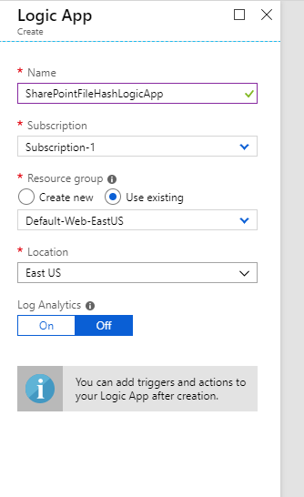
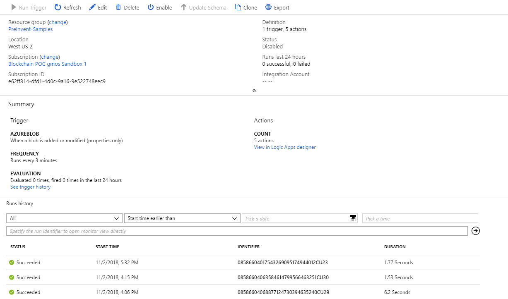
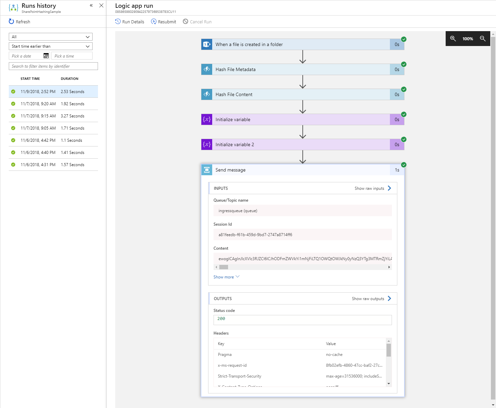

# Hash file contents and metadata and then store on chain when a file is added to a Office 365 SharePoint directory

## Overview

This logic app hashes file metadata and contents and then stores it on chain when a file is added to an Office 365 SharePoint directory. The app will use a connector to be notified when new files are available.

Specifically –

- It will look for newly updated files on a periodic basis
- It obtains the file from SharePoint
- Hashes the file contents and some metadata about the file
- Creates a new contract containing the hashed data and then adds it to the Registry

## Pre-Requisites

The pre-requisites for this sample include -

- An Office 365 account and a SharePoint site set up that the account has access to
- An Azure Blockchain Workbench deployment with a File Registry application deployed and the Registry opened

## Of Note

This sample is designed to work with the File Registry application and File contract.

## Create a Function App

This sample uses a Function App to hash the file contents. If you already have a Function App created, then you can skip to the next section.

Navigate to the Azure portal at <http://portal.azure.com>

Click the + symbol in the upper left corner of the screen to add a new resource.

Search for and select Function App and then click Create.


Choose a name for the Function App, make sure .NET is chosen for the Runtime Stack and then click Create. This Function App will be used during the setup of the Logic App.


Once the app has been created, open it in the portal and click the + symbol next to Functions to add a new function.


Select "HTTP trigger" as the type of function to add.


Name the new function "GenericHashFunction".


Add the following code to the function. This function will return a SHA256 hash of the content that is passed to it.

```c
#r "Newtonsoft.Json"

using System.Net;
using Microsoft.AspNetCore.Mvc;
using Microsoft.Extensions.Primitives;
using Newtonsoft.Json;
using System.Security.Cryptography;
using System.Text;

public static async Task<IActionResult> Run(HttpRequest req, ILogger log)
{
    log.LogInformation("C# HTTP trigger function processed a request.");

    string requestBody = await new StreamReader(req.Body).ReadToEndAsync();

    if (string.IsNullOrWhiteSpace(requestBody))
        return new BadRequestObjectResult("File content or metadata failed to be hashed.");

    string contentHash = ComputeSha256Hash(requestBody);
        
    return (ActionResult)new OkObjectResult(contentHash);
}

public static string ComputeSha256Hash(string rawData)  
{  
    // Create a SHA256   
    using (SHA256 sha256Hash = SHA256.Create())  
    {  
        // ComputeHash - returns byte array  
        byte[] bytes = sha256Hash.ComputeHash(Encoding.UTF8.GetBytes(rawData));  

        // Convert byte array to a string   
        StringBuilder builder = new StringBuilder();  
        for (int i = 0; i < bytes.Length; i++)  
        {  
            builder.Append(bytes[i].ToString("x2"));  
        }  
        return builder.ToString();  
    }  
} 
```


Save the function. This will be used in our logic app.

## Create the Logic App

Click the + symbol in the upper left corner of the screen to add a new resource.

Search for and select Logic App and then click Create.


Name the logic app "SharePointFileHashLogicApp".

Click the Create button.



A logic app is initiated by a trigger.

In this scenario, the trigger will be when a file is uploaded to the configured SharePoint site.

Within the Logic App Designer, select "Blank Logic App".


Search for SharePoint and then select the "When a file is created in a folder" trigger.


When prompted, login in with the Office 365 credentials.


To configure the trigger, add the Uri of the SharePoint set to be used in the "Site Address" field. Then select the folder within the site you wish to monitor. You can set or adjust the frequency that the SharePoint site is to be checked for new or modified files. When you are done configuring the trigger, click + New Step.


## Add Hashing Functions

This next step will create hash values for the uploaded file's metadata and content. The first step is to create the hash for the metadata.

Search for Azure Function and then click "Choose an Azure function".


Pick the Azure Function App you created at the start of this sample and then select "GenericHashFunction" that you created earlier.


Once you select the function you will be prompted to add the request body that will be passed into the function. This will be a JSON object and should look like the following image. Click the three dots at the top, select "Rename" and name this function "Hash File Metadata".


The properties above are dynamic content that Azure determines based on the apps and connectors used upstream.  You can see an example of the dynamic content available from the SharePoint connector below.


Repeat the steps above to add a second call to the Azure Function.  This time we will hash the content of the file.  In the Request Body field type "@triggerBody().$content".  This is necessary because the "File Content" dynamic field is actually an object that contains both the content and content-type. Click the three dots at the top, select "Rename" and name this function "Hash File Content".


## Initializing the Variables

The contract that we will be using requires two pieces of generated data: a request Id and a process time. This will be created using a variable action. Search for "Variable" and select "Initialize variable"


The name of the first variable is "RequestId" and the type will be "String". When you click on the Value field, the expression editor will appear. Select "Expression" and enter "guid()". This will generate a unique guid for our call to use.


Add a second variable whose name is "ProcessDateTime" and the type is "String". The expression for this variable is "utcNow()".


## Sending the Service Bus Message

The last portion of the logic app will be to create and send a message to the Service Bus Queue for the Azure Blockchain Workbench. Search "Service Bus" and then select "Send Message".


Select the service bus you wish to connect to, either by selecting on from your current subscription or adding the connection string if it exists in a different location.


The Send Message dialog will allow you to configure the message. For the "Queue/Topic name" select the "activityhub". The Content will contain dynamic data that we have created along the process of the logic app. Enter the following JSON into the field:

```
{
    "requestId": "",
    "userChainIdentifier": "0x13ea6fbcaa5a5606f557ee1aeb5ed99f4c571ac6",
    "applicationName": "FileRegistry",
    "workflowName": "File",
    "parameters": [
        {
            "name": "registryAddress",
            "value": "0x7cfc428eda3ead7b35134a58a7930b56f9bd5b43"
        },
        { "name": "fileId", "value": "" },
        { "name": "location", "value": "" },
        { "name": "fileHash", "value": "" },
        { "name": "fileMetadataHash", "value": "" },
        { "name": "contentType", "value": "" },
        { "name": "etag", "value": "" },
        { "name": "processedDateTime", "value": "" }           
    ],
    "connectionId": 1,
    "messageSchemaVersion": "1.0.0",
    "messageName": "CreateContractRequest"
}
```

Add the dynamic fields from the previous steps and Variable sections as show here.  Remember, the metadata hash is the result for the first Azure Function call (the Body object) and the content hash is the result of the second Azure Function call.


Once this is complete. Click Save and your logic app is ready to be tested.

## Testing the logic app

You can test this functionality by taking the following steps –

1. Navigate to the overview page of for the logic app in the portal and confirm
   that it is enabled (if it is not, click on the “disabled” link at the top of
   the screen to transition the logic app to an enabled state).
2. Deploy the File Registry and File sample applications in Azure Blockchain
   Workbench.
3. Add members to the new application for the roles of Registrar, Registrant,
   and BlockchainAgent.
4. Create a new contract instance in the File Registry application. Once deployed, select the new Registry and perform the Open Registry action.
5. Upload an image file to your SharePoint account/folder used in the logic app.
6. The logic app should now be triggered and the code will be executed.
   Upon successful execution, you should see a File entry in your File workbench application.
   If you’d like to look at the execution of the logic app,
   navigate to the logic app in the portal. At the bottom of the screen, you
   will detail for Runs history



7. Click on the most recent execution of your logic app in the list.  
   This will show details on the trigger and actions executing within the logic
   app and allow you to validate success or troubleshoot reasons for failure.



8. Once making changes in your logic app, you can navigate back to this same
   screen and click “Resubmit” and it will call the current version of your
   logic app with the values provided by the previous run.

### In Review

This sample deployed and configured a logic app that will hash file content and metadata and deploy a smart contract in an Azure Blockchain Workbench application.

This sample is designed to work with the File Registry sample application and contracts but can be easily adapted to other contracts by making changes to Service Bus – Send a Message action at the end of the sample to reflect the specifics of the new contract.
