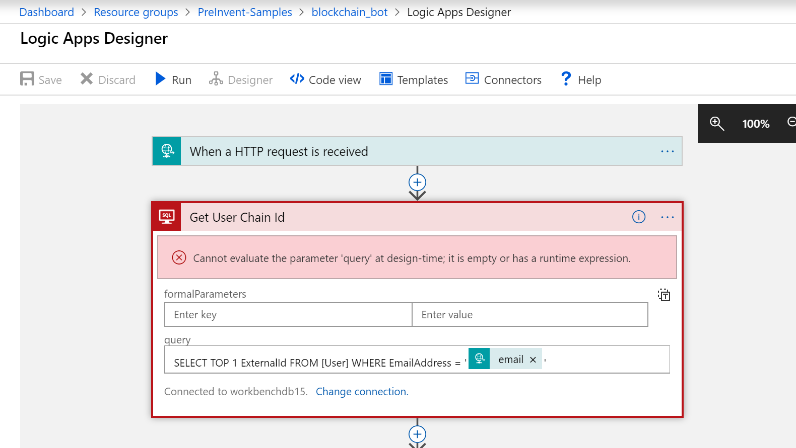
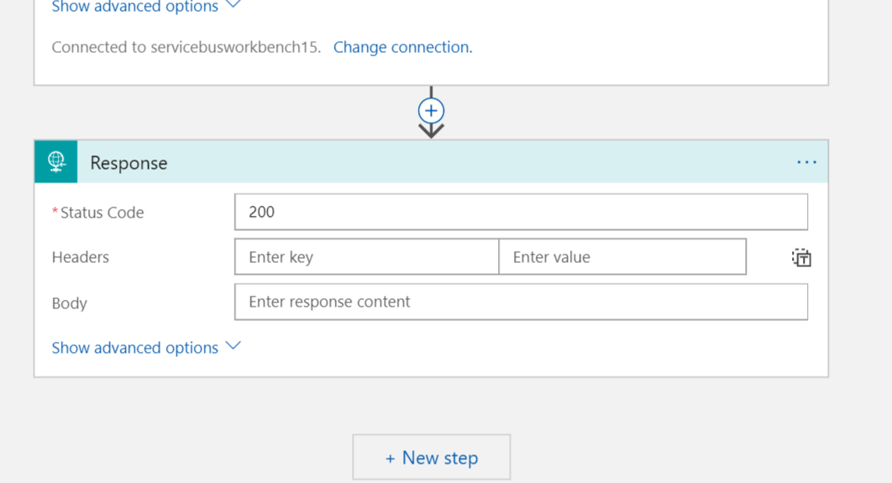

# Blockchain Cortana Bot 

This sample demonstrates the building of an Azure Bot Service that interacts with a blockchain.


1. Install the Bot CLI Tools

```bash
npm install -g chatdown msbot ludown luis-apis qnamaker botdispatch luisgen
```
## Deploy Luis Application

2. Create a new luis application by importing the .luis files. Use your own luis authoring key from the luis.ai site

```bash
luis import application --in DeploymentScripts/blockchain.luis --appName blockchain --authoringKey <luis authoring key>
```

The app Id is in the output of the command

```
{
  "id": "ff828503-a169-4ceb-8ed8-97c78fdd1917",
  "name": "blockchain",
  "description": "Basic bot BotBuilder V4 sample.",
  "culture": "en-us",
  "usageScenario": "",
  "domain": "",
  "versionsCount": 1,
  "createdDateTime": "2018-11-02T17:53:11Z",
  "endpoints": {},
  "endpointHitsCount": 0,
  "activeVersion": "0.1"
}
```

3. Train the Luis application

```bash
luis train version --appId <app id from above> --versionId 0.1 --authoringKey <luis authoring key>
```

4. Publish the luis application to an endpoint

```bash
 luis publish version --appId <app id from above> --versionId 0.1 --authoringKey <luis authoring key>
```


## Create the Bot Service

6. Now we will create the bot service using the bot.recipe file. This will create a resource group and all the necessary services to run the bot. For this step you may need to create an application at [https://apps.dev.microsoft.com/](). 


```bash
msbot clone services -f DeploymentScripts --subscriptionId <subscription id> --luisAuthoringKey <luis authoring key> --name blockchainbot --location westus --force --appSecret <secret from apps.dev.microsoft.com> --appId <app id from apps.dev.microsoft.com>
```

Note the secret generated by msbot. 

- The secret key is used later for `appsettings.json`.
```bash
The secret used to decrypt <NAME>.bot is:
XXXXXXXXXXXXXXXXXXXXXXXXXXXXXXXXXXXXXXXXXXX=
NOTE: This secret is not recoverable and you should store this secret in a secure place according to best security practices.
Your project may be configured to rely on this secret and you should update it as appropriate.
```
7. Inspect Bot configuration file.

- The `msbot clone` command above generates a bot configuration file.
- The name of the bot configuration file is <NAME>.bot, where <NAME> is the name of your bot used in the `msbot clone` step.
- The configuration file can be loaded by the [Microsoft Bot Framework Emulator](https://aka.ms/botframeworkemulator).

8. Update "YOUR_LUIS_SERVICE_NAME" in `BasicBot.cs'.

 ```dotnet
     public class BasicBot : IBot
    {
       ...
        public static readonly string LuisConfiguration = "YOUR_LUIS_SERVICE_NAME";
 ```
9. Right click on the generated bot configuration file, click "Properties".

  - Ensure "Copy to Output Directory" is set to "Copy always".

10. Update your `appsettings.json` with your .bot file path and .bot file secret.

- Update the `botFilePath` with the name of your generated bot configuration file.
- Update the `botFileSecret` with the secret that the msbot tool generated from step 5 above.

```bash
{
    "botFilePath": "<YOUR BOT CONFIG>.bot",
    "botFileSecret": "<YOUR BOT SECRET>"
}
```


## Create the Logic App

1. Now in the azure portal create a new Logic App
    

2. In the Logic Apps Designer, select "When a HTTP request is received"
    

3. Configure the HTTP request step with the following JSON schema

    

    Use this json for the schema

    ```json
    {
        "properties": {
            "askingprice": {
                "type": "integer"
            },
            "description": {
                "type": "string"
            },
            "email": {
                "type": "string"
            }
        },
        "type": "object"
    }
    ```

4. Then add a new step, and select the SQL Connector. Use the Execute SQL Query Action
    

5. Create a new connection to the Blockchain Workbench SQL Server and insert the credentials for the database.
    

6. Use the following SQL for the query text

    

    7. Add  'Parse JSON' step to the logic app

       In the Expression field add `body('Get_User_Chain_Id')?['resultsets']['Table1'][0]` and in the Schema field add the following json

       ```json
       {
           "properties": {
               "ExternalId": {
                   "type": "string"
               }
           },
           "type": "object"
       }
       ```

    8. Add an 'Initialize Variable' step named 'requestId' and use the guid() function to create a random id that will be used in the next step.

       

    9. Now add a Service Bus Send Message step to the logic app and create a connection to the Blockchain Workbench Service Bus

       

    10. Select 'activityhub' for the queue and add the 'requestId' variable as SessionId

       

    11. In the content field add the following json

        ```json
        {
            "requestId": "@{variables('requestId')}",
            "userChainIdentifier": "0x@{replace(body('Parse_JSON')?['ExternalId'], '-', '')}",
            "applicationName": "SimpleMarketplace",
            "workflowName": "SimpleMarketplace",
            "parameters": [
                {
                    "name": "Description"
                    "value": "@{triggerBody()?['description']}"
                }, { "name": "askingprice", "value": "@{triggerBody()?['askingprice']}" }
            ],
            "connectionId": 1,
            "messageSchemaVersion": "1.0.0",
            "messageName": "CreateContractRequest"
        }
        ```

    12. Finally, add an HTTP Response step to the logic app and give it a status code of 200

        


## Deploy Web Application for Bot Service

1. Open the .bot file and find the service that is labeled "type: generic". Replace the URL with the URL that was generated when you created the logic app.

2. Using Visual Studio, right click on publish the bot service project to the App Service that was created during step 6.

3. In the Azure Portal you can navigate to the Bot Service and test it using the 'Test in Web Chat' page

   

## Enable Cortana Channel

So far, the bot only works on the embeddable web chat channel. Now we will enable the bot to work over Cortana.

1. In the channels tab of the bot service, select the Cortana channel

   

2. Now the bot can be used with Cortana on a Windows machine where the signed in user is the same as the user that created the Cortana channel

   
