Version 1.0

Overview
========

This sample focuses on the receipt, transformation, and delivery of
messages from associated devices with [Azure IoT
Central](https://docs.microsoft.com/en-us/azure/iot-central/overview-iot-central)
to Azure Blockchain Workbench.

Specifically, this sample provides guidance on:

-   Deployment of Azure IoT Central

-   Association a real or simulated device

-   Configuration of simulated device to work with a Workbench
    application

-   Development of Microsoft Flow, which will connect alerts fired from
    devices associated with Azure IoT Central to Azure Blockchain
    Workbench

This sample is designed to work with the [Refrigerated Transportation
sample
application](https://github.com/Azure-Samples/blockchain/tree/master/blockchain-workbench/application-and-smart-contract-samples/refrigerated-transportation)
and contracts but can easily be adapted to other contracts by making
changes to the configured alerts in Azure IoT Central and messages being
pushed to Azure Blockchain Workbench.

Sample Flow Table of Contents
=============================

This sample is complex and involves multiple steps. Below is a
high-level flow of the sample with links to the associated section
within the sample:

-   [Deploy Azure IoT Central](#deploy-azure-iot-central)

-   [Add a device to Azure IoT
    Central](#add-a-device-to-azure-iot-central)

-   [Connect a device with Azure Blockchain
    Workbench](#connect-a-device-with-azure-blockchain-workbench)

-   [Create device alert rules](#create-device-alert-rules)

-   [Create device alert actions](#create-device-alert-action)

-   [Create a Microsoft Flow to connect with Azure Blockchain
    Workbench](#create-a-microsoft-flow-to-connect-with-azure-blockchain-workbench)

-   [Testing](#testing)

Deploy Azure IoT Central
========================

Azure IoT Central is a fully managed IoT Software-as-a-Service solution
that makes it easy to create products that connect the physical and
digital worlds. With Azure IoT Central you are able to manage a
collection of real and/or simulated devices, monitor readings from
devices, troubleshoot and remediate issues with devices, define custom
rules and actions based on data from devices, and provision new devices.

We recommend reading the [Azure IoT Central
documentation](https://docs.microsoft.com/en-us/azure/iot-central/overview-iot-central)
before getting started with this sample.

The following steps outline how to deploy Azure IoT Central:

1.  Sign in to the [Azure portal](https://portal.azure.com/).

2.  Select your account in the top right corner, and switch to the
    desired Azure AD tenant where you want to deploy Azure IoT Central.

3.  In the left pane, select **Create a resource**. Search for “IoT
    Central” in the **Search the Marketplace** search bar.

    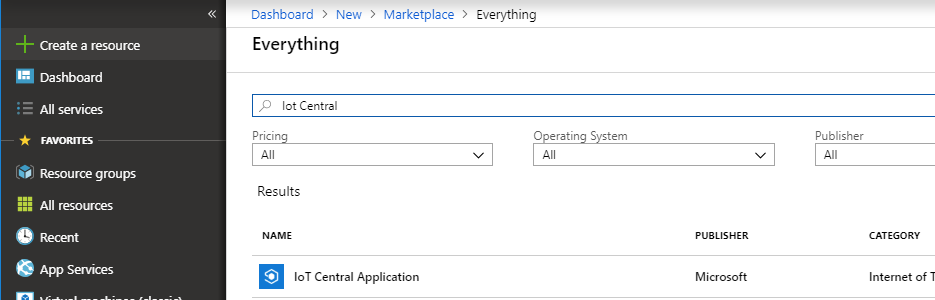

4.  Select **IoT Central Application**.

5.  Select **Create**.

6.  Complete the fields in the creation form.

    

7.  Select **Create** to deploy your Azure IoT Central application.

Add a Device to Azure IoT Central
=================================

Once your Azure IoT Central deployment completes, you can now access
Azure IoT Central application by navigating to Azure IoT Central
[Application Manager](https://aka.ms/iotcentral) page. Select the
application you created in the previous step or create a new application
following the [create an Azure IoT Central
application](https://docs.microsoft.com/en-us/azure/iot-central/quick-deploy-iot-central)
documentation.

You should now have access to your Azure IoT Central application, which
allows you to manage connected IoT devices. Depending on your solution
requirements, you are able to add a collection of real and/or simulated
devices. The refrigerated transportation Workbench application requires
the following readings from a real or simulated device:

-   Temperature

-   Humidity

-   Timestamp

For the sake of simplicity, this sample will go over the creation of a
simulated device, which will be able to work with the refrigerated
transportation Workbench application. Note, real devices, which collect
the required readings can also work, but is not covered in this sample.
You can find documentation on connecting real devices to Azure IoT
Central in the [add a
device](https://docs.microsoft.com/en-us/azure/iot-central/tutorial-add-device)
documentation.

For reference, please refer to the [define a new device
type](https://docs.microsoft.com/en-us/azure/iot-central/tutorial-define-device-type)
documentation for creating simulated devices in Azure IoT Central. The
following steps show you how to create a new refrigerated transportation
compatible device template, which can send temperature and humidity
telemetry to your application:

1.  On the **Application Builder** page, choose **Create Device
    Template**.

2.  On the **Device Templates page**, choose **Custom**.

3.  On the **New Device Template** page, enter the unique name of your
    simulated device.

4.  In your new device template, make sure you are on the
    **Measurements** page, which will allow you to define the
    measurements the device is capturing.

5.  Choose **Edit Template**.

6.  To add temperature telemetry measurement, choose **New
    Measurement**.

7.  Choose **Telemetry**.

8.  In the **Create Telemetry** pane, fill in applicable fields. Be sure
    to specify a minimum and maximum temperature value, which is in
    nominal range for your scenario. Click **Save** when done. Here is
    an example of filled out telemetry for temperature:

    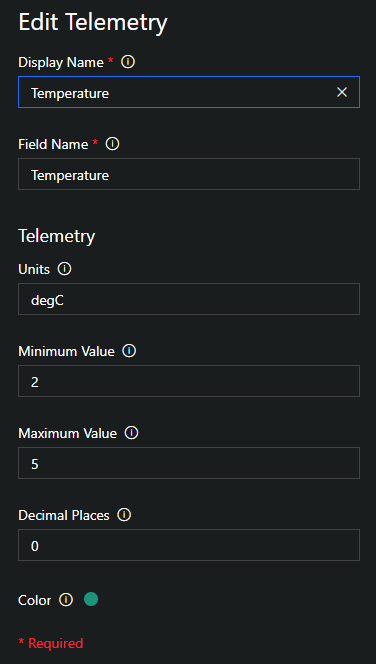
    
9.  To add humidity telemetry measurement, choose **New Measurement**.

10. Choose **Telemetry**.

11. In the **Create Telemetry** pane, fill in applicable fields. Be sure
    to specify a minimum and maximum humidity value, which is in nominal
    range for your scenario. Click **Save** when done. Here is an
    example of filled out telemetry for humidity:

    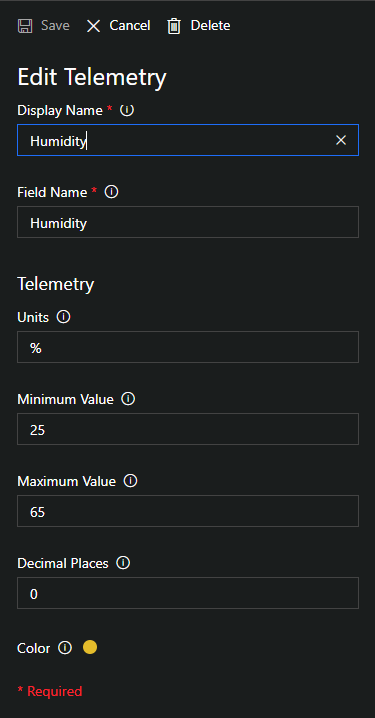

12. At this point your simulated device has all the necessary telemetry
    needed to work with the refrigerated transportation Workbench
    application. Choose **Done** to ensure the device template is saved.

Connect a Device with Azure Blockchain Workbench
================================================

Azure Blockchain Workbench relies on unique identities for all entities,
users and devices, which perform transactions on the blockchain. These
identities are managed within Azure Active Directory. The following
high-level steps are needed to have a device work with Workbench:

1.  (Pre-requisite) Add stored procedures to Azure Blockchain
    Workbench’s database deployment.

2.  Create an Azure AD user for each device you want to use with Azure
    Blockchain Workbench.

3.  Provision device user in Azure Blockchain Workbench.

4.  Associate device ID of the device with the provisioned user in Azure
    Blockchain Workbench.

The below sections go in details for each of the high-level steps
outlined above.

Deploy Stored Procedures for Azure Blockchain Workbench
-------------------------------------------------------

You need to complete the following steps as a pre-requisite to
connecting devices to Azure Blockchain Workbench:

1.  Download the following file of stored procedures, which is needed to
    support this sample. The file can be downloaded from this location:
    <https://github.com/Azure-Samples/blockchain/blob/master/blockchain-workbench/iot-integration-samples/SQL/IoTSprocs.sql>

2.  Open a Web browser and navigate to the [Azure
    portal](http://portal.azure.com).

3.  Navigate to the database deployed as part of your Azure Blockchain
    Workbench deployment.

4.  Choose **Query editor**.

    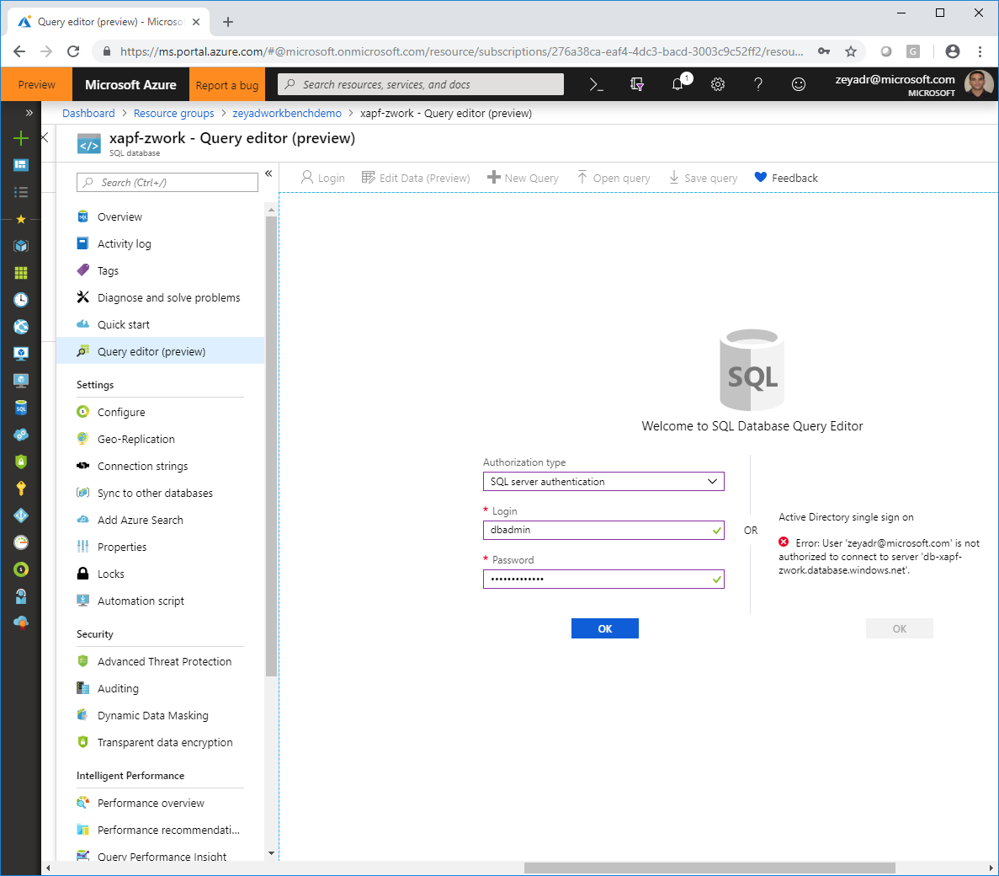

5.  Enter your login and password information and choose **OK**. Note,
    login is set to “dbadmin” and password was specified at Azure
    Blockchain Workbench deployment.

6.  Choose **Open query** and select the stored procedure file you
    downloaded in the previous step.

7.  Choose **Run** to create the stored procedures in the database.

Create an Azure AD User for Devices
-----------------------------------

Azure Blockchain Workbench relies on Azure AD users to perform
transactions on the blockchain. This statement implies devices must be
associated with unique Azure AD accounts to participate in transactions.
Refer to [manage users in Azure Blockchain
Workbench](https://docs.microsoft.com/en-us/azure/blockchain/workbench/manage-users)
documentation for more information on creating and managing users within
Azure AD.

The following steps show you how to associate devices with Azure AD
accounts, which can be used within Azure Blockchain Workbench:

1.  Sign in to the [Azure portal](https://portal.azure.com/).

2.  Select your account in the top right corner, and switch to the Azure
    AD tenant associated to Blockchain Workbench.

3.  Select **Azure Active Directory &gt; Users**. You see a list of
    users in your directory.

4.  Choose **New user** to add a new user to the directory.

    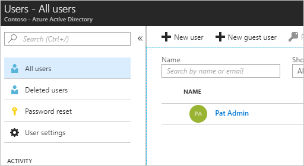

5.  Complete the required fields for the new user. This new user will
    represent the device you want to use with Azure Blockchain
    Workbench. Choose **Create**.

Provision Device User in Azure Blockchain Workbench
---------------------------------------------------

Users added to Azure AD tenant associated to Blockchain Workbench can
use the Azure Blockchain Workbench Web client. There are two different
ways to provision a user added to Azure AD in Azure Blockchain
Workbench:

1.  Manually have the user login to Azure Blockchain Workbench.

2.  Use the Azure Blockchain Workbench API to provision an Azure AD user
    for Azure Blockchain Workbench.

For method \#1, manually login to the Web client of Azure Blockchain
Workbench. Logging in the first time will automatically provision the
user from Azure AD as a registered user within Azure Blockchain
Workbench.

For method \#2, you can use Azure Blockchain Workbench REST API to
provision the user without needing the user to sign in manually.
Specifically, you will need to use POST /api/v1/users to provision the
user.

Either method will work, but you need to do one of them.

Associate Device ID with Provisioned Device User
------------------------------------------------

Once a device user is provisioned in Azure Blockchain Workbench, we need
to associate the device ID of the device with the provisioned user. The
following steps show you how to associate the device ID with the
provisioned user:

1.  Navigate to Azure IoT Central [Application
    Manager](https://aka.ms/iotcentral) page.

2.  Select the application you created in the previous steps with the
    device you want to associate with the provisioned device user in
    Azure AD.

3.  On **Device Explorer** page, find the device you want to associate
    with the provisioned Azure AD user.

4.  **Copy** the Device ID of the applicable device.

    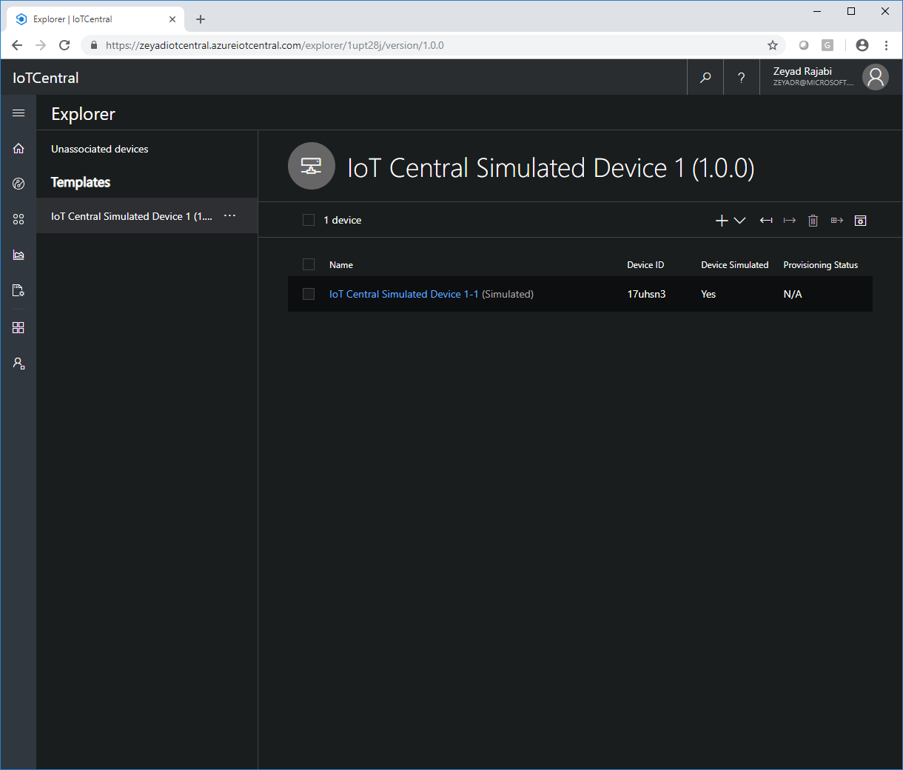

5.  Navigate to the [Azure portal](http://portal.azure.com).

6.  Navigate to the database deployed as part of your Azure Blockchain
    Workbench deployment.

7.  Choose **Query editor**.

8.  In the query window, enter and execute the following SQL:

    Update \[User\] Set ExternalId = ‘&lt;your device id here&gt;’ where
    EmailAddress = ‘&lt;insert email address of device user here&gt;’

Create Device Alert Rules
=========================

At this point we’ve added a device to Azure IoT Central and have
provisioned that device as a user for Azure Blockchain Workbench. We now
need to connect Azure IoT Central to Azure Blockchain Workbench via
device alert rules and Microsoft Flow. The device alert rules will
specify when data will flow from Azure IoT Central to Azure Blockchain
Workbench. Device alert rules will be created for temperature and
humidity readings, which exceed some threshold we care about. For sake
of simplicity, this sample will show the creation of one alert for
capturing temperature readings higher than some value.

The following steps show you how to configure a device alert rule for
the device ID with the provisioned user:

1.  Navigate to Azure IoT Central [Application
    Manager](https://aka.ms/iotcentral) page.

2.  Select the application you created in the previous steps with the
    device you want to associate with the provisioned device user in
    Azure AD.

3.  On **Device Explorer** page, select the device you want to create
    device alert rules.

4.  Choose **Rules** to navigate to the Rules page.

5.  Choose **Edit Template**.

6.  To add a new rule, choose **New Rule**.

7.  Choose **Telemetry**.

8.  In the **Configure Telemetry Rule** pane, enter a name for the rule.

9.  Choose **+** in **Conditions** section to add new alert condition.

10. For **Measurement**, choose **Temperature**.

11. Leave **Aggregation** to **None**.

12. Set **Operator** to **is greater than**.

13. For **Threshold** specify a value above the nominal maximum
    temperature setting specified for the device in the previous step.

14. Choose **+** in **Conditions** section to add new alert condition.

15. For **Measurement**, choose **Humidity**.

16. Leave **Aggregation** to **None**.

17. Set **Operator** to **is greater than or equal to**.

18. For **Threshold** specify **0**.

19. Click **Save** when done. Here is an example of filled out telemetry
    rule for temperature above **6**:

    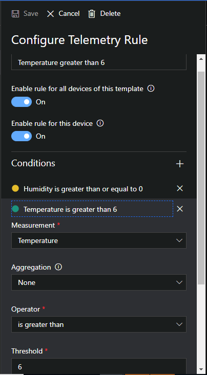

Create Device Alert Action
==========================

Alerts will now fire whenever the conditions specified in the previous
steps are met. However, these alerts will not go anywhere as we have not
specified any routing. Luckily, Azure IoT Central makes it easy to take
actions on alerts. The following steps show you how to configure a
device alert action for the rules you created in the previous steps:

1.  Navigate to Azure IoT Central [Application
    Manager](https://aka.ms/iotcentral) page.

2.  Select the application you created in the previous steps with the
    device you want to associate with the provisioned device user in
    Azure AD.

3.  On **Device Explorer** page, select the device you want to create
    device alert rules.

4.  Choose **Rules** to navigate to the Rules page.

5.  Choose **Edit Template**.

6.  To add a new rule, choose **New Rule**.

7.  Select the rule you created in the previous steps.

8.  Choose **+** in **Actions** section to add new alert action.

9.  Choose **Email**.

10. Enter your email address and name for the email action. This alert
    action will be helpful in debugging in case you are wondering if an
    alert fired.

11. Choose **+** in **Actions** section to add new alert action.

12. Choose **Microsoft Flow**.

The next section will cover details on creating a Microsoft Flow to
connect to Azure Blockchain Workbench.

Create a Microsoft Flow to Connect with Azure Blockchain Workbench
==================================================================

The following steps outline the necessary steps to create a Microsoft
Flow, which is able to connect Azure IoT Central to Azure Blockchain
Workbench:

1.  Confirm the creation of a new Microsoft Flow by choosing
    **Continue**.

    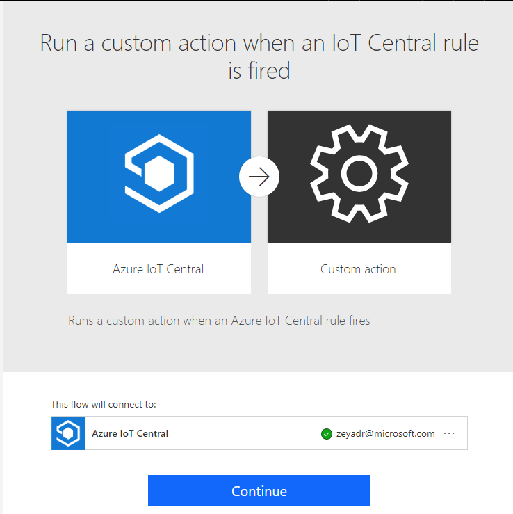
    
2.  For the **When a rule is fired** step, specify the Azure IoT Central
    application and the device alert rule you are using:

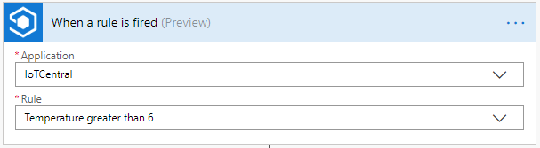

1.  Choose **Add an action** to add a new step.

2.  In **Search connectors and actions**, enter and select **Initialize
    variable**.

3.  For **Name,** specify “TimestampInt.” For **Type**, specify
    **Integer**. For **Value**, specify
    “ticks(triggerBody()\['timestamp'\])” under **Expression**.

    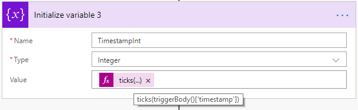{width="6.3125in" height="1.9375in"}

4.  Choose **Add an action** to add a new step.

5.  In **Search connectors and actions**, enter and select **Execute
    stored procedure** for SQL Server.

6.  Enter connection details to connect to you Azure Blockchain
    Workbench SQL database.

7.  For **Procedure** **name**, select
    \[dbo\].\[GetContractInfoForDeviceId\].

8.  For DeviceID, use **DeviceID** found in the **When a rule is fired**
    section of **Dynamic content**.

    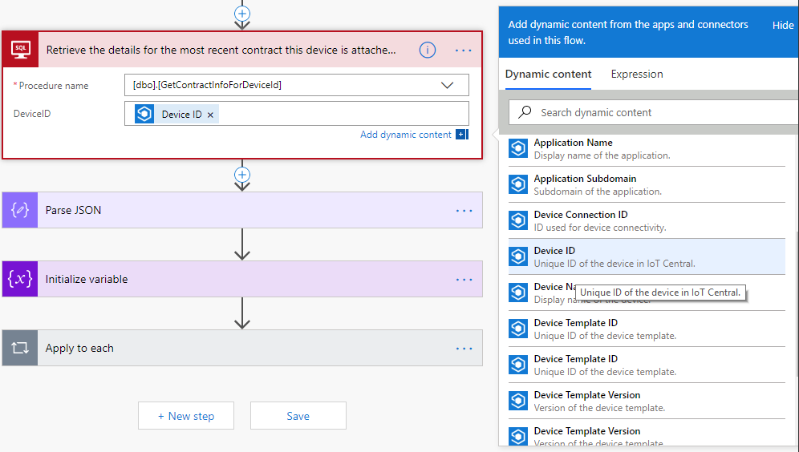

9.  Choose **Add an action** to add a new step.

10. In **Search connectors and actions**, enter and select **Parse
    JSON**.

11. For **Content**, select **ResultSets** found in **Variables**
    section of **Dynamic content**.

    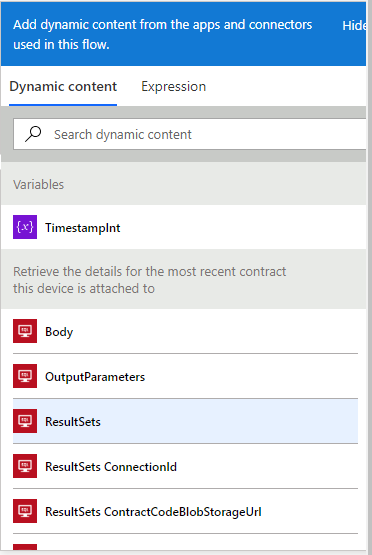{width="3.875in" height="5.78125in"}

12. For **Schema**, copy and paste the following JSON:

{

"properties": {

"Table1": {

"items": {

"properties": {

"ConnectionId": {

"type": "number"

},

"ContractCodeBlobStorageUrl": {

"type": "string"

},

"ContractId": {

"type": "number"

},

"ContractLedgerIdentifier": {

"type": "string"

},

"IngestTelemetry\_ContractPersonaID": {},

"IngestTelemetry\_ContractWorkflowFunctionID": {

"type": "number"

},

"IngestTelemetry\_Humidity\_WorkflowFunctionParameterID": {

"type": "number"

},

"IngestTelemetry\_Temperature\_WorkflowFunctionParameterID": {

"type": "number"

},

"IngestTelemetry\_Timestamp\_WorkflowFunctionParameterID": {

"type": "number"

},

"UserChainIdentifier": {

"type": "string"

},

"WorkflowFunctionId": {

"type": "number"

},

"WorkflowFunctionName": {

"type": "string"

},

"WorkflowName": {

"type": "string"

}

},

"required": \[

"ContractId",

"WorkflowFunctionId",

"ConnectionId",

"ContractLedgerIdentifier",

"ContractCodeBlobStorageUrl",

"UserChainIdentifier",

"WorkflowFunctionName",

"WorkflowName",

"IngestTelemetry\_ContractWorkflowFunctionID",

"IngestTelemetry\_ContractPersonaID",

"IngestTelemetry\_Humidity\_WorkflowFunctionParameterID",

"IngestTelemetry\_Temperature\_WorkflowFunctionParameterID",

"IngestTelemetry\_Timestamp\_WorkflowFunctionParameterID"

\],

"type": "object"

},

"type": "array"

}

},

"type": "object"

}

1.  Choose **Add an action** to add a new step.

2.  In **Search connectors and actions**, enter and select **Initialize
    variable**.

3.  For **Name,** specify “RequestId.” For **Type**, specify **String**.
    For **Value**, specify “guid()” under **Expression**.

    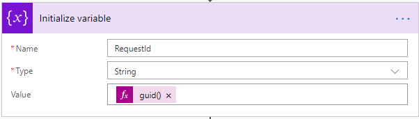

4.  Choose **Add an action** to add a new step.

5.  In **Search connectors and actions**, enter and select **Apply to
    each**.

6.  For **Select an output from previous steps**, specify **Table1**
    under **Parse JSON**.

7.  Within **Apply to each** step, choose **Add** **an** **action**.

8.  In **Search connectors and actions**, enter **Service Bus** and
    select **Send message**.

9.  Specify the Service Bus action to connect and use the Service Bus
    resource deployed as part of Azure Blockchain Workbench. Note, when
    specifying the Service Bus connection string, make sure you use a
    policy with a **Manage** claim. To get the Service Bus connection
    string, choose **Shared access Policies** under **Settings** of the
    Service Bus resource. Select the appropriate policy and copy the
    appropriate connection string.

10. For **Queue/Topic name**, specify **activityhub (queue)**.

11. For **Session Id**, specify **RequestId** under **Variables** in
    **Dynamic content**.

    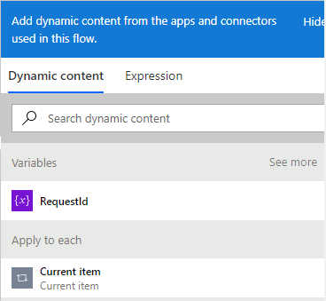

12. For **Content**, copy and paste the following JSON:

{

"ContractActionId": null,

"ConnectionId":,

"UserChainIdentifier": "",

"ContractCodeArtifactBlobStorageURL": "",

"OperationName": "CreateContractAction",

"ContractLedgerIdentifier": "",

"WorkflowFunctionName": "IngestTelemetry",

"WorkflowName": "RefrigeratedTransportation",

"ContractActionParameters": \[

{

"name": "humidity",

"value": ""

},

{

"name": "temperature",

"value": ""

},

{

"name": "timestamp",

"value":

}

\],

"RequestId": ""

}

1.  Augment **Content** with values from the **Dynamic content** window
    to match the screenshot below:

    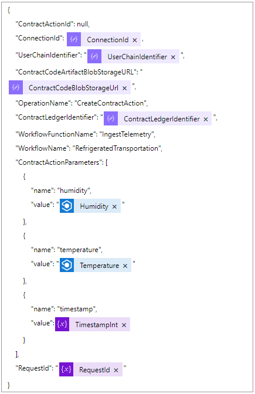
    
2.  Choose **Save** to save your completed Microsoft Flow.

3.  Make sure you **Save** your configured device rule within Azure IoT
    Central and choose **Done** to save device template.

Testing
=======

At this point you have configured a device within Azure IoT Central,
which will fire an alert when specific conditions are met, where the
alert data is pushed to Azure Blockchain Workbench. To complete this
sample, you need to do the following:

1.  Use the device in a refrigerated transportation application.

2.  Trigger a device event, which fires the device alert rule specified
    in previous steps.

For \#1, reference the [manage Workbench
users](https://docs.microsoft.com/en-us/azure/blockchain/workbench/manage-users)
and [use blockchain
app](https://docs.microsoft.com/en-us/azure/blockchain/workbench/use)
documentation. At a high-level, you need to do the following:

1.  Add the device user as a member of the refrigerated transportation
    Workbench application. Ensure the device is specified with a
    **Device** role.

    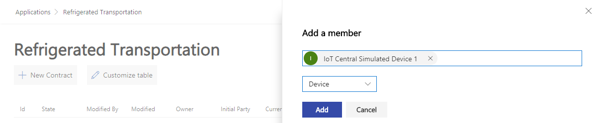

2.  Create a contract with the device user and ensure the minimum and
    maximum temperature and humidity values are within the nominal
    ranges you specified when creating your simulated device.

    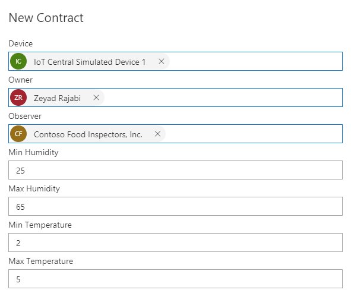
    
The following steps show you how to fire a device alert rule for the
device:

1.  Navigate to Azure IoT Central [Application
    Manager](https://aka.ms/iotcentral) page.

2.  Select the application you created in the previous steps with the
    device you want to associate with the provisioned device user in
    Azure AD.

3.  On **Device Explorer** page, select the device you are using.

4.  Make sure you are on the **Measurements** page.

5.  Choose **Edit Template**.

6.  Choose **Edit** for the **Temperature** **Telemetry** setting.

7.  Change the minimum and maximum values to be greater than the value
    specified in the device alert rule.

8.  Choose **Save** and then **Done** to ensure the device template is
    saved.

Check your contract in Azure Blockchain Workbench. You should now see it
an **Out of Compliance** state. 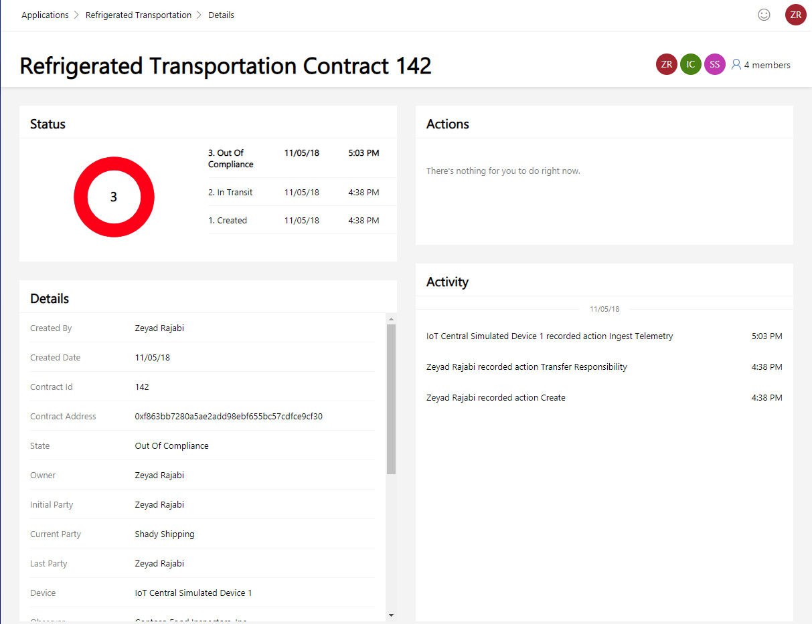

Review
======

This sample deployed and configured Azure IoT Central, added a simulated
device to Azure IoT Central, connected the device to Azure Blockchain
Workbench, created device alert rules and actions, and created a
Microsoft Flow connecting IoT Central with Azure Blockchain Workbench.

This sample is designed to work with the Refrigerated Transportation
sample application and contracts but can be easily adapted to other
contracts by making changes to Service Bus – Send a Message action at
the end of the sample to reflect the specifics of the new contract.
