# Receive information from Twilio voice messaging to be saved to block chain

## Overview

This logic app receives information from a Twilio voice session and creates a new contract in a block chain. The logic app will be triggered by HTTP request from an Azure Function.

Specifically –

- Use an Azure Function to collect information via Twilio voice and touch tone commands
- Pass that information to an Azure Logic App
- Creates a new contract containing the data and then adds it to the Simple Marketplace

## Pre-Requisites

The pre-requisites for this sample include -

- A Twilio account with a phone number attached to it
- An Azure Blockchain Workbench deployment with a Simple Marketplace application deployed

## Of Note

This sample is designed to work with the Simple Marketplace application.

## Create a Function App

This sample uses a Function App to handle the voice communication via Twilio. If you already have a Function App created, then you can skip to the next section.

Navigate to the Azure portal at <http://portal.azure.com>

Click the + symbol in the upper left corner of the screen to add a new resource.

Search for and select Function App and then click Create.

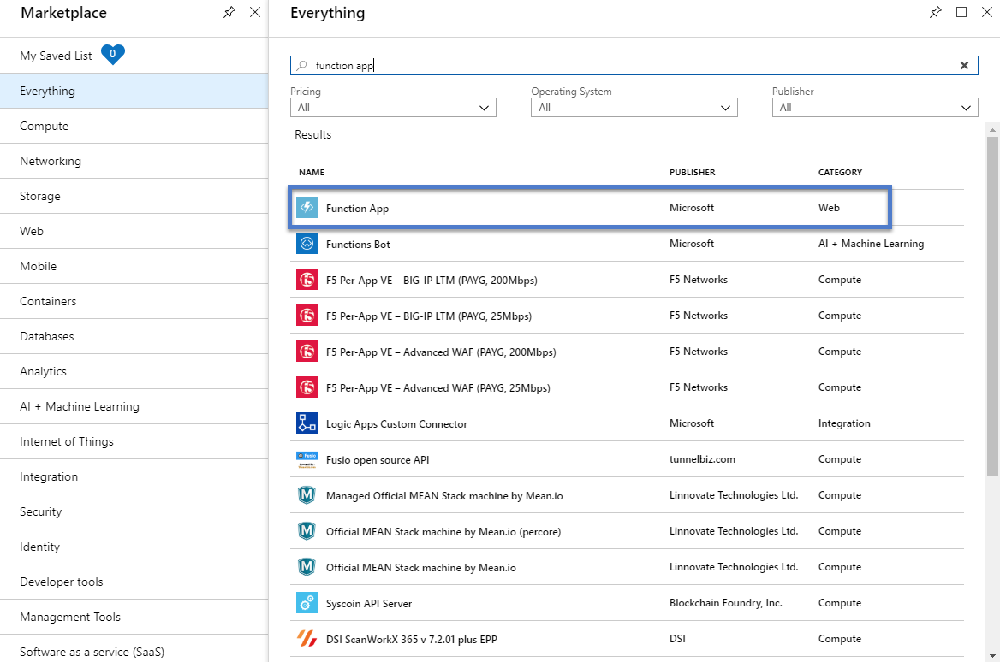

Choose a name for the Function App, make sure .NET is chosen for the Runtime Stack and then click Create. This Function App will be used during the setup of the Logic App.

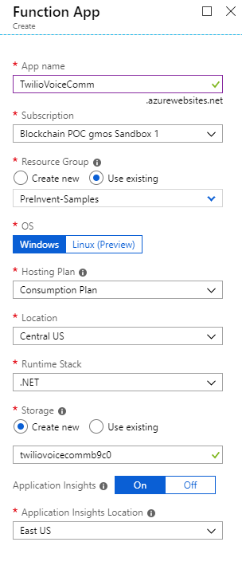

## Create the Twilio Azure Function

Once the app has been created, open it in the portal and click the + symbol next to Functions to add a new function.

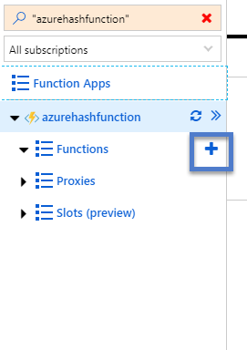

Select "HTTP trigger" as the type of function to add.

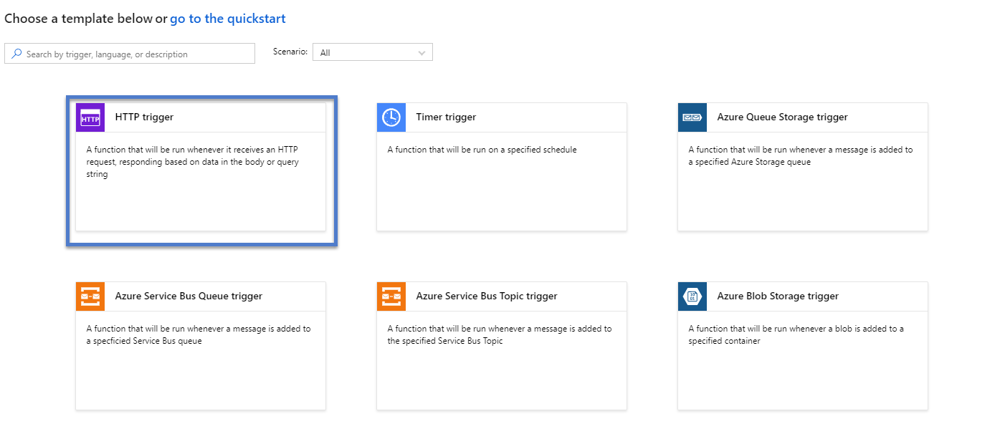

Name the new function "TwilioVoiceFunction".


Add the following code to the function. This function will walk the user through collecting data to be used for a contract in the market place. First it will ask for a description of the item to sell, the price, and finally will report the results of adding the item to the market place. In the function we will replace "[LOGIC_APP_URI]" with a Uri from the logic app created later in this sample.

```c
#r "Newtonsoft.Json"

using System.Net;
using System.Web;
using System.Net.Http.Headers;
using System.Net.Http;
using Microsoft.AspNetCore.Mvc;
using Microsoft.Extensions.Primitives;
using Newtonsoft.Json;
using System.Text;

static Dictionary<string, Listing> listings = new Dictionary<string, Listing>();
static HttpClient httpClient = new HttpClient();

public class Listing {
    public string Description { get; set;}
    public double ListingAmount { get; set;}
}

public static async Task<IActionResult> Run(HttpRequest req, ILogger log)
{
    log.LogInformation("C# HTTP trigger function processed a request.");

    string requestBody = await new StreamReader(req.Body).ReadToEndAsync();
    var values = HttpUtility.ParseQueryString(requestBody);
 
    string logicAppUrl = "[LOGIC_APP_URI]";
    string id = values["Caller"];
    log.LogInformation("Caller - " + id);

    if(!listings.ContainsKey(id)) {
        var newListing = new Listing();

        listings.Add(id, newListing);

        var message = BuildGatherResponse("What would you like to sell?", "speech");
        return new ContentResult { Content = message, ContentType = "application/xml" };
    } else {
       var listing = listings[id];
       
       if(string.IsNullOrEmpty(listing.Description)) {
           listing.Description = values["SpeechResult"];

           var message = BuildGatherResponse(string.Format("Enter in how much you want to sell {0} for", listing.Description), "dtmf" );
           return new ContentResult { Content = message, ContentType = "application/xml" };
       } else {
           double val;
           if(double.TryParse(values["Digits"], out val)) {
               listing.ListingAmount = val;

               var buffer = Encoding.UTF8.GetBytes(JsonConvert.SerializeObject(listing));
               var byteContent = new ByteArrayContent(buffer);
               byteContent.Headers.ContentType = new MediaTypeHeaderValue("application/json");
       
               var response = await httpClient.PostAsync(logicAppUrl, byteContent);

               var message = BuildHangupResponse(string.Format("{0} has been listed for {1} dollars.", listing.Description, listing.ListingAmount) );
               listings.Remove(id);

               return new ContentResult { Content = message, ContentType = "application/xml" };

           } else {
              var message = BuildGatherResponse(string.Format("Invalid amount. Enter in how much you want to sell {0} for", listing.Description), "dtmf" );
              return new ContentResult { Content = message, ContentType = "application/xml" };
           }        
       }
    }
}

public static string BuildGatherResponse(string message, string messageType) {

    return string.Format("<?xml version=\"1.0\" encoding=\"utf-8\"?>" +
        "<Response>" +
        "<Gather input=\"{1}\" method=\"post\" timeout=\"3\">" +
        "<Say>{0}</Say>" +
        "</Gather>" +
        "</Response>", message, messageType);
    
}

public static string BuildHangupResponse(string message) {
    return string.Format("<?xml version=\"1.0\" encoding=\"utf-8\"?>" +
        "<Response>" +
        "<Say>{0}</Say>" +
        "<Say>Goodbye</Say>" +
        "<Hangup/>" +
        "</Response>", message);
    
}

```

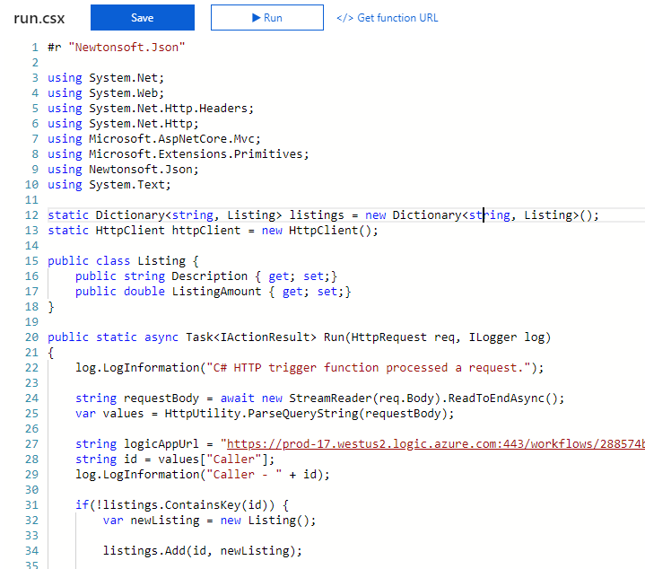

Save the function. This will be used in our logic app.

## Create the Logic App

Click the + symbol in the upper left corner of the screen to add a new resource.

Search for and select Logic App and then click Create.

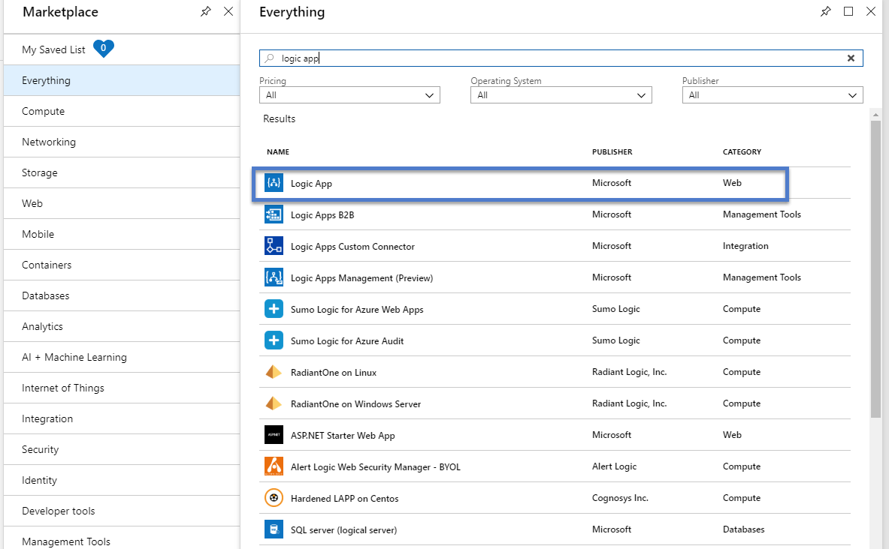

Name the logic app "TwilioVoiceLogicApp".

Click the Create button.

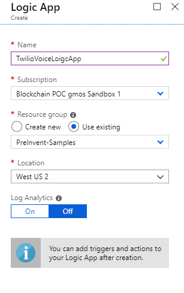

A logic app is initiated by a trigger.

In this scenario, the trigger will be a HTTP request from the Azure Function once all of the needed data has been collected.

Within the Logic App Designer, select "Blank Logic App".

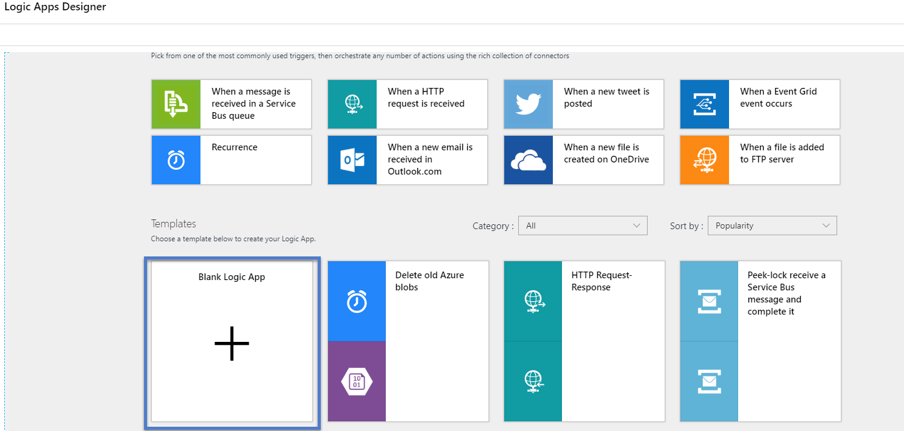

Search for Request and then select the "When a HTTP request is received" trigger.

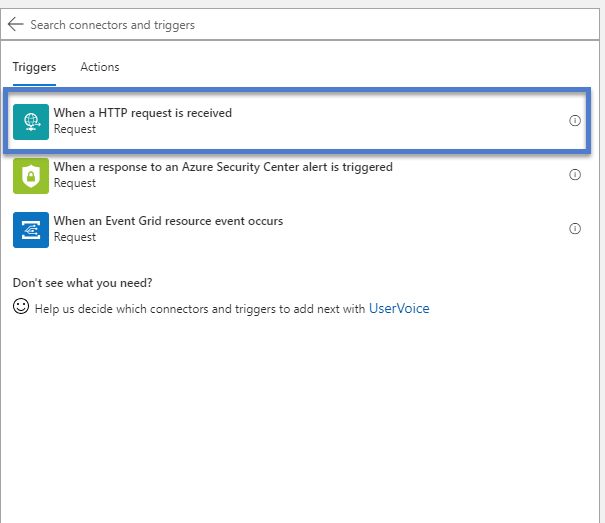

The HTTP Post URL will be available after the logic app is saved and will be used later for testing. In the "Request Body JSON Schema" section add the following JSON. This will allow the logic app to parse out the required data.

```javascript
{
    "properties": {
        "Description": {
            "type": "string"
        },
        "ListingAmount": {
            "type": "integer"
        }
    },
    "type": "object"
}
```
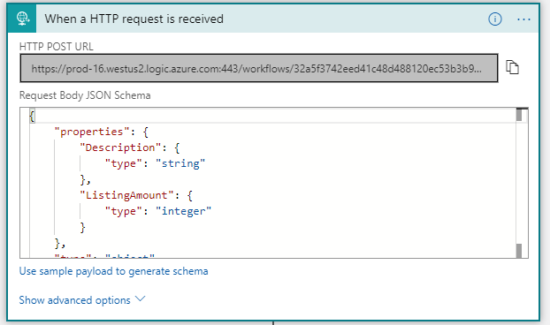

## Retrieve User Chain Id

The logic app will need a chain to attach the contract to. This sample will pull the most recent chain for a given user. Search for SQL Server and select "Execute a SQL query".

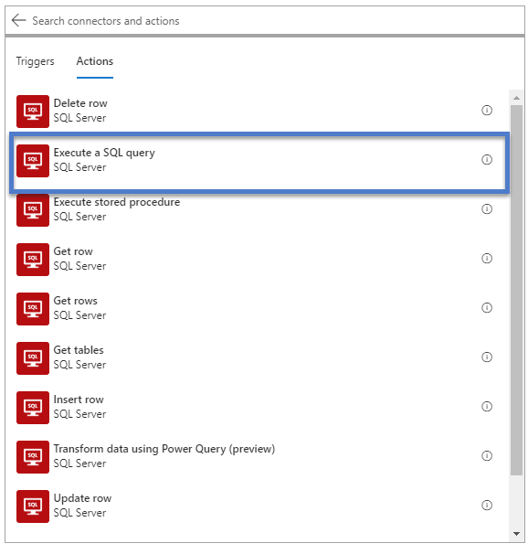

The first step will be to connect to the SQL database created with the workbench.

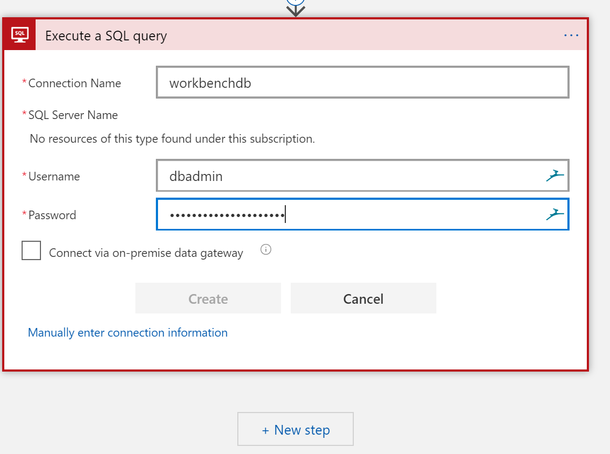

Enter the following SQL query in the query window. Replace [USER_EMAIL] with an email address that has access to the Simple Marketplace

```sql
SELECT TOP 1 ChainIdentifier FROM [UserChainMapping] WHERE UserID = (SELECT Id FROM [User] WHERE EmailAddress = '[USER_EMAIL]')
```

Rename this action to "Get User Chain Id".

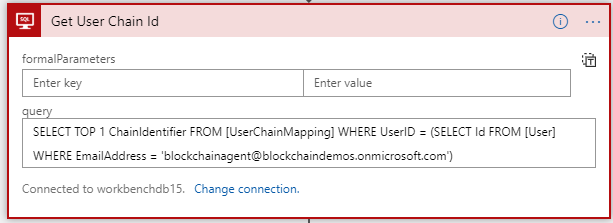

Once we have the SQL data, we need to parse the returned JSON so that the information can be used later in the sample. Search for Data Operations and select "Parse JSON".

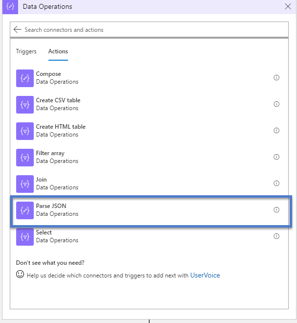

The content will be an expression that pulls the first value from the first row. Add the following in the Express field.

```
body('Get_User_Chain_Id')?['resultsets']['Table1'][0]
```

The Schema for the JSON is provided below.

```
{
    "properties": {
        "ChainIdentifier": {
            "type": "string"
        }
    },
    "type": "object"
}
```

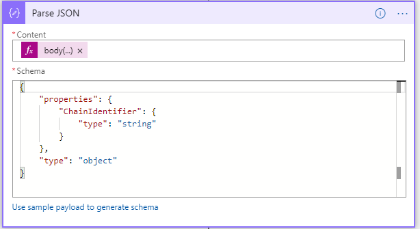

## Initializing a Variable

The contract that we will be using requires a request Id that is a unique guid. This will be created using a variable action. Search for "Variable" and select "Initialize variable"

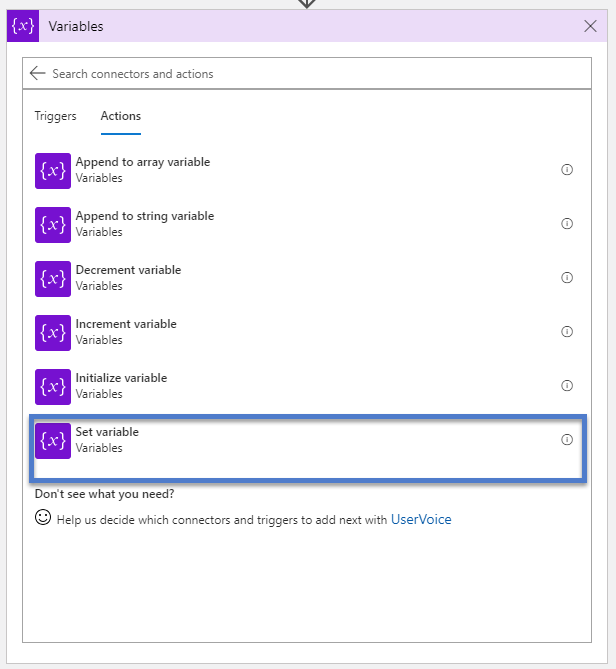

The name of the variable is "RequestId" and the type will be "String". When you click on the Value field, the expression editor will appear. Select "Expression" and enter "guid()". This will generate a unique guid for our call to use.


## Sending the Service Bus Message

The logic app will create and send a message to the Service Bus Queue for the Azure Blockchain Workbench. Search "Service Bus" and then select "Send Message".

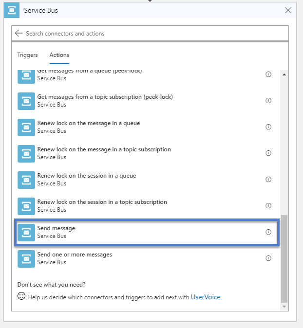

Select the service bus you wish to connect to, either by selecting one from your current subscription or adding the connection string if it exists in a different location.

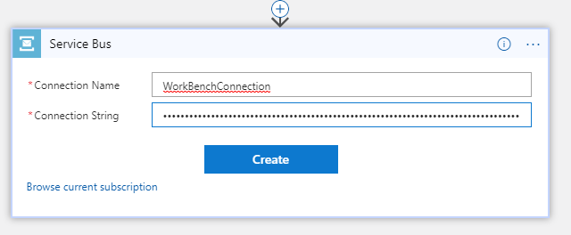

The Send Message dialog will allow you to configure the message. For the "Queue/Topic name" select the queue associated with your Azure Blockchain Workbench. The Content will contain dynamic data that we have created along the process of the logic app. Enter the following JSON into the field:

```
{
    "requestId": "",
    "userChainIdentifier": "",
    "applicationName": "SimpleMarketplace",
    "workflowName": "SimpleMarketplace",
    "parameters": [
        {
            "name": "description",
            "value": ""
        }, { "name": "price", "value": "" }
    ],
    "connectionId": 1,
    "messageSchemaVersion": "1.0.0",
    "messageName": "CreateContractRequest"
}
```

Add the dynamic fields from the previous steps and Variable sections as show here. 

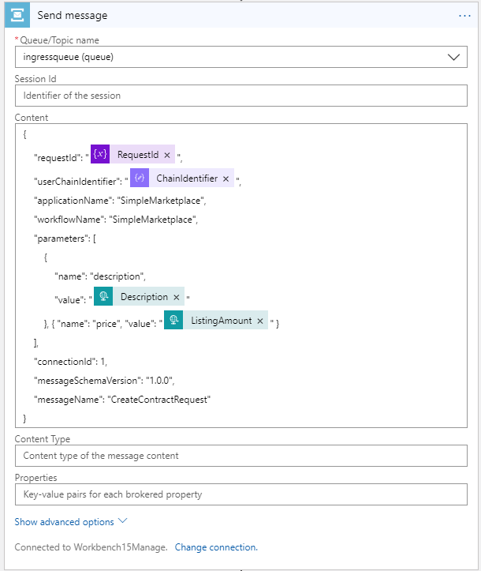

## HTTP Response

The last section is to return a HTTP response to the Azure Function. The response does not to contain any additional information, simply a status code of 200 to single a successful completion. 

Search Request and select "Response". The default settings for this response do not need to be altered for this sample.

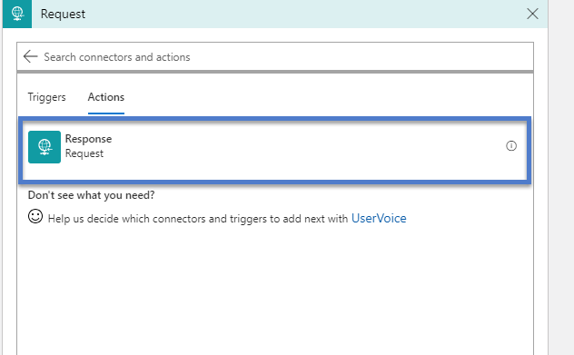

Once this is complete. Click Save and your logic app is ready to be tested.

## Add Logic App to Azure Function
Once you have saved the logic app, the HTTP Request action will have a Uri associated with it. This Uri needs to replace the [LOGIC_APP_URI] text found in the Azure function

## Configuring Twilio
With the Azure function and the Logic App complete, the final step for the sample is to configure the Twilio phone number used to communicate with our Azure function.

Open the Twilio portal and navigate to the phone number you will be testing. In the Messaging section add the Uri for the Azure Function you created in the "A Message Comes In" section. Make sure to change the method to "HTTP POST". Any messages received by this number will now be routed to the Azure Function.

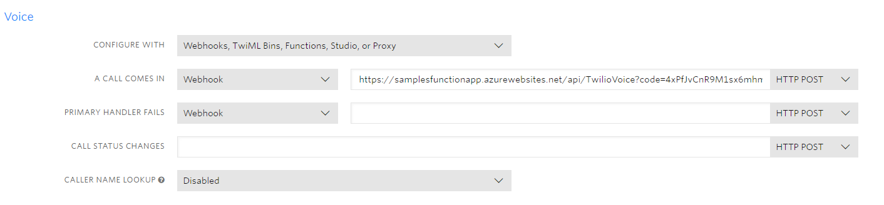

## Testing the logic app

You can test this functionality by taking the following steps –

1. Navigate to the overview page for the logic app in the portal and confirm
   that it is enabled (if it is not, click on the “disabled” link at the top of
   the screen to transition the logic app to an enabled state).
2. Deploy the Simple Marketplace application in Azure Blockchain
   Workbench.
3. Send a text to the Twilio number being tested. Then follow the prompts.
4. The logic app should now be triggered and the code will be executed.
   Upon successful execution, you should see an entry in the Simple Marketplace workbench application.
   If you’d like to look at the execution of the logic app,
   navigate to the logic app in the portal. At the bottom of the screen, you
   will detail for Runs history

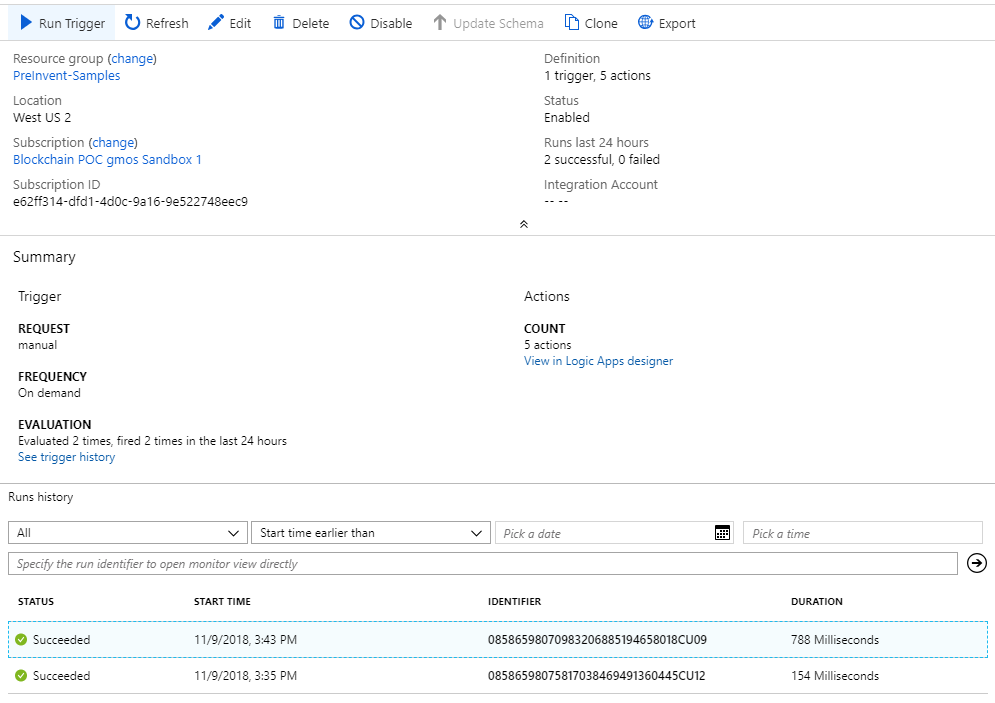

5. Click on the most recent execution of your logic app in the list.  
   This will show details on the trigger and actions executing within the logic
   app and allow you to validate success or troubleshoot reasons for failure.


### In Review

This sample deployed and configured a logic app that will take the results from a Twilio voice session and add a smart contract in an Azure Blockchain Workbench application.

This sample is designed to work with the Simple Marketplace sample application and contracts but can be easily adapted to other contracts by making changes to Service Bus – Send a Message action at the end of the sample to reflect the specifics of the new contract.
