# Introduction 

## What is this sample? 
This project contains a native iOS and Android application built with Xamarin.Forms for Azure Blockchain Workbench.

The application is fully dynamic and will work with any Azure Blockchain Workbench instance. It is designed to work with the Blockchain Workbench REST API through the .NET SDK located here: https://github.com/Azure-Samples/blockchain/tree/master/blockchain-workbench/rest-api-samples/dotnet

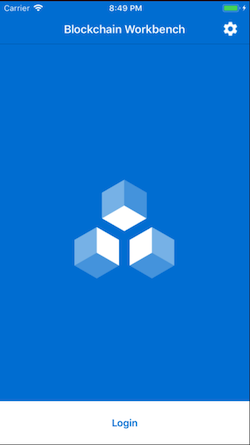    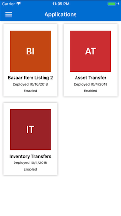    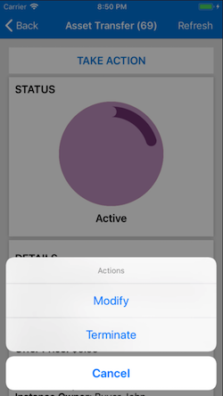    
## Getting Started 
Assuming you have all the Xamarin pre-requisites installed, you will be able to build the project after cloning. 

This app is built with Xamarin.Forms, a cross platform UI toolkit for building Xamarin Apps from a single codebase. If you are new to Xamarin or Xamarin.Forms, Please read and follow the documentation for a primer: https://docs.microsoft.com/en-us/xamarin/xamarin-forms/


## Colors and Theming
This app can be easily themed to colors of your liking. 

In the file `Contants.cs` under the "Helpers" folder in the project `Workbench.Forms`, you will find a set of static properties. 

These properties define the colors that are used to theme the application. Feel free to change them to your liking. 

In top of that, by default the splash background image and login pages use a resource called `logo.png`, which exists in the Resources folders for both the Android and iOS apps. 

Both projects also contain splash pages (`Splashpage.axml` on Android and `Launchscreen.storyboard` on iOS ) that can be modified to your liking.

## Using the App & Limitations
The App works on a permission basis in the same manner as whats available in the Blockchain Workbench web client. 

There are some features that are **not** available on the mobile client, but are otherwise available from the Workbench web application. All changes made in the web application will be seen through to the mobile app, however you cannot initiate these changes from the mobile side:

1. Creating new applications by uploading contract code
2. Modifying/disabling existing applications or workflows
3. Modifying/disabling user roles or user associations with applications
4. Deleting users

The above are **administrative** functions that are not appropriate for the mobile app today and are intended to be done using the website.

Every other action that is available in the web application is also available in the mobile app. 

## Building with AppCenter

AppCenter is a tool that allows you to continiously build your iOS and Android apps,as well as provide features such as Automatic Updates, Analytics and Crash reporting.

In the `Constants.cs` file you will also find two parameters for the AppCenter ID's for the Android and iOS app. These are referenced in the "appcenter-pre-build" shell scripts in both projects and are used for registering the app with AppCenter. The build script injects build environment variables that you can configure in AppCenter in order to dynamically change the ID (in case you end up having multiple branches). 

Please view the AppCenter documentation for more information: https://visualstudio.microsoft.com/app-center/

# Setting up Blockchain Workbench for the Mobile App 


## Step 1: Creating an Active Directory Native App Registration for the mobile client

This sample uses the ADAL libraries on Android and iOS to Authenticate with Active Directory. In order to facilitate this, we have to make a new app registration for the native application:

1. Sign in to the Azure portal.
2. Go to the Active Directory that you are using for Workbench
3. Navigate to the Azure Active Directory > App registrations.
4. Select New application registration.
5. Specify a name for your application, select Native as the application type, and provide the Redirect URI for your application. (http://localhost will work)

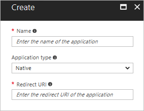

5. Click Create.

## Step 2: Grant Access to the Workbench Application
We now must enable the native application to be exposed to the workbench application that we have already created in our directory during setup.

1. Still in App registrations, select the new native application that you just created.
2. Select **Required permissions**
3. Select **Add**
4. Open the first step, Select an API.
5. Use the search bar to find the Workbench Client app that you have already published when setting up Workbench. Choose that app,then click Select.

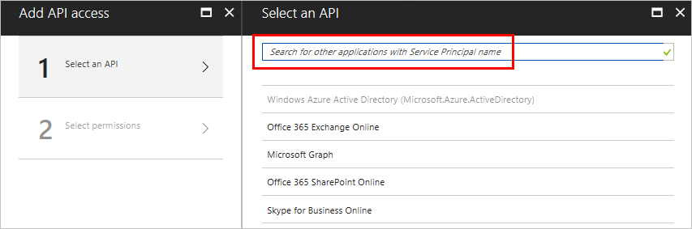

6. Open the second step, **Select Permissions*
7. Use the checkbox to grant the Native application access to the Workbench Client: 

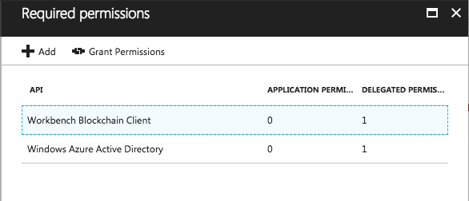

## Getting Workbench Environment Variables and creating your App Configuration JSON

On first launch, the app will prompt you to enter a URL containing a JSON configuration file in order to configure. **You must make sure that this file is publically available so that the app can access it.**

The content of this JSON file is in this format:

```
{
   "ResourceId" : "45d74736-e1c6-4158-a09a-d57f8472693a",
   "ClientId" : "49e54370-e26a-4749-aa61-80b350f629e0",
   "ReturnUrl" : "http://localhost",
   "SiteUrl" : "https://mahdi-7g5q-api.azurewebsites.net/",
   "TenantId" : "c5995154-0468-4735-8d46-349adfde7d08"
}
```

Every "Workbench Environment" in the mobile app consists of four parameters: 

* **ResourceId** - In your Active Directory, this is the value of the "Application ID" for the Workbench Web Client

* **ClientId"** - In your Active Directory, this is the value of the "Application ID" for your newly created "Native Client app Registration"

* **ReturnUrl** - this **must** contain the same value as what you configured as the return Url for the Native Client app registration above

* **SiteUrl** - this is the API endpoint for your Workbench deployment. Its the domain name of your web app appended with a "-api"

* **TenantID** - This is the "Directory ID". You can find this value by Navigating to your Active Directory Settings -> Properties -> under Directory ID

### **When you first start the mobile app, it will ask you to enter in a URL that contains the above JSON configuration file** ###

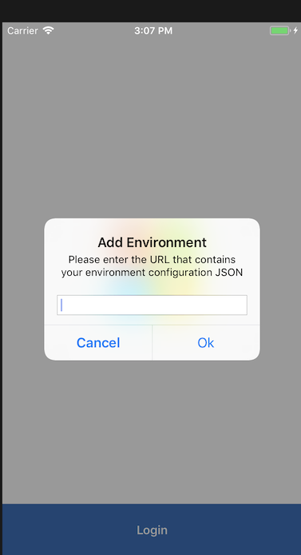

1. Once you have all the configuration values in the JSON payload format as defined above, copy it into an Azure Blob Storage container by uploading it.

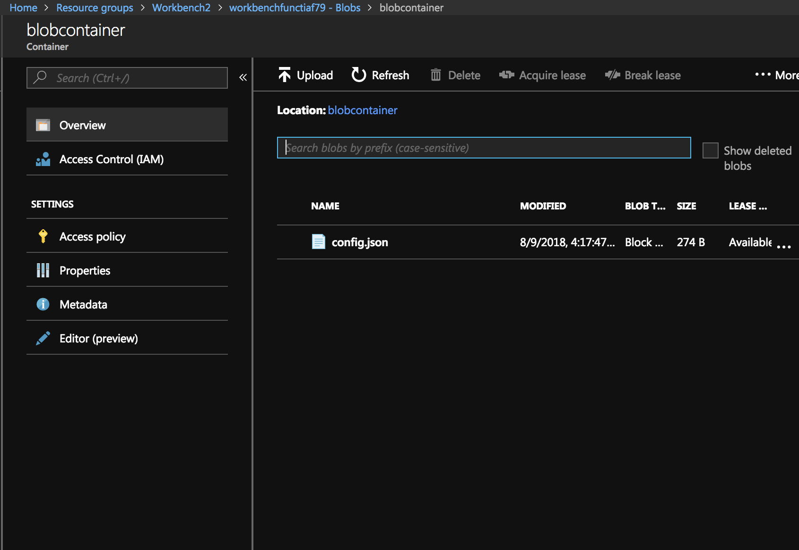

2. **Make sure your blob container has Anonymous read access enabled** 

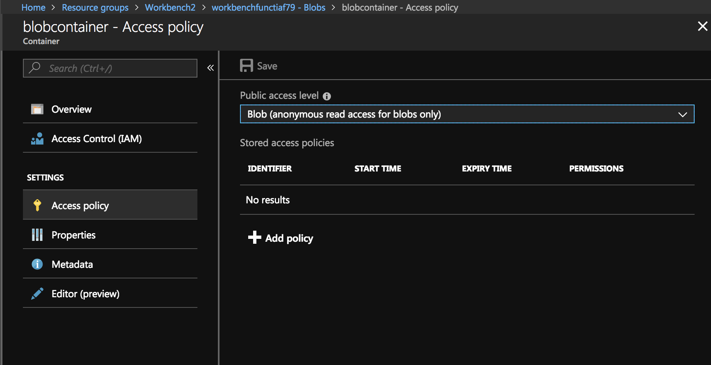

3. You can also inspect your file to make sure the data is correct:

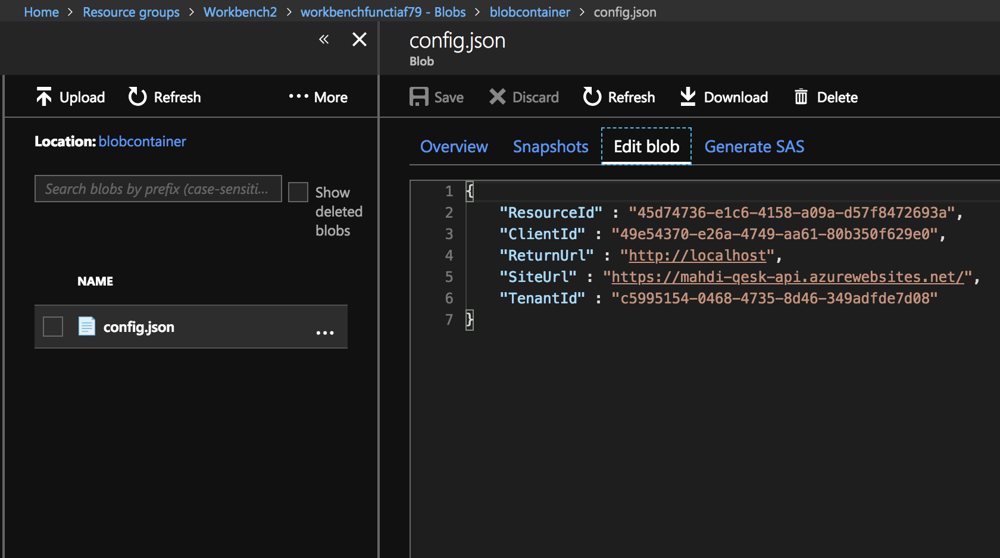

4. Lastly, take note of the URL for your JSON configuration file and input it into the mobile app's prompt:

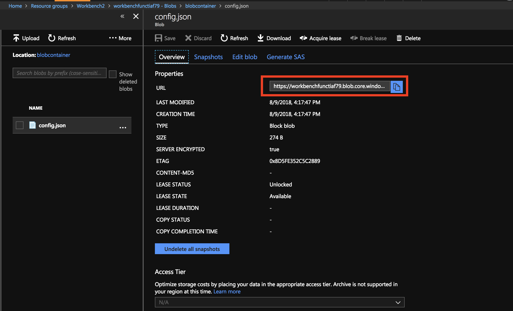

**If you followed the same JSON format as above, the mobile app should pull down the JSON file from your blob container URL. It will then proceed to the login page where you can now sign in.**


# Roadmap

## Code changes and updates 
The mobile app is in active development and improvements will be made to the code structure, with UITests also added. 
The *time* data type is not currently supported in the mobile app - it is being tested and will be released with an update.

## A quick note on auto-refresh
In workbench's current state there is no support for Push Notifications with Azure Notification Hub. This feature is actively being worked on. For the time being, refresh is done by polling the API for any changes. 


# Licenses

This project uses some third-party assets with a license that requires attribution:

- [Xam.Plugins.Settings](https://github.com/jamesmontemagno/SettingsPlugin): by James Montemagno
- [DLToolkit.Forms.Controls](https://github.com/daniel-luberda/DLToolkit.Forms.Controls): by Daniel Luberda
- [Com.Airbnb.Xamarin.Forms.Lottie](https://github.com/martijn00/LottieXamarin/tree/master): by Martijn Van Dijk
- [sqlite-net](https://github.com/praeclarum/sqlite-net): by praeclarum
- [ACR User Dialogs](https://github.com/aritchie/userdialogs): by Allan Ritchie
- [Newtonsoft.Json](https://github.com/JamesNK/Newtonsoft.Json): by James Newton-King
- [Rg.Plugin.Popup](https://github.com/rotorgames/Rg.Plugins.Popup): by Rotorgames
- [SkiaSharp](https://github.com/mono/SkiaSharp): by Mono


