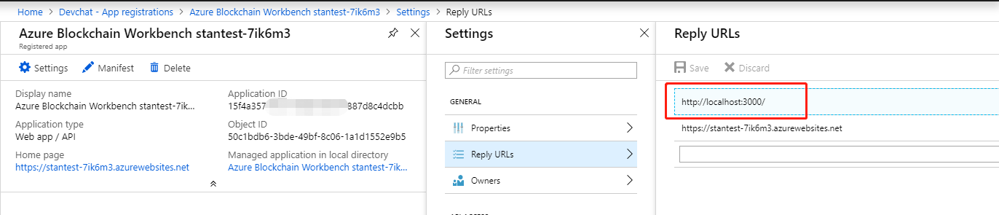
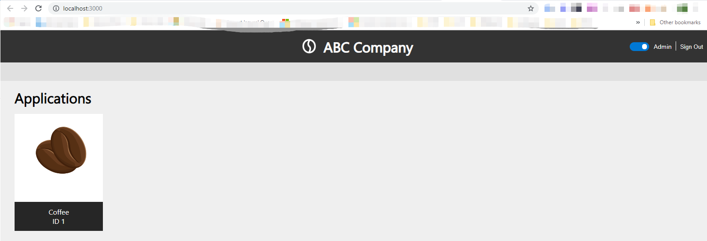

#Supply Chain React App

A web application to illustrate alternate ways of visualizing Workbeanch
applications and contracts. The web application was built using Create React App
and makes API calls to a deployed Workbench instance.

It makes use of properties and actions as defined in the *Coffee* smart contract
and configuration files, available in the root of this source directory.

The demo assumes you want to do development and test locally for rapid
iteration. Once you are happy with the website, you would go through your normal
DevOps processes to deploy this to an Azure AppService or other environment that
will serve this application to consumers.

#Setup

Install Azure Blockchain Workbench following the instructions
[here](https://docs.microsoft.com/en-us/azure/blockchain/workbench/deploy).

Get an API Key for Bing Maps following instructions
[here](https://www.bingmapsportal.com/).

Copy the source code to your development environment.

This sample is designed to showcase an application built for a specific smart
contract. Within Azure Blockchain Workbench, log in as an administrator and
upload the smart contract and configuration file located
[here](https://github.com/Azure-Samples/blockchain/tree/master/blockchain-development-kit/connect/web/workbench/custom-ux-sample/smart_contracts).

From a command prompt, install NPM modules from the directory that contains the
package.json file:

\$ npm install --no-optional

Within the source code navigate to src\\common and open the config.json file in
an editor, e.g. VS Code

There will be parameters that you will populate –

| Config.baseUrl    | This is the API application url of your Azure blockchain workbench deployment                                                                                                                                                              |
|-------------------|--------------------------------------------------------------------------------------------------------------------------------------------------------------------------------------------------------------------------------------------|
| Config.aad.tenant | This is the name of your Azure AD Name                                                                                                                                                                                                     |
| Config.aad.appId  | The value of the application ID of the Azure AD application created during workbench deployment. Additional details can be found [here](https://docs.microsoft.com/en-us/azure/blockchain/workbench/deploy#azure-ad-configuration-script). |
| Config.bingmaps   | The key for Bing maps which is used with the example pages that display provenance data on a map.                                                                                                                                          |

You can then add the local development environment as a reply URL for the [Azure
AD application created during workbench
deployment.](https://docs.microsoft.com/en-us/azure/blockchain/workbench/deploy#azure-ad-configuration-script)

You are now ready to run a local instance of the web app:

\$ npm start

Once you log in you will see an alternate rendering of the Azure Blockchain
Workbench UX.

It will start with a new rendering of the applications page, as can be seen
below.

