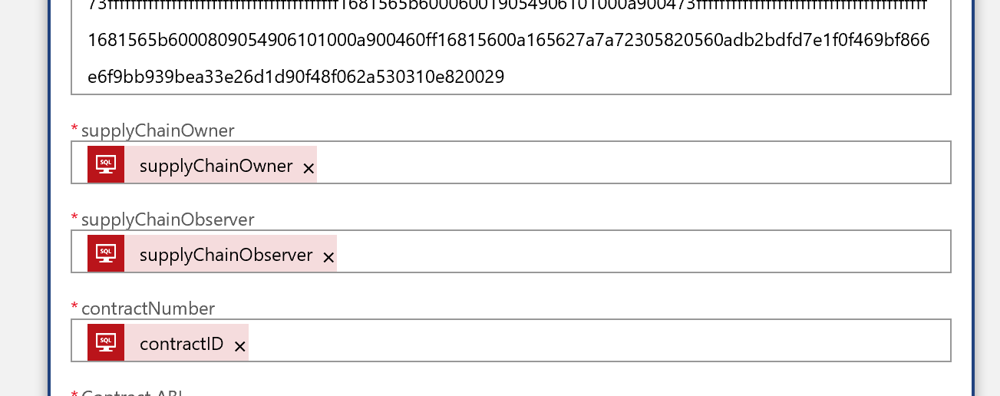

# Add Ethereum ledger data to Azure Search using the Ethereum Logic App Connector


This sample shows you how to take ledger data from an Ethereum ledger and add that information to Azure Search. This allows ledger data to be available to a broad range of Enterprise applications, as well as allow for unstructured searching of contract data from users. 

This sample uses the Ethereum and the SQL Server Logic App Connectors available in the Azure marketplace in addition to the Azure Search service.

## Contents

| File/folder       | Description                                                  |
| ----------------- | ------------------------------------------------------------ |
| `media`           | Images used in this README                                   |
| `contract`        | An example Solidity contract, ABI and bytecode files used to configure the logic apps used in this sample |
| `.gitignore`      | Define what to ignore at commit time.                        |
| `CHANGELOG.md`    | List of changes to the sample.                               |
| `CONTRIBUTING.md` | Guidelines for contributing to the sample.                   |
| `README.md`       | This README file.                                            |
| `LICENSE`         | The license for the sample.                                  |

## Prerequisites

- A public Ethereum RPC endpoint - you may create one from Azure here
- An [Azure SQL database](https://docs.microsoft.com/en-us/azure/sql-database/sql-database-technical-overview) - you only need a single database
- An Ethereum contract. This sample is based on the  `BasicProvenance` contract included in the `contract` directory located on the root of this sample

## Setup

1. [Create a database](https://docs.microsoft.com/en-us/azure/sql-database/sql-database-single-database-get-started) in your SQL Server.

   1. Name the database `provenancecontract`

   2. Using the [built in](https://docs.microsoft.com/en-us/azure/sql-database/sql-database-single-database-get-started#query-the-database) Azure Query Editor, connect to your data base as shown in the online documentation

   3. Once connected, in Query Editor, cut and paste the following SQL query and select `Run`

      ```sql
      CREATE TABLE contractrecords (id int NOT NULL IDENTITY(1,1) PRIMARY KEY, contractID VARCHAR(50), supplyChainOwner VARCHAR(50), supplyChainObserver VARCHAR(50), contractAddress VARCHAR(50));
      ```

2. Deploy Azure Search from the [Azure portal](https://docs.microsoft.com/en-us/azure/search/search-create-service-portal)

3. Once deployment is complete copy your [service API key](https://docs.microsoft.com/en-us/azure/search/search-create-index-rest-api#identify-your-azure-search-services-admin-api-key) 

4. Using Postman or Fiddler create an Azure Search index by sending a `POST` request the the service REST interface in this format

   `URL`

   ```http
   https://<yoursearchservice>.search.windowsnet
   ```

   `header`

   ```http
   Content-Type: application/json
   api-key: <yourapikeyfromAzureportal>
   ```

   `body`

   ```json
   {
        "name": "contracts",  
        "fields": [
          {"name": "contractAddress", "type": "Edm.String", "key":true, "searchable": false},
          {"name": "transactionHash", "type": "Edm.String", "searchable":false},
          {"name": "contractID", "type": "Edm.String"},
          {"name": "supplyChainObserver", "type": "Edm.String"},
          {"name": "supplyChainOwner", "type": "Edm.String"}
         ]
        }
   ```

5. Create a new [Azure Logic App](https://docs.microsoft.com/en-us/azure/logic-apps/quickstart-create-first-logic-app-workflow) 

6. In the Azure portal, select your new logic app and select the logic app designer, create a new *blank* logic app

7. In Logic App Designer build the following logic app flow

   1. Search for the SQL server logic app and select the `when an item is created` action

      1. If necessary, provide the connection credentials to your database server in the logic app
      2. In the `Table name` field type in `contractrecords` as shown below

      

   2. Add an Ethereum Logic App connector with the action `deploy a smart contract` 

   3. Cut and paste the ABI from your own contract, or from the example contract located in the `contract` directory of this sample into ABI field in the Ethereum Logic App connector

   4. Cut and paste the application bytecode from your own contract, or from the example contract located in the `contract` directory of this sample into ABI field in the Ethereum Logic App connector

   5. Finally use the dynamic text fields to provide inputs for `supplyChainOwner`, `supplyChainObserver` and `contractNumber` as shown below

      

   6. Next add an `HTTP` action to your logic app flow

      1. Create a `POST` method and add your Azure Search `URI` and `api-key` into the header fields
      2. In the `body` field add the following (replace the text inside the <> braces below with the dynamic fields in the designer manually)

      ```json
      {
        "value": [
          {
            "@@search.action": "upload",
            "contractAddress": "<contractAddress>",
            "contractID": "<contractID>",
            "supplyChainObserver": "<supplyChainObserver>",
            "supplyChainOwner": "<supplyChainOwner>",
            "transactionHash": "<TransactionHash>"
          }
        ]
      }
      ```

   7. Your final logic app flow should look like the below

      

   


## Running the sample

1. In the Query Editor paste this SQL query and select `Run`

   ```sql 
   INSERT INTO contractrecords (contractID, supplyChainOwner, supplyChainObserver) VALUES (1234, '0x9a5773d9ec637f21a3007deb8c876c77b6fbb0ec', '0x9a5773d9ec637f21a3007deb8c876c77b6fbb0ec');
   ```

2. Upon executing the above SQL statement, the logic app will create a new contract on the Ethereum blockchain and contract data will be sent to Azure Search. 

3. This contract data is now available to any application with access to your Azure Search index through simple search queries via either `POST` or `GET` methods.

   You may use either Postman or Fiddler to test your queries with the `POST` or `GET` methods below:

   ### Search using POST

   `URL`

   ```http
   https://<yoursearchservice>.search.windowsnet/indexes/contracts/docs/search?api-version=2017-11-11
   ```

   `header`

   ```http
   Content-Type: application/json
   api-key: <yourapikeyfromAzureportal>
   ```

   `body`

   ```json
   {
       "search": "1234",
       "select": "contractAddress"
   }
   ```

   ### Search using GET

   `URL`

   ```http
   https://<yoursearchservice>.search.windowsnet/indexes/contracts/docs?search=1234&api-version=2017-11-11
   ```

   `header`

   ```http
   Content-Type: application/json
   api-key: <yourapikeyfromAzureportal>
   ```

   

## Key concepts

Let's take a quick review of what's happening in this example. 

- A new entry into a SQL table is added. In this case we are using simple SQL queries added via the Azure Query editor, but in practice these may come from any number of backend systems which track contract creation and status
- After being triggered by the new table entry, the logic app flow gets the newly added information from the SQL server
- With the new SQL data, the Ethereum Logic App creates a new Provenance Contract as defined in the `BasicProvenance.sol` file included in this sample
- Once the contract is created the Ethereum Logic App sends the new contract and creation information into Azure Search where it is available to any service with access to the search index.

## Next steps

You can learn more about the Ethereum Logic App Connector and the various triggers and actions on the [official documentation site](https://docs.microsoft.com/en-us/connectors/blockchainethereum/).