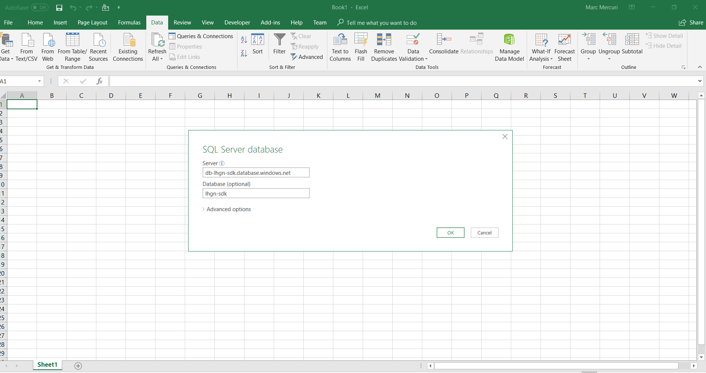
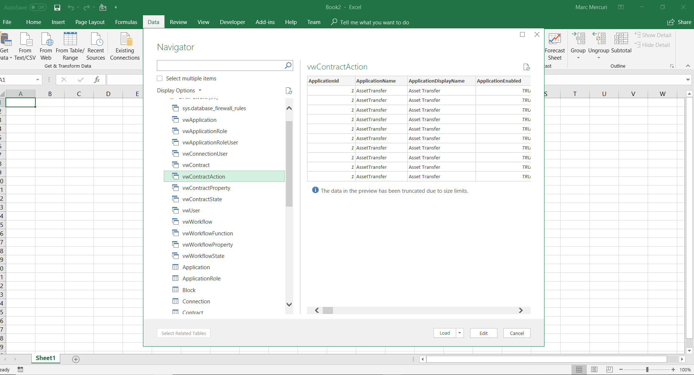

Using Azure Blockchain Workbench Data with Microsoft Excel
==========================================================

Microsoft Excel provides the ability to import and interact with data in Azure
SQL DB, and this includes the database populated by Azure Blockhain Workbench’s
SQL DB.

This section contains a step by step walkthrough of how to connect to Azure
Blockchain Workbench’s SQL Database from within Microsoft Excel.

Microsoft Excel to data in Azure Blockchain Workbench
-----------------------------------------------------

Open Microsoft Excel.

Click on the “Get Data” tab.

Select “From Azure” and then “From Azure SQL DB”

Enter in the Azure Blockchain Workbench server and database information and
click the OK button.

You will next provide your login credentials to access data in the Azure
Blockchain Workbench SQL DB.

Click the Database link on the left side of the dialog and enter your database
user credentials.

If you are using the credentials created by the Azure Blockchain Workbench
deployment process, the username will be dbadmin and the password will be the
one you provided during deployment.

After connecting to the database, you will be presented with the Navigator
dialog.

Once connected to the database, the Navigator dialog will display the tables and
views available within the database. The views are designed for reporting and
are all prefixed ‘vw’.

Select the view you wish to include.

For demonstration purposes select vwContractAction which contains details on all
of the actions that have taken place on a contracts in Azure Blockchain
Workbench.

Clicking the “Load” button will retrieve the data and place it in your Excel
Workbook.

You can now utilize all of the features of Excel with the metadata and
blockchain transaction data held within the Azure Blockchain Workbench “off
chain” store.
