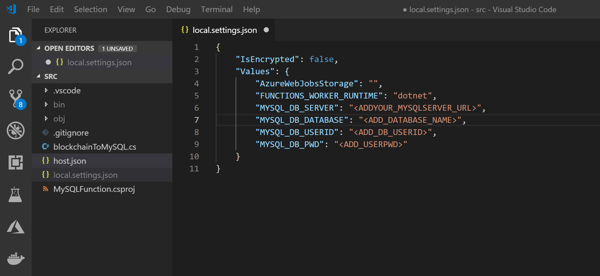
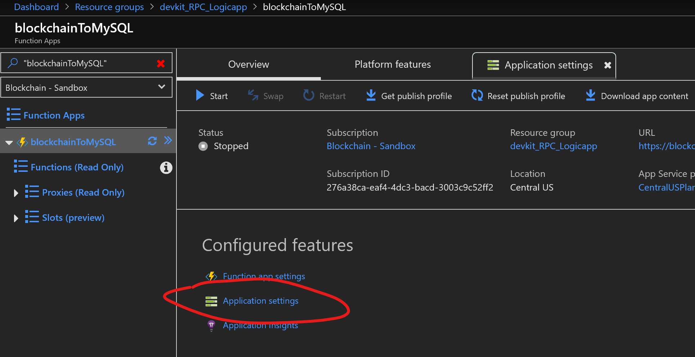
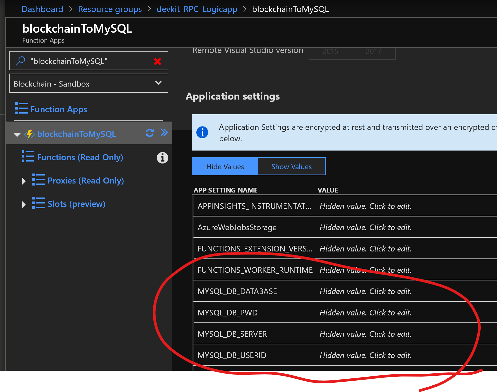
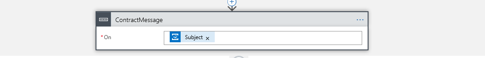
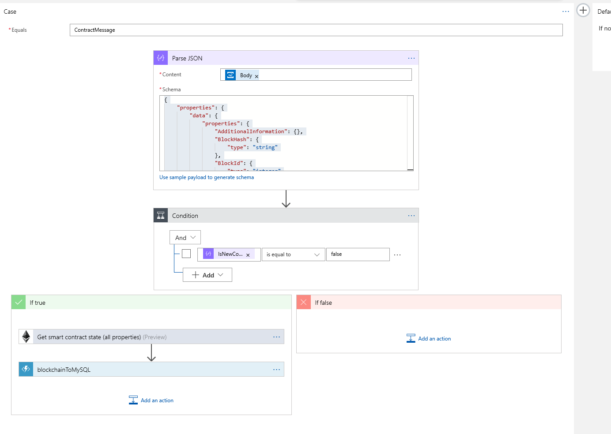
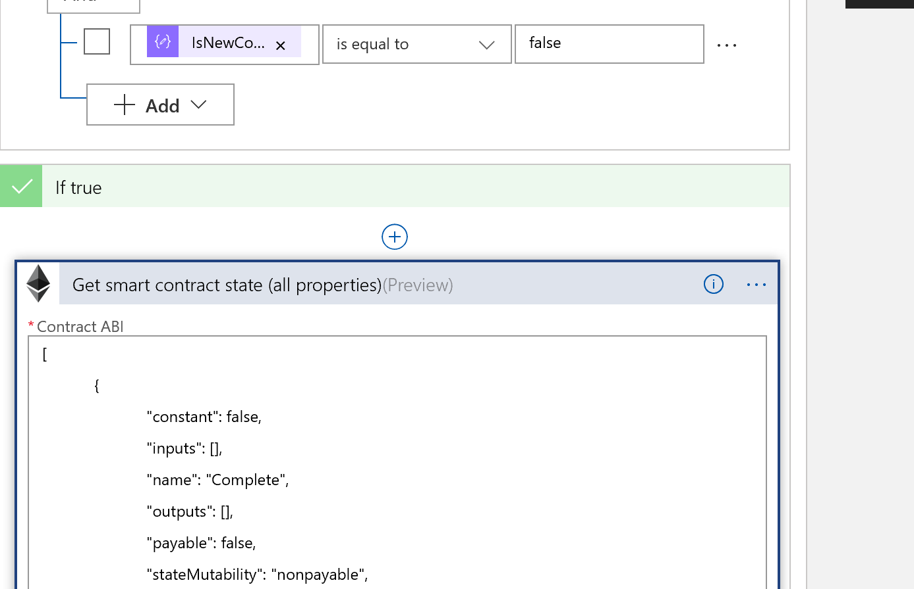
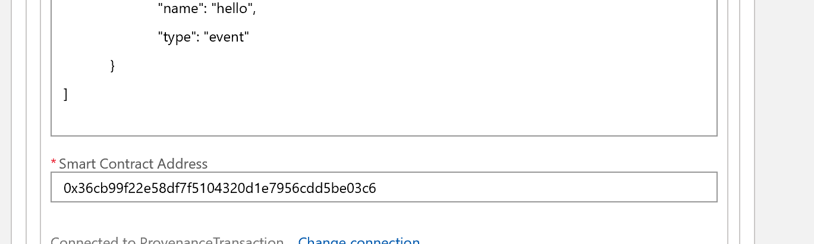
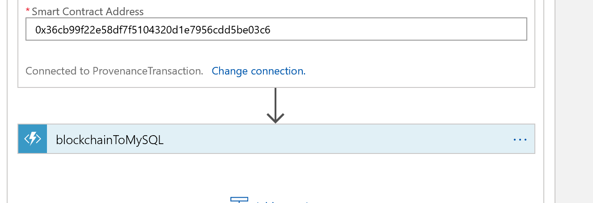
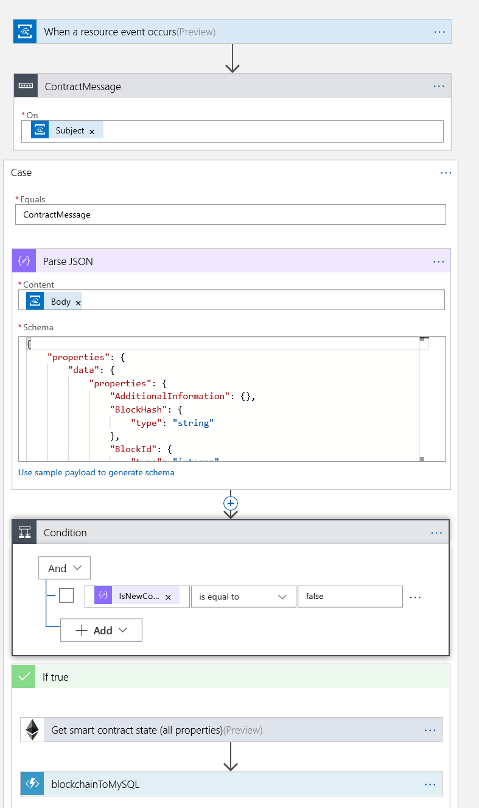

# Connect and add blockchain data to a MySQL Database using the Ethereum Logic App Connector


This sample shows you how to use the Azure Ethereum Logic App and an Azure Function to store blockchain events in a MySQL database.

## Contents

| File/folder | Description |
|-------------|-------------|
| `src`       | Sample source code. |
| `media` | Images used in this README |
| `schema` | A JSON schema file used in the logic app JSON parser needed in this sample. |
| `.gitignore` | Define what to ignore at commit time. |
| `CHANGELOG.md` | List of changes to the sample. |
| `CONTRIBUTING.md` | Guidelines for contributing to the sample. |
| `README.md` | This README file. |
| `LICENSE`   | The license for the sample. |

## Prerequisites

- An [Azure Blockchain Workbench](https://azure.microsoft.com/en-us/features/blockchain-workbench/) instance with a public Ethereum RPC endpoint 
- An [Azure MySQL database](https://docs.microsoft.com/en-us/azure/mysql/quickstart-create-mysql-server-database-using-azure-portal)
- A [MySQL explorer](https://dev.mysql.com/downloads/)
- An Ethereum contract. You may use your own, or one included in the Blockchain Workbench or in the Blockchain Development Kit

## Setup

1. Clone or download this sample repository

2. Open the Visual Studio Code project in `./src` 

    1. To test the project locally, you must add a `local.settings.json` file to the project and add your MySQL database credentials as shown below

        

    2. To test and run this Azure Function in the cloud you must add these same credentials to the application settings for the Azure Function

        

        After selecting `Application Settings` scroll down until you see the `Application Settings` area of the tab. Insert your key/values as shown below (all key/value pairs are encrypted at rest in Azure)

        

3. [Create a database and table](https://docs.microsoft.com/en-us/azure/mysql/tutorial-design-database-using-portal#connect-to-the-server-using-mysql) in your MySQL server.

    1. Name the database `blockchaintestdb`
    2. Name the table `contractaction`

4. Create a new [Azure Logic App](https://docs.microsoft.com/en-us/azure/logic-apps/quickstart-create-first-logic-app-workflow) and deploy it to the same Azure subscription your Azure Blockchain Workbench resides

5. In the Azure portal, select your new logic app and select the logic app designer, create a new *blank* logic app

6. In Logic App Designer build the following logic app flow

    1. Add an Event Grid watcher to the logic app designer

        

        1. Enter the subscription where you have deployed Azure Blockchain Workbench
        2. Select `Microsoft.EventGrid.Topics` as the resource name
        3. Select the event grid resource name created when you deployed workbench (search your resource group for event grid and get the resource name from the portal)

    2. Next add a switch case conditional statement block and add "subject" as the switch condition

        

    3. In the case statement type in `ContractMessage` as the case condition

    4. Add an action to parse the incoming JSON

        1. In the parse JSON step, select `body` as the content section and cut and paste the schema contained in ``./schema/logic/appParseSchema.txt`` into the Schema window

        

    5. Next we want to add an evaluation of the contract status. Workbench gives us updates on many things, in this sample we are tracking updates to an existing contract. Thus we want to filter out messages related to new contracts being added. Add a filter and select `IsNewContract` as the filter condition

         

    6. For the "if true" branch of the above condition, you want to add the Ethereum Logic App connector - Get smart contract state (all properties) action

        1. Upload your contracts ABI to the connector
        2. Add the address of your deployed contract to the connector

        

        

    7. Finally add the Azure Function `blockchainToMySQL` that you uploaded earlier

        

    8. The finished logic app connections should look like this

        

         


## Running the sample

1. Make sure the your `blockchainToMySQL` function and Azure logic app are running

2. Create and execute a few transaction/state changes in your contract.

3. Connect your MySQL explorer to your server and `contractactions` table and execute the following SQL statement

   ```sql 
    SELECT * FROM contractaction
   ```

4. For every state change you should see the SQL table add a new row with all parties and state transactions recorded as shown in the example below

   


## Key concepts

Let's take a quick review of what's happening in this example. 

* Contract events that happen on the blockchain are sent to an Azure Event Hub
* An Azure Logic App monitors that Event Hub for notifications of new contract events
* Upon a receipt of a new contract event the Ethereum Logic App Connector queries the blockchain at the address of a contract we are monitoring and pulls the current contract status
* The Ethereum Logic App Connector then forwards the current contract status to a custom Azure Function
    ```JSON
        "body": {
        "PreviousCounterparty": "0x0123...",
        "SupplyChainObserver": "0x4567...",
        "Counterparty": "0x0000...",
        "SupplyChainOwner": "0x89ab...",
        "InitiatingCounterparty": "0xcdef...",
        "State": "2"
    }
    ```

* The Azure Function is parsing the contract status JSON and inserts that into a MySQL table
    ```c#
    string requestBody = await new StreamReader(req.Body).ReadToEndAsync();
            dynamic data = JsonConvert.DeserializeObject(requestBody);
    ```

    ```c#
    command.CommandText = @"INSERT INTO contractaction (previouscounterparty, supplychainobserver, counterparty, supplychainowner, initiatingcounteraparty, state) VALUES (@_previouscounterparty, @_supplychainobserver, @_counterparty, @_supplychainowner, @_initiatingcounteraparty, @_state);";
    ```

* Finally, you are viewing a record of all smart-contract actions as recorded in a MySQL database by querying the database using the MySQL workbench database viewer and selecting all records from the database `contractaction`


## Next steps

You can learn more about the Ethereum Logic App Connector and the various triggers and actions on the [official documentation site](https://docs.microsoft.com/en-us/connectors/blockchainethereum/).