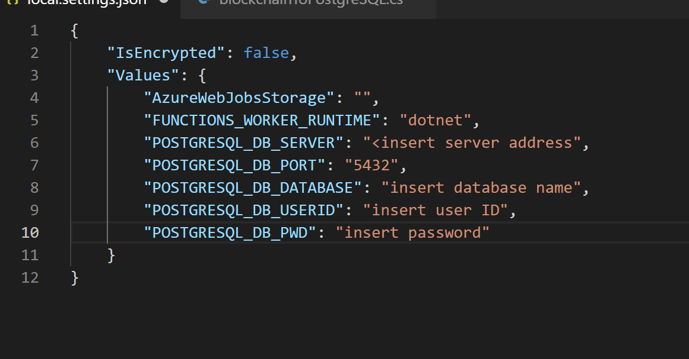
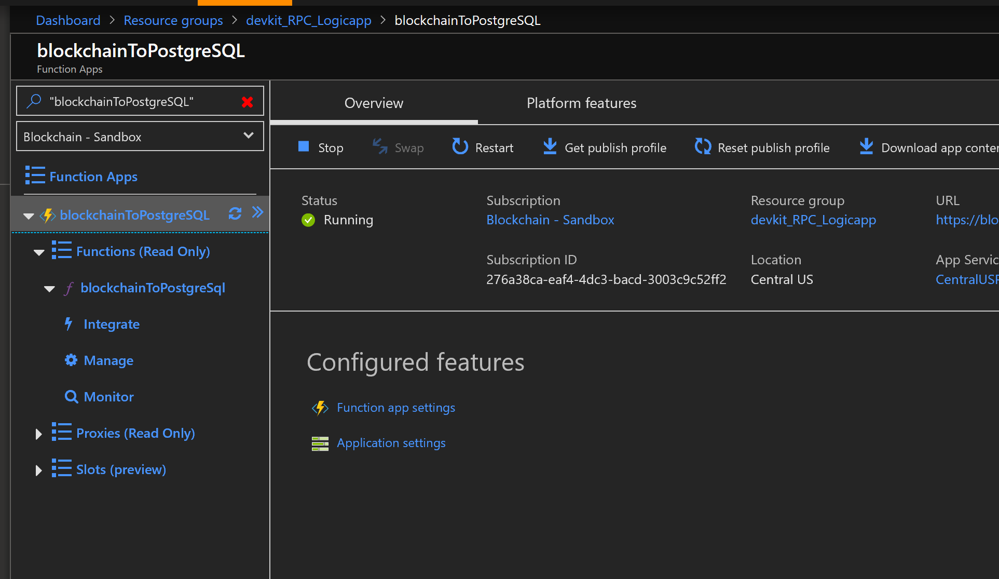
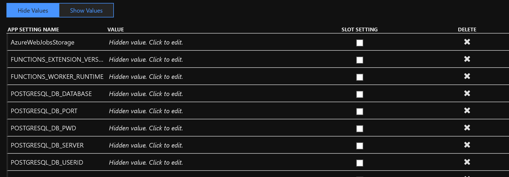
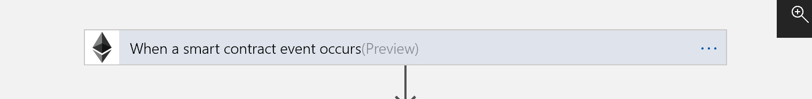
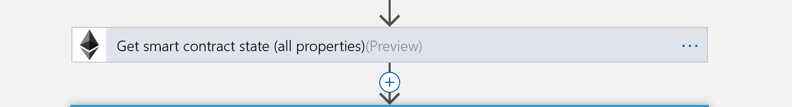
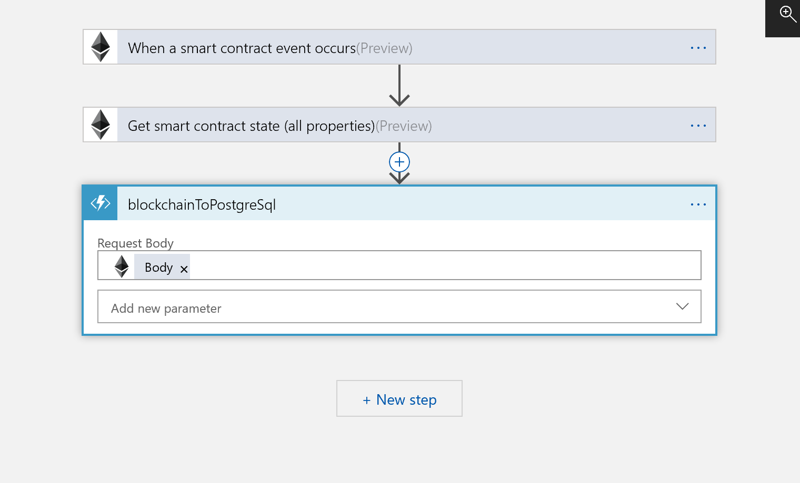
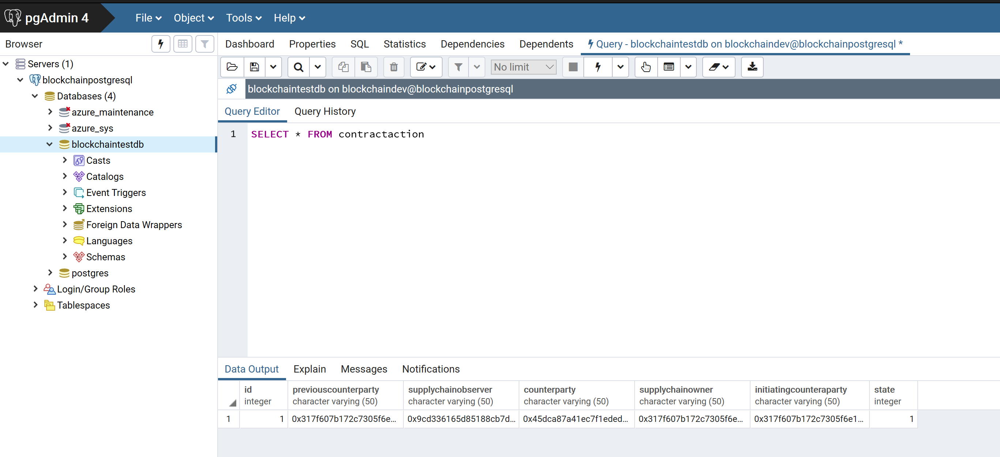

# Connect and add blockchain data to a PostgreSQL Database using the Ethereum Logic App Connector


This sample, which is similar to the [MySQL sample](../mysql),  shows you how to use the Azure Ethereum Logic App and an Azure Function to store blockchain events in a PostgreSQL database.

The preliminary difference in this sample is that in this PostgreSQL sample, we are monitoring the contract stored on the blockchain directly for any events the contract itself creates. This sample uses the Azure Ethereum Logic App to monitor the contract for events, and upon being triggered by the contract,  the logic app queries the contract for its current state. That state is written to a PostgreSQL database using the same schema as the MySQL sample.

## Contents

| File/folder | Description |
|-------------|-------------|
| `src`       | Sample source code. |
| `media` | Images used in this README |
| `contract` | An example Solidity contract and ABI. This contract contains an "emit" function which generates an event that the logic app is triggered on. |
| `.gitignore` | Define what to ignore at commit time. |
| `CHANGELOG.md` | List of changes to the sample. |
| `CONTRIBUTING.md` | Guidelines for contributing to the sample. |
| `README.md` | This README file. |
| `LICENSE`   | The license for the sample. |

## Prerequisites

- Optional - [Azure Blockchain Workbench](https://azure.microsoft.com/en-us/features/blockchain-workbench/) instance with a public Ethereum RPC endpoint 
- An [Azure PostgreSQL database](https://docs.microsoft.com/en-us/azure/postgresql/quickstart-create-server-database-portal)
- [pgAdmin](https://www.pgadmin.org/) A PostgreSQL database explorer
- An Ethereum contract. You may use your own, or one included in the `contract` directory in this sample

## Setup

1. Clone or download this sample repository

2. Open the Visual Studio Code project in `./src` 

    1. To test the project locally, you must add a `local.settings.json` file to the project and add your PostgreSQL database credentials as shown below

        

    2. To test and run this Azure Function in the cloud you must add these same credentials to the application settings for the Azure Function

        

        After selecting `Application Settings` scroll down until you see the `Application Settings` area of the tab. Insert your key/values as shown below (all key/value pairs are encrypted at rest in Azure)

        

3. [Create a database and table](https://docs.microsoft.com/en-us/azure/postgresql/quickstart-create-server-database-portal#connect-to-the-postgresql-database-using-psql) in your PostgreSQL server.

    1. Name the database `blockchaintestdb`

    2. Name the table `contractaction` using this SQL statement

        ```sql
        CREATE TABLE contractaction (id serial PRIMARY KEY, previouscounterparty VARCHAR(50), supplychainobserver VARCHAR(50), counterparty VARCHAR(50), supplychainowner VARCHAR(50), initiatingcounteraparty VARCHAR(50), state INTEGER);
        ```

4. Create a new [Azure Logic App](https://docs.microsoft.com/en-us/azure/logic-apps/quickstart-create-first-logic-app-workflow) and deploy it to the same Azure subscription your Azure Blockchain Workbench resides

5. In the Azure portal, select your new logic app and select the logic app designer, create a new *blank* logic app

6. In Logic App Designer build the following logic app flow

    1. Add the Ethereum Logic App connector, select the trigger `when a smart contract event occurs` as shown below

        

    2. Cut and paste the ABI from your own contract, or from the example contract located in the `contract` directory of this sample

    3. Cut and paste the address of your contract into the address field of this connector and save.

    4. Add a 2nd Ethereum Logic App connector. This time select the action `Get contract state (all properties)` as shown below

        

    5. Finally add the last action, connect this to your `blockchainToPostgreSQL` Azure Function you uploaded earlier

    6. Add the \`body` as the input into the  Azure Logic App from the dynamic content menu

    7. The final logic app flow should look like this

        

        


## Running the sample

1. Make sure the your `blockchainToPostgreSQL` function and Azure logic app are running

2. Create and execute a few transaction/state changes in your contract.

3. Connect your PostgreSQL explorer to your server and `contractactions` table and execute the following SQL statement

   ```sql 
    SELECT * FROM contractaction
   ```

4. For every state change you should see the SQL table add a new row with all parties and state transactions recorded as shown in the example below

   


## Key concepts

Let's take a quick review of what's happening in this example. 

* Contract events that happen on the blockchain are emitted by the Ethereum EVM as events that the Azure Ethereum Logic App is triggered on
* After being triggered a 2nd Azure Ethereum Logic App then takes an action to query the blockchain at the address of a contract we are monitoring and pulls the current contract status
* The Ethereum Logic App Connector then forwards the current contract status to a custom Azure Function
    ```JSON
        "body": {
        "PreviousCounterparty": "0x0123...",
        "SupplyChainObserver": "0x4567...",
        "Counterparty": "0x0000...",
        "SupplyChainOwner": "0x89ab...",
        "InitiatingCounterparty": "0xcdef...",
        "State": "2"
    }
    ```

* The Azure Function is parsing the contract status JSON and inserts that into a PostgreSQL table
    ```c#
    string requestBody = await new StreamReader(req.Body).ReadToEndAsync();
            dynamic data = JsonConvert.DeserializeObject(requestBody);
    ```

    ```c#
    command.CommandText = @"INSERT INTO contractaction (previouscounterparty, supplychainobserver, counterparty, supplychainowner, initiatingcounteraparty, state) VALUES (@_previouscounterparty, @_supplychainobserver, @_counterparty, @_supplychainowner, @_initiatingcounteraparty, @_state);";
    ```

* Finally, you are viewing a record of all smart-contract actions as recorded in a PostgreSQL database by querying the database using the PostgreSQL workbench database viewer and selecting all records from the database `contractaction`


## Next steps

You can learn more about the Ethereum Logic App Connector and the various triggers and actions on the [official documentation site](https://docs.microsoft.com/en-us/connectors/blockchainethereum/).