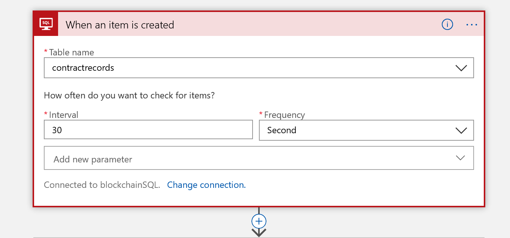
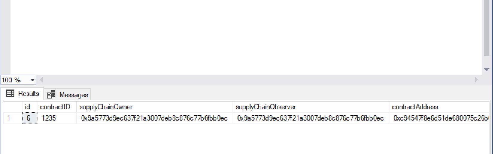

# Add SQL data to an Ethereum ledger using the Ethereum Logic App Connector


This sample shows you how to take SQL data from a SQL table and create a new contract on the Ethereum blockchain ledger based on the table data. Once created we also show how to update the SQL table with the contract address for recordkeeping purposes. 

This sample uses the Ethereum and the SQL Server Logic App Connectors available in the Azure marketplace. 

## Contents

| File/folder | Description |
|-------------|-------------|
| `media` | Images used in this README |
| `contract` | An example Solidity contract, ABI and bytecode files used to configure the logic apps used in this sample |
| `.gitignore` | Define what to ignore at commit time. |
| `CHANGELOG.md` | List of changes to the sample. |
| `CONTRIBUTING.md` | Guidelines for contributing to the sample. |
| `README.md` | This README file. |
| `LICENSE`   | The license for the sample. |

## Prerequisites

- A public Ethereum RPC endpoint - you may create one from Azure here
- An [Azure SQL database](https://docs.microsoft.com/en-us/azure/sql-database/sql-database-technical-overview) - you only need a single database
- An Ethereum contract. This sample is based on the  `BasicProvenance` contract included in the `contract` directory located on the root of this sample

## Setup

1. [Create a database](https://docs.microsoft.com/en-us/azure/sql-database/sql-database-single-database-get-started) in your SQL Server.

    1. Name the database `provenancecontract`

    2. Using the [built in](https://docs.microsoft.com/en-us/azure/sql-database/sql-database-single-database-get-started#query-the-database) Azure Query Editor, connect to your data base as shown in the online documentation

    3. Once connected, in Query Editor, cut and paste the following SQL query and select `Run`

        ```sql
        CREATE TABLE contractrecords (id int NOT NULL IDENTITY(1,1) PRIMARY KEY, contractID VARCHAR(50), supplyChainOwner VARCHAR(50), supplyChainObserver VARCHAR(50), contractAddress VARCHAR(50));
        ```

2. Create a new [Azure Logic App](https://docs.microsoft.com/en-us/azure/logic-apps/quickstart-create-first-logic-app-workflow) 

3. In the Azure portal, select your new logic app and select the logic app designer, create a new *blank* logic app

4. In Logic App Designer build the following logic app flow

    1. Search for the SQL server logic app and select the `when an item is created` action

        1. If necessary, provide the connection credentials to your database server in the logic app
        2. In the `Table name` field type in `contractrecords` as shown below

        

    2. Add an Ethereum Logic App connector with the action `deploy a smart contract` 

    3. Cut and paste the ABI from your own contract, or from the example contract located in the `contract` directory of this sample into ABI field in the Ethereum Logic App connector

    4. Cut and paste the application bytecode from your own contract, or from the example contract located in the `contract` directory of this sample into ABI field in the Ethereum Logic App connector

    5. Finally use the dynamic text fields to provide inputs for `supplyChainOwner`, `supplyChainObserver` and `contractNumber` as shown below

        

    6. Next add a 2nd SQL Server Logic App Connector with the action `Execute a SQL query` in the query field type the following SQL query string

        ```sql
        UPDATE contractrecords SET contractAddress = '
        ```

        Note: You must include the string escape character `'` after the `=` sign to properly handle the hex user identifiers in the table

    7. Use the dynamic text fields to insert  `Smart Contract Address` into the query

    8. Add the final bits of the SQL query string

        ```sql
        ' WHERE contractID =
        ```

    9. Use the dynamic text fields to insert `contractID` into the query

    10. The final logic app flow looks like this

        

        


## Running the sample

1. In the Query Editor paste this SQL query and select `Run`

   ```sql 
   INSERT INTO contractrecords (contractID, supplyChainOwner, supplyChainObserver) VALUES (1234, '0x9a5773d9ec637f21a3007deb8c876c77b6fbb0ec', '0x9a5773d9ec637f21a3007deb8c876c77b6fbb0ec');
   ```

2. Upon executing the above SQL statement, the logic app will create a new contract on the Ethereum blockchain and the address of that contract will then be appended to your table entry. To view the contract address type paste this SQL query into the Query Editor and run it

   ```sql
   SELECT * FROM contractrecords;
   ```

3. On completion of the above query, you should see something similar to the below

   Note: The actual contract address comes from the ledger. Your values will be different

   


## Key concepts

Let's take a quick review of what's happening in this example. 

* A new entry into a SQL table is added. In this case we are using simple SQL queries added via the Azure Query editor, but in practice these may come from any number of backend systems which track contract creation and status
* After being triggered by the new table entry, the logic app flow gets the newly added information from the SQL server
* With the new SQL data, the Ethereum Logic App creates a new Provenance Contract as defined in the `BasicProvenance.sol` file included in this sample
* Once the contract is created the Ethereum Logic App sends the new contract address back to a SQL server logic app connector which writes the new contract address into the SQL record


## Next steps

You can learn more about the Ethereum Logic App Connector and the various triggers and actions on the [official documentation site](https://docs.microsoft.com/en-us/connectors/blockchainethereum/).