# Parse CSV Flat File on upload and Create Contract Action

## Overview

This logic app will parse the comma separated values from a flat file when uploaded to an FTP server and place them in a contract on chain. The app will use a connector to be notified when new files are available.

Specifically –

- It will look for newly updated files on a periodic basis
- It obtains the file from your FTP server
- Parses the CSV contents of the file
- Adds a Recall Event for each record to the Recall Events Registry contract

<a href="https://portal.azure.com/#create/Microsoft.Template/uri/https%3A%2F%2Fraw.githubusercontent.com%2FAzure-Samples%2Fblockchain%2Fmaster%2Fblockchain-development-kit%2Fintegrate%2Fftp%2Finbound%2Fblockchain-workbench%2Fdeploy%2FLogicApp.json" target="_blank">    </a> <a href="http://armviz.io/#/?load=https%3A%2F%2Fraw.githubusercontent.com%2FAzure-Samples%2Fblockchain%2Fmaster%2Fblockchain-development-kit%2Fintegrate%2Fftp%2Finbound%2Fblockchain-workbench%2Fdeploy%2FLogicApp.json" target="_blank"></a>

## Pre-Requisites

The pre-requisites for this sample include -

- An FTP server
- An Azure Blockchain Workbench deployment with a Recall Event Registry application and the registry opened

## Of Note

This sample is designed to work with the Recall Event Audit contract.

## Create a Function App

Navigate to the Azure portal at <http://portal.azure.com>

Click the + symbol in the upper left corner of the screen to add a new resource.

Search for and select Function App and then click Create.

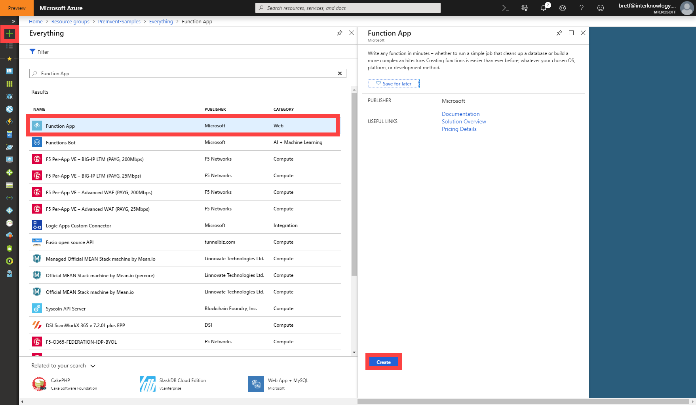

Choose a name for the Function App, make sure .NET is chosen for the Runtime Stack and then click Create.

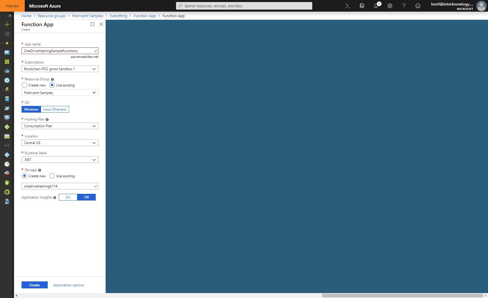

Once your Function app is deployed, navigate to the resource.  In the Function App, click the + button next to the Functions entry to create a new Function.

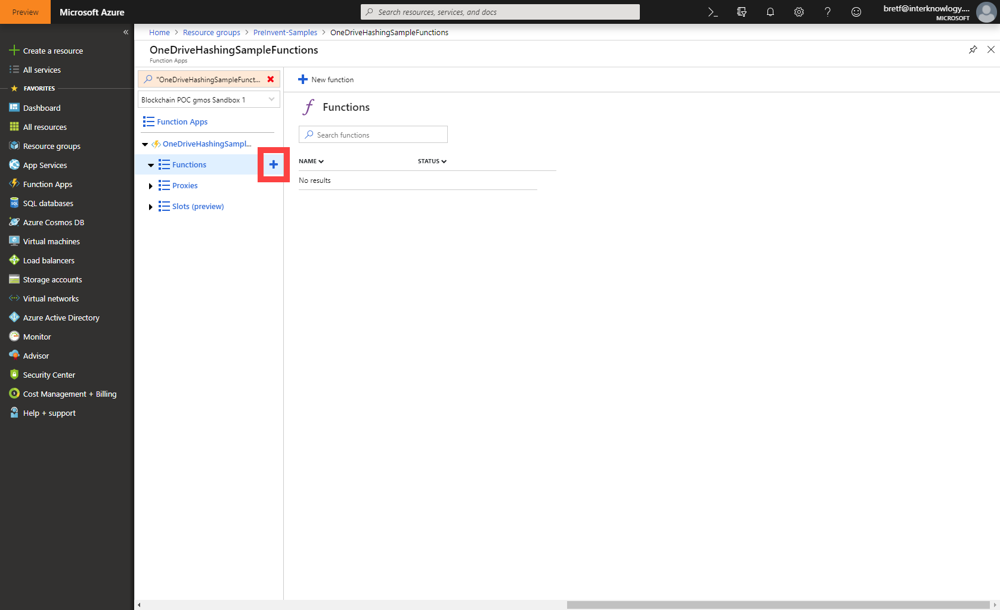

Select "In Portal" when asked to choose your development environment and then click Continue.

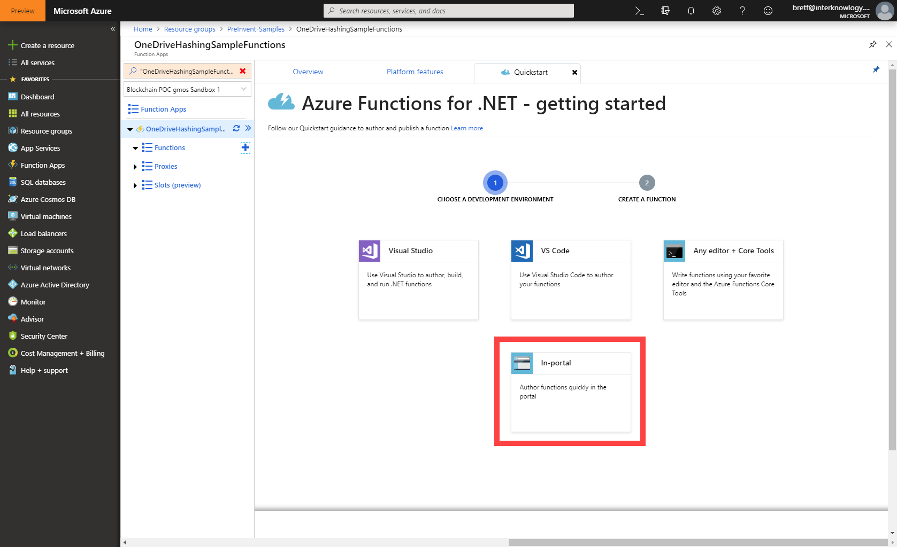

Select "More Templates" and click Finish and view templates.

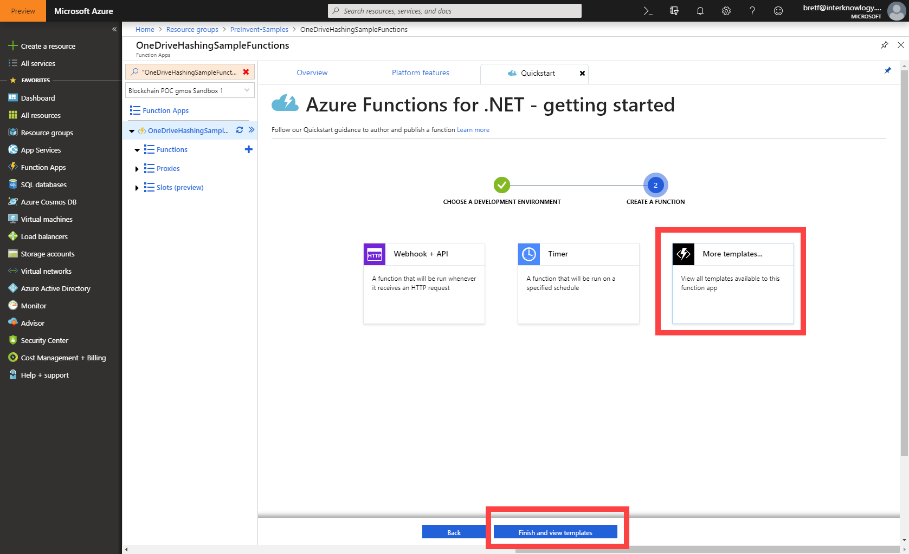

Select "HTTP Trigger" or search for it if necessary.


Name your function "CSVParser" and then click Create.

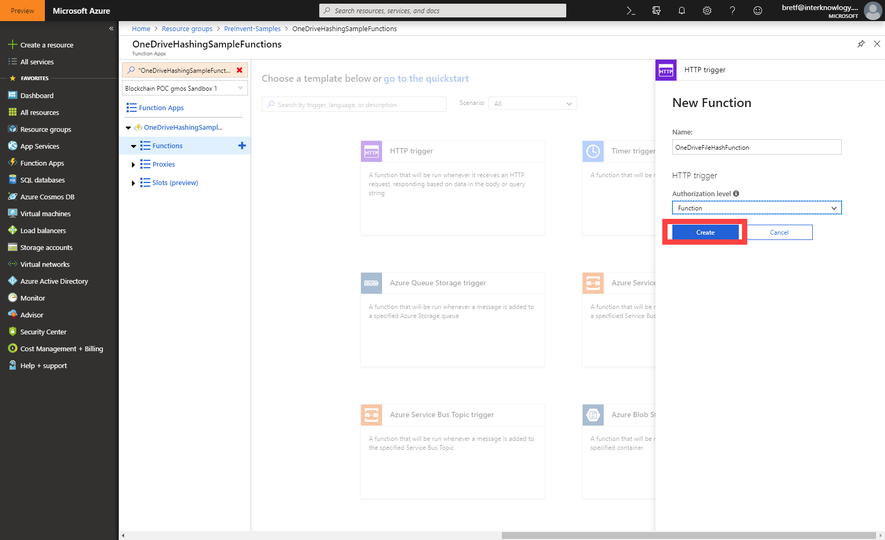

In the Function editor, replace the default code with the code below and then click Save.

```c#
#r "Newtonsoft.Json"

using System.Net;
using Microsoft.AspNetCore.Mvc;
using Microsoft.Extensions.Primitives;
using Newtonsoft.Json;
using System.Dynamic;
using System.Collections;
using System.Text.RegularExpressions;

public static async Task<IActionResult> Run(HttpRequest req, ILogger log)
{
    log.LogInformation("C# HTTP trigger function processed a request.");

    string requestBody = await new StreamReader(req.Body).ReadToEndAsync();

    var regex = new Regex("(?<=^|,)(\"(?:[^\"]|\"\")*\"|[^,]*)");

    var entries = requestBody.Split(new string[] { "\r\n" }, StringSplitOptions.RemoveEmptyEntries);
    
    dynamic data = new ExpandoObject();
    data.Rows = new List<ExpandoObject>();

    var properties = entries[0].Split(new char[] { ',' });
    
    for (int row = 1; row < entries.Count(); row++)
    {
        var rowData = new ExpandoObject();
        var rowDictionary = (IDictionary<string, object>)rowData;

        int fieldIndex = 0;

        foreach (Match m in regex.Matches(entries[row]))
        {
            rowDictionary.Add(properties[fieldIndex], m.Value);
            fieldIndex++;
        }

        data.Rows.Add(rowData);
    }

    var serialized = JsonConvert.SerializeObject(data);
    return (ActionResult)new OkObjectResult(serialized);
}

```

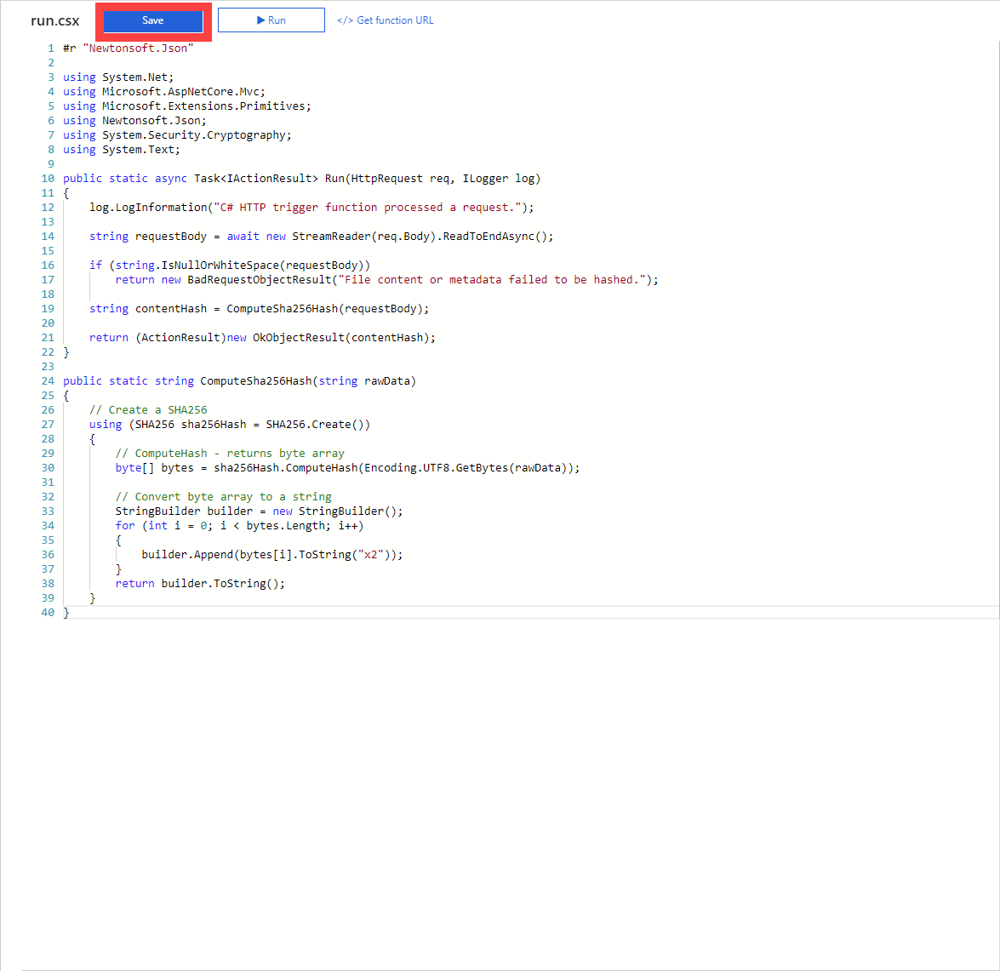

## Create the Logic App

Click the + symbol in the upper left corner of the screen to add a new resource.

Search for and select Logic App and then click Create.


Name the logic app "FTPReceiveLogicApp".

Click the Create button.

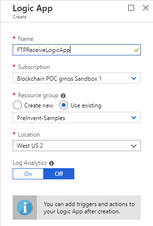

A logic app is initiated by a trigger.

In this scenario, the trigger will be when a file is uploaded to the configured FTP folder.

Within the Logic App Designer, select "Blank Logic App".


Search for FTP and then select the "When a file is added or modified" trigger.

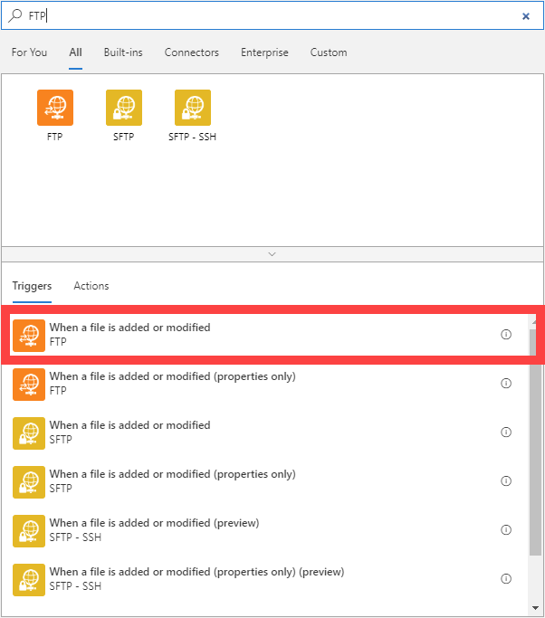

Within the Logic App Designer, setup the connection to your FTP server and set your polling interval.  Click "Show advanced options" and make sure "Include file content" is set to "Yes".  When you are done configuring your settings, click + New Step.

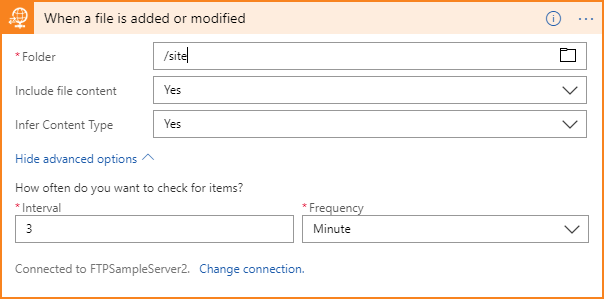

## Add Parsing Function

This next step will process the content of the CSV file and return JSON that will be used to create the recall events in the contract.

Search for Azure Function and then click "Choose an Azure function".


Pick the Azure Function App you created at the start of this sample and then select "CSVParser" that you created earlier.

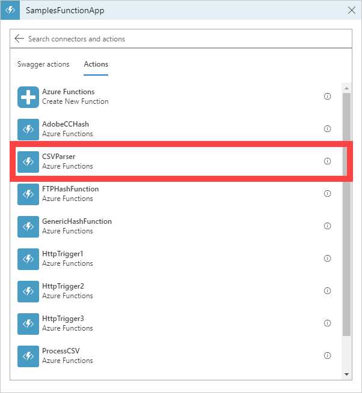

Click the Request Body field and select the "File Content" dynamic content from the previous step.

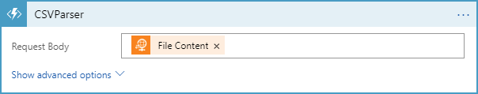

The result of the Azure Function will be JSON containing the rows and field values in the CSV file.  In order to use these properties later in the logic app, we will need to parse them.  Click + New Step and search for and select "Parse JSON".

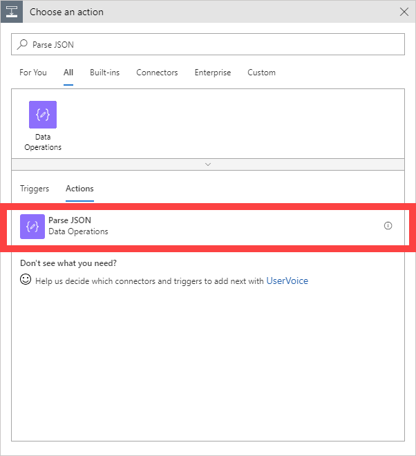

In the Content field, select the "Body" dynamic content from the previous CSVParser step, then enter the following schema into the Schema field.

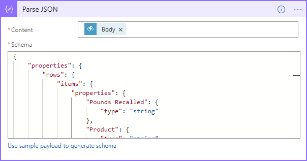

```json
{
    "properties": {
        "Rows": {
            "items": {
                "properties": {
                    "Pounds Recalled": {
                        "type": "string"
                    },
                    "Product": {
                        "type": "string"
                    },
                    "Reason for Recall": {
                        "type": "string"
                    },
                    "Recall Class": {
                        "type": "string"
                    },
                    "Recall Date": {
                        "type": "string"
                    },
                    "Recall Number": {
                        "type": "string"
                    }
                },
                "required": [
                    "Recall Date",
                    "Recall Number",
                    "Recall Class",
                    "Product",
                    "Reason for Recall",
                    "Pounds Recalled"
                ],
                "type": "object"
            },
            "type": "array"
        }
    },
    "type": "object"
}
```

## Initializing the Variables

The contract that we will be using requires two pieces of generated data: a request Id and a process time. This will be created using a variable action. Search for "Variable" and select "Initialize variable"

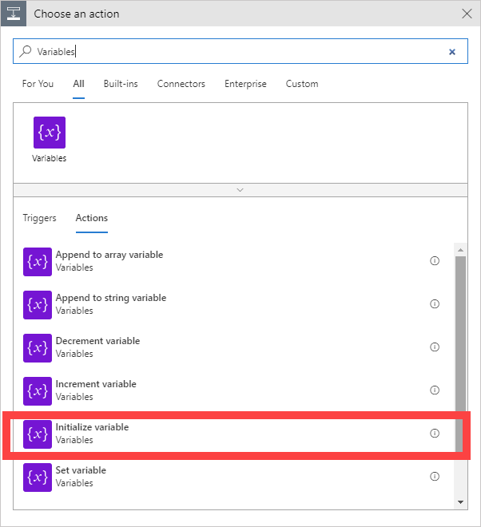

The name of the first variable is "RequestId" and the type will be "String". When you click on the Value field, the expression editor will appear. Select "Expression" and enter "guid()". This will generate a unique guid for our call to use.

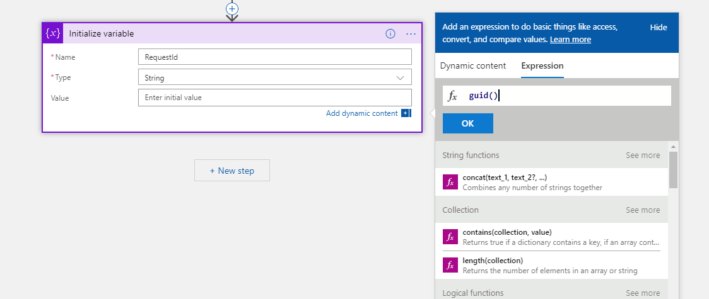

Add a second variable whose name is "ProcessDateTime" and the type is "String". The expression for this variable is "utcNow()".

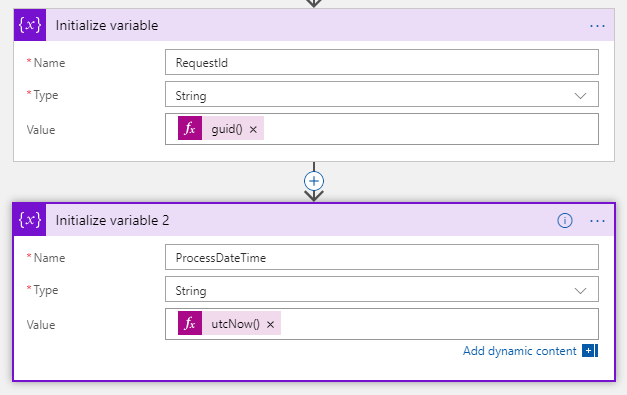

## Process the records and Create a Contract Action

In order to loop through the records in the data we need a Control Action.  Click + New Step.  Search for 
"Control" and select "For each".

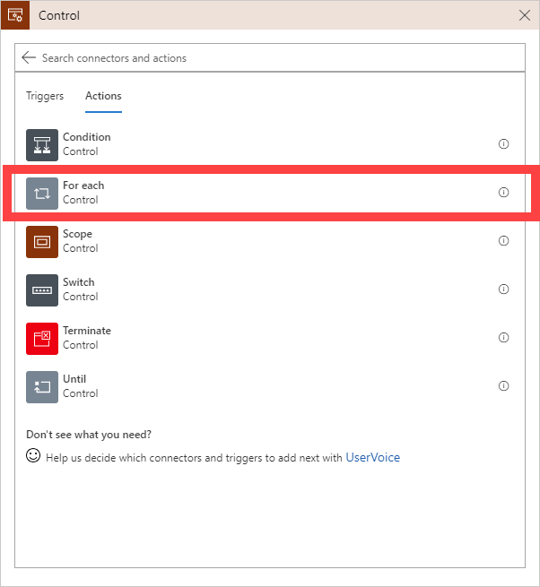

In the "For each" Action select the "Rows" dynamic content output from the Parse JSON step above.  If the dynamic content doesn't show automatically, click the "See more" link under the appropriate section(s).

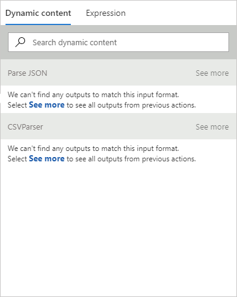

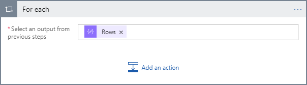

Each contract action will need its own unique RequestId so we need to generate a new one in the For each loop.  Click "Add an action", search for "Variables", and select "Set Variable".  Choose the RequestId variable created earlier and then set the "Value" to the expression guid() as you did above.

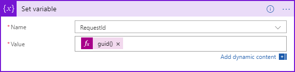

Repeat this step again, this time choosing ProcessDateTime and setting the "Value" to the utcNow() expression.

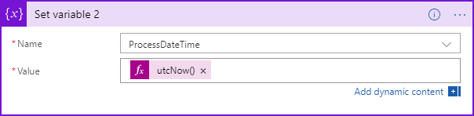

The last portion of the logic app will be to create and send a message to the Service Bus Queue for the Azure Blockchain Workbench.  Click "Add an action", search for "Service Bus", and then select "Send Message".


Select the service bus you wish to connect to, either by selecting on from your current subscription or adding the connection string if it exists in a different location.


The Send Message dialog will allow you to configure the message. For the "Queue/Topic name" select the queue used for interacting with the Azure Blockchain Workbench. Set the "Session Id" to be the RequestId variable created above. The Content will contain dynamic data that we have created along the process of the logic app. Enter the following JSON into the field:

```
{
    "requestId": "",
    "userChainIdentifier": "<Your user's address in Azure Blockchain Workbench>",
    "contractLedgerIdentifier": "<Recall Event contract address>",
    "workflowFunctionName": "RegisterRecallEvent",
    "Parameters": [
        { "name": "RecallDate", "value": "" },
        { "name": "RecallNumber", "value": "" },
        { "name": "RecallClass", "value": "" },
        { "name": "Product", "value": "" },
        { "name": "ReasonForRecall", "value": "" },
        { "name": "PoundsRecalled", "value": },
        { "name": "ContractAddress", "value": "<Recall Event contract address>" }
    ],
    "connectionId": 1,
    "messageSchemaVersion": "1.0.0",
    "messageName": "CreateContractActionRequest"
}
```

Add the dynamic fields from the previous steps and Variable sections as show here. 

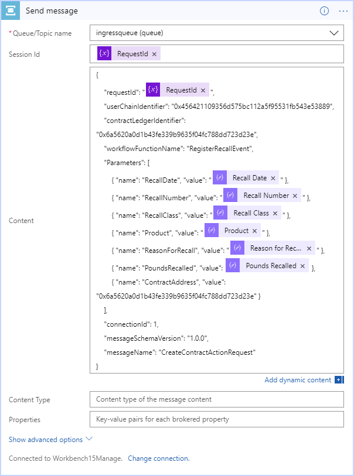

Once this is complete. Click Save and your logic app is ready to be tested.

## Testing the logic app

You can test this functionality by taking the following steps –

1. Navigate to the overview page of for the logic app in the portal and confirm
   that it is enabled (if it is not, click on the “disabled” link at the top of
   the screen to transition the logic app to an enabled state).
2. Deploy the Recall Event Registry application in Azure Blockchain
   Workbench.
3. Add members to the new application for the roles of Registrar, Registrant,
   and BlockchainAgent.
4. Create a new contract instance in the Recall Event Registry application. Once deployed, select the new Registry and perform the Open Registry action.
5. Upload the CSV file to your FTP server and folder used in the logic app.
6. The logic app should now be triggered and the code will be executed.
   Upon successful execution, you should see a Recall Event entry in your Recall Event Registry application.
   If you’d like to look at the execution of the logic app,
   navigate to the logic app in the portal. At the bottom of the screen, you
   will detail for Runs history

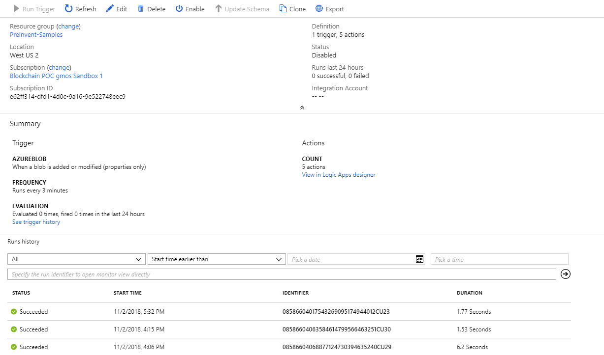

7. Click on the most recent execution of your logic app in the list.  
   This will show details on the trigger and actions executing within the logic
   app and allow you to validate success or troubleshoot reasons for failure.


8. Once making changes in your logic app, you can navigate back to this same
   screen and click “Resubmit” and it will call the current version of your
   logic app with the values provided by the previous run.

### In Review

This sample deployed and configured a logic app that will parse CSV file content and create a Recall Event in your Recall Event Registry application in your Azure Blockchain Workbench.

This sample is designed to work with the Recall Event Registry application and contracts but can be easily adapted to other contracts by making changes to Service Bus – Send a Message action at the end of the sample to reflect the specifics of the new contract.
