Using the Ethereum Blockchain Logic App Connector to Create a New Smart Contract When an Entity is Created in the Common Data Service (CDS)
===========================================================================================================================================

In this sample, we will demonstrate how to easily integrate with the Common Data
Service (CDS) and the blockchain using Logic Apps and the Ethereum Blockchain
Connector for Logic Apps.

the Common Data Service (CDS) represents data as entities. In this sample, you
will use the built in Logic App connector for the Common Data Service (CDS).
That connector exposes a trigger named “When a new record is created.”

This particular trigger identifies that an entity has been created and will
initiate the workflow refleceted in the logic app.

Using the Ethereum Blockchain Connector for Ethereum you will then create a new
instance of an associated smart contract on the blockchain that represents the
appropriate projection of the entity that was added in the Common Data Service
(CDS).

Determine What Projection of the Entity Should Be Reflected in a Smart Contract 
================================================================================

The word “projection” is used here because not all data placed in an entity
within the Common Data Service (CDS) is appropriate to put on the ledger.

Sample considerations include –

-   What data in the entity is needed by parties on the blockchain?

-   What data in the entity should not be put on the blockchain because it
    represents personally identifiable information?

-   What data in the entity may be subject to GDPR or other legislation that may
    result in requests to remove the data that cannot be satisfied because the
    blockchain is immutable?

For example, if a purchase order entity contained a first name, a last name, an
address, a PO number, and a dollar amount. It may only be appropriate to include
the purchase order and the dollar amount on the blockchain.

Using Registry and Entity Contracts 
====================================

The approach used in this sample will use a set of two smart contracts. One is a
smart contract that represents the projection of an entity, and the other is a
registry.

When you create a new smart contract in Ethereum, it will be given an address on
the blockchain.

When you want to interact with that contract, you will need to know the address
of the contract to be able to read its state or execute transactions against
functions within it.

This will require another mechanism to provide a way to “look up” the address
based on a unique identifier associated with the entity.

Using a purchase order, this would be the purchase order ID.

In some cases, there may be more than one identifier that can be used to find a
smart contract that represents an entity. For example, an automobile is assigned
a Vehicle Identification Number (VIN) that is delivered when it is manufactured
and can also have a unique registration number that is associated with it.

While this can be addressed using an “off chain” database, such as SQL Server,
in this sample we use a registry contract. The registry contract will register
the entity contracts, build arrays to use to lookup values, and provide the
appropriate smart contract address for a given entity.

If your records don’t have a natural unique identifier, you can also create one
using a guid.

Create the Smart Contracts
==========================

The next step would be to create the smart contract that represents the
projection of the entity that you want to store on the blockchain. You will also
want to create a registry that will register these smart contracts and provide
the ability to find the smart contract address for an entity using a unique
identifier.

Microsoft recently released a registry accelerator that will automate the
creation of these contracts for you. You can find the accelerator source code
located in the [github repository for the Azure Blockchain Developer
Kit](https://github.com/Azure-Samples/blockchain/tree/master/blockchain-development-kit/accelerators/registry-generator).
An example deployment of the accelerator can be found
[here](https://aka.ms/bcregaccelerator).

In the current iteration of the accelerator, you’ll define your entity using
JSON.

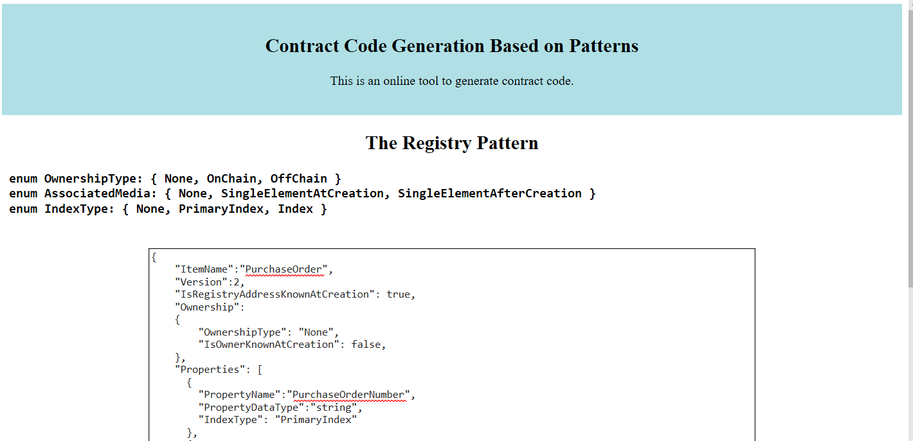

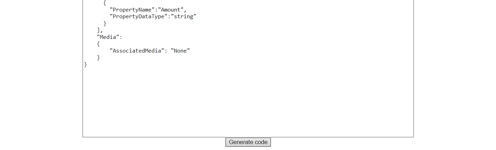

The JSON has several top level elements, including ItemName, Version,
IsRegistryAddressKnownAtCreation, Ownership, Properties, and Media.

Top Level Elements
------------------

| ItemName                         | The name of your entity that will be used in the functions.                                                                                                |
|----------------------------------|------------------------------------------------------------------------------------------------------------------------------------------------------------|
| Version                          | The version of the entity that this represents. Setting this parameter will append this number to the name of the contracts.                               |
| IsRegistryAddressKnownAtCreation | Identifies if the address for the registry is known in advance. In this sample it is, so the value will be true.                                           |
| Ownership                        | Identifies if the entity can be owned, if the owner is has an “on chain” identifier or is represented by an id in an “off chain” system such as a database |
| Properties                       | Identifies the properties for the entity. This includes the name and data type for the property and also identifies if the property represents an index.   |
| Media                            | Identifies if media is associated with the entity. In this sample, this will be set to None.                                                               |

Ownership
---------

The ownership element has two elements within it – OwnershipType,
IsOwnerKnownAtCreation.

| OwnershipType | This identifies if there is an owner of this particular entity. If you would like to assign an owner for the entity, this can be specified here. There are three possible values – |
|---------------|------------------------------------------------------------------------------------------------------------------------------------------------------------------------------------|

-   None – This does nothing to the contract

    -   OnChain – This provides the ability to store an address for an owner and
        the ability to assign an owner.

        -   OffChain – This provides the ability to store an identifier for an
            owner who is represented in an “off chain” store such as SQL DB.

| IsOwnerKnownAtCreation | This identifies if the owner is identified at the time of creation or assigned at a later time. There are two possible values - |   |   |   |
|------------------------|---------------------------------------------------------------------------------------------------------------------------------|---|---|---|

-   true - this will add parameters to the constructor to define the owner.

-   false - this will add a function that enables the assignment of an owner.

 Properties
--------------

The Properties element represents an array of Property elements. A Property has
several elements PropertyName, PropertyDataType, and IndexType.

| PropertyName     | This is the name of the property of an entity                                                                                                                 |
|------------------|---------------------------------------------------------------------------------------------------------------------------------------------------------------|
| PropertyDataType | This is the name of the blockchain data type to use in the smart contract for this property.                                                                  |
| IndexType        | This identifies if there is this property represents a unique field that should be represented in an index on the registry. There are three possible values – |

-   None – This is not a unique value and should not be an index.

-   PrimaryIndex – This is a unique value and is the property that most people
    will use to find entity smart contracts.

-   Index – This is a unique value that can be used to find entity smart
    contracts, but is not the one that will be used by the largest number of
    consumers.

If PrimaryIndex or Index are specified, the generated contracts will provide
variables to store the index values of registered entity contracts. In addition,
functions will be created in the registry that will enable both the lookup of
contract addresses for the entity contracts as well as enable the ability to
determine if a particular entity has already been registered.

Media
-----

The Media element has a single element named AssociatedMedia.

| AssociatedMedia | In some cases, an entity may have a piece of media associated with it. For example, a purchase order may have an associated PDF file that represents it at the time of creation. In other cases, an image may represent a physical document that has been signed, certified, etc. The contract generated for the entity can automatically generate this by providing a value for Associated Media. There are three possible values – |
|-----------------|--------------------------------------------------------------------------------------------------------------------------------------------------------------------------------------------------------------------------------------------------------------------------------------------------------------------------------------------------------------------------------------------------------------------------------------|

-   None - There is no media associated with this entity.

-   SingleElementAtCreation – There is a media element associated with this and
    it is known at the time of creation. This will update the constructor to
    incorporate this into this.

-   SingleElementAfterCreation - There is a media element associated with this
    and it is not known at the time of creation. This will add a function to add
    this after the contract is created.

A simple example for a purchase order that has two values, a primary index of a
purchase order number and a dollar amount, that will be used in the projection.

{

"ItemName":"PurchaseOrder",

"Version":2,

"IsRegistryAddressKnownAtCreation": true,

"Ownership":

{

"OwnershipType": "None",

"IsOwnerKnownAtCreation": false,

},

"Properties": [

{

"PropertyName":"PurchaseOrderNumber",

"PropertyDataType":"string",

"IndexType": "PrimaryIndex"

},

{

"PropertyName":"Amount",

"PropertyDataType":"string"

}

],

"Media":

{

"AssociatedMedia": "None"

}

}

Clicking the Generate button will generate a set of files, place them in a .ZIP
file and make that available for download.

Opening the zip file will show that three files were created. There are solidity
files that represent each of the smart contracts and a JSON file that represents
a configuration file for use with Azure Blockchain Workbench.

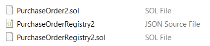

NOTE – Azure Blockchain Workbench is not required for this sample, however, this
sample can be used in conjunction with Azure Blockchain Workbench. To use this
with Azure Blockchain Workbench, the JSON file would be uploaded as the
configuration file and the solidity files would need to be zipped and uploaded
as the application.

### Supporting Multiple Indices

The following is a more advanced example that describes a vehicle. In this case,
the entity has three properties a unique vehicle identification number (VIN)
that will be the primary index, a RegistrationNumber that is an index but not
the primary one, and a description of the color.

In this case, the owner is not known at the time the entity contracts are
created, and a function will be added to assign the owner at a later date.

{

"ItemName":"Vehicle",

"Version":2,

"IsRegistryAddressKnownAtCreation": true,

"Ownership":

{

"OwnershipType": "OnChain",

"IsOwnerKnownAtCreation": false,

},

"Properties": [

{

"PropertyName":"VIN",

"PropertyDataType":"string",

"IndexType": "PrimaryIndex"

},

{

"PropertyName":"RegistrationNumber",

"PropertyDataType":"string",

"IndexType": "Index"

},

{

"PropertyName":"Color",

"PropertyDataType":"string"

}

],

"Media":

{

"AssociatedMedia": "SingleElementAfterCreation"

}

}

Identifying the Blockchain Node Endpoint
========================================

For the Ethereum blockchain connector, you will want to be able to deploy and
interact with the blockchain using a blockchain endpoint for a private or public
Ethereum network.

Private Ethereum
----------------

If you have an existing blockchain node endpoint, you will want to record the
URI for a publicly accessible endpoint.

If you do not have an existing blockchain node endpoint, you will want to deploy
a node. There are templates for deploying Ethereum Proof of Authority and
Ethereum Proof of Work in the Azure Marketplace. Then when deploying workbench,
you would select the option to deploy to an existing network and specify the
endpoint for your Ethereum node.

To deploy Ethereum Proof of Authority from the marketplace, follow the
instructions at this
[link](https://azuremarketplace.microsoft.com/en-us/marketplace/apps/microsoft-azure-blockchain.azure-blockchain-ethereum).

Public Ethereum
---------------

This sample can also be used against public Ethereum or the public Ethereum
testnet. In those cases, you would record the URI for a publicly accessible
node.

Note – there are costs for using the public Ethereum network for executing
transactions. If choosing to deploy to the public Ethereum chain, you should
first research and understand the associated costs.

Creating Keys
=============

To sign transactions using the Ethereum Blockchain Logic App Connector, you will
need to provide a private key.

If you don’t have an existing private key that you would like to use, you can
easily generate one using the MetaMask browser extension.

You can download it [here](https://metamask.io/).

Once installed, click on your account. The default to account created in
MetaMask is Account 1.

Click the button labeled “Export Private Key”

You will then be prompted to enter you MetaMask password.

This will display your private key which you can then copy and use with the
Logic App Connector for Ethereum.

Deploying the Registry
======================

While you can deploy the registry using the Ethereum Blockchain Connector for
Logic Apps, it is something you will deploy independently as there will only be
one instance of it.

There is an online tool named from the Ethereum Foundation named Remix that can
be found at <http://remix.ethereum.org>

Click the folder icon and load the PurchaseOrder2.sol and
PurchaseOrderRegistry2.sol files created earlier.

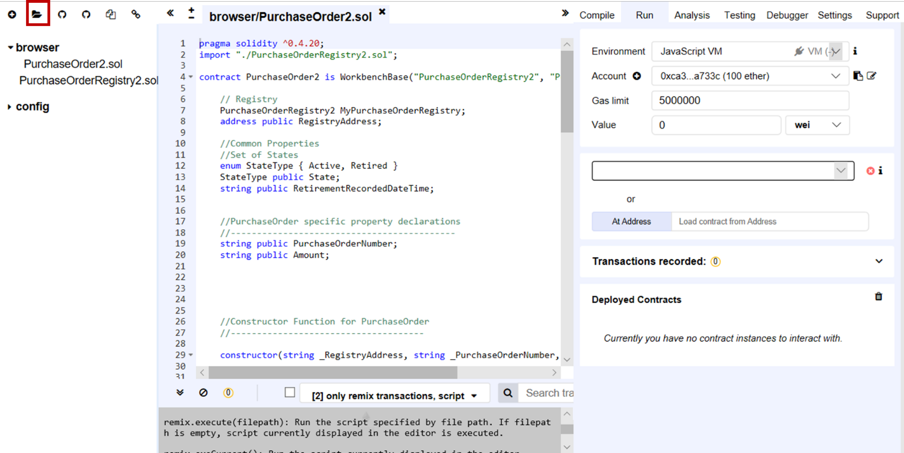

Next, you’ll specify the Web3 endpoint for your Ethereum node. Do this by
clicking the Environment drop down and select Web3 Provider. This will ask you
to specify the endpoint.

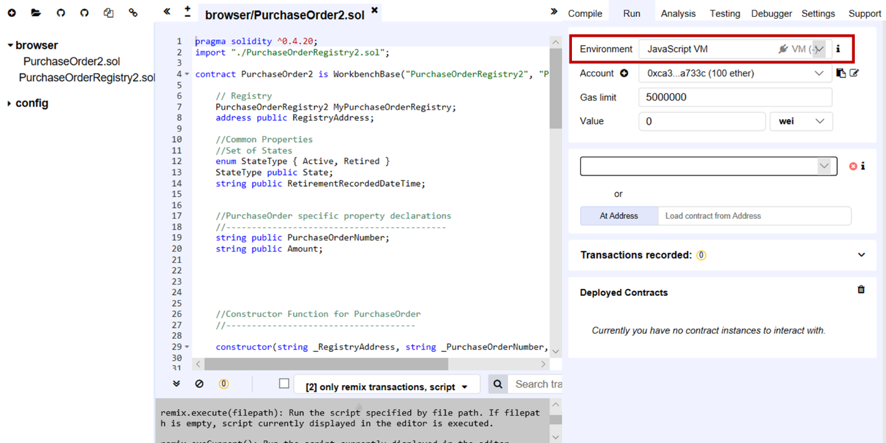

Provide your key in the account drop down, and then select the
PurchaseOrderRegistry2.

In the Compile tab, click the Start to Compile button. This should only take a
few seconds.

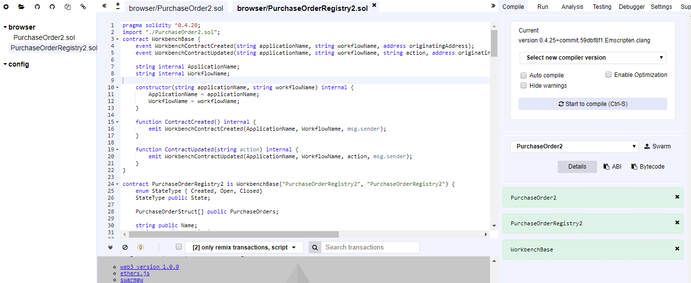

Back in the Run tab, select PurchaseOrderRegistry2 contract and click the deploy
button. This will create a new instance of the registry contract that you can
now see in the the Deployed contracts section.

The address for the Registry will be used later. It can be copied from the
Deployed Contract section.

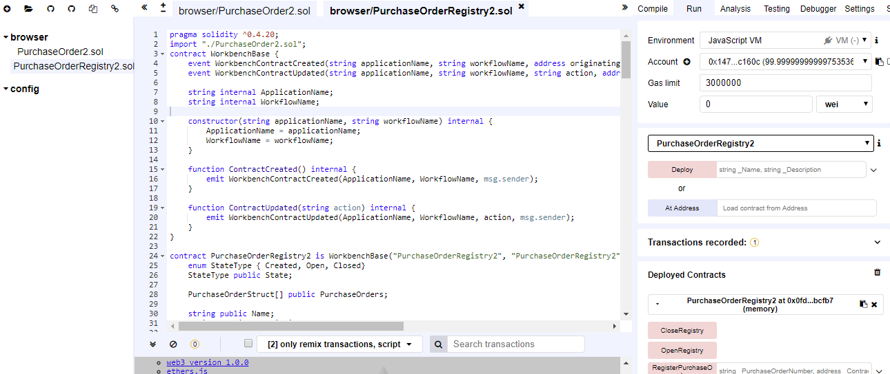

Selecting the contract in the Deployed Contracts section will show a list of the
available functions on the contract that can be called.

You will click on the the OpenRegistry button to call the OpenRegistry function
on the deployed contract. This “opens” the registry and allows contracts to add
themselves to it.

Compiling the Entity Contract
=============================

Compile the Entity Contract by selecting the PurchaseOrder2. sol file and
clicking the Start to compile button. The PurchaseOrder2 contract should appear
in the drop down.

In the drop down, you have the option to select the ABI for the contract. The
ABI contains metadata about the contract and a section of this file will be used
with the Logic App Connector.

Copy the contents of the Bytecode section of the ABI for future use.

Building the Logic App
======================

Create a new logic app use the Azure Portal. After the logic app is done
creating, navigate to the logic app designer page. Select Blank Logic App.

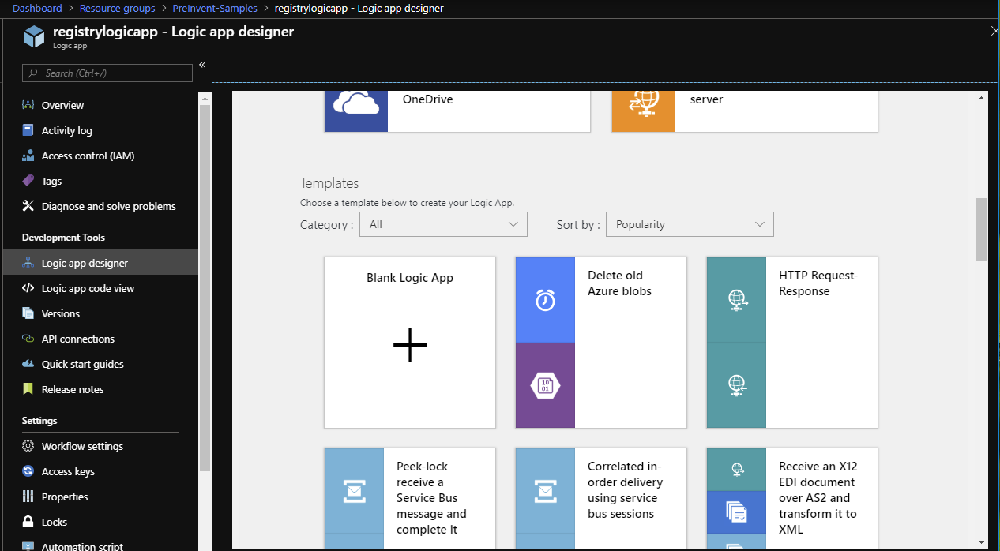

In the designer pane, search for the Common Data Service (CDS) and select the
“When a new record is created” trigger.

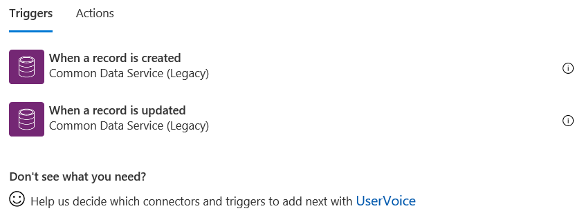

You will be prompted to create a connection to the Common Data Service.

If a purchase order object doesn’t exist in your CDS database, you can create a
new one in the PowerApps Portal using [instructions on this
page](https://docs.microsoft.com/en-us/powerapps/maker/common-data-service/create-edit-entities-portal).

After the Common Data Service (CDS) trigger is defined, click the button add a
new step.

Search for Ethereum Blockchain connector and add an “Execute smart contract
function action”.

You will be prompted to create a connection to the blockchain. When prompted,
enter a name for your connection, e.g. “My Blockchain Connection”, your RPC
endpoint and private key.

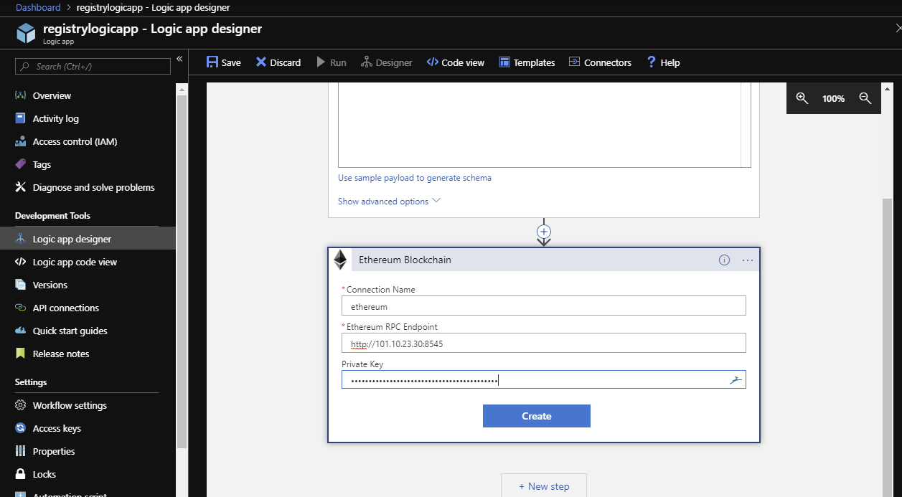

After configuring the RPC endpoint, you will be asked to enter the contract ABI
and Bytecode. Use the ABI and bytecode from the purchase order entity contract
that you saved earlier.

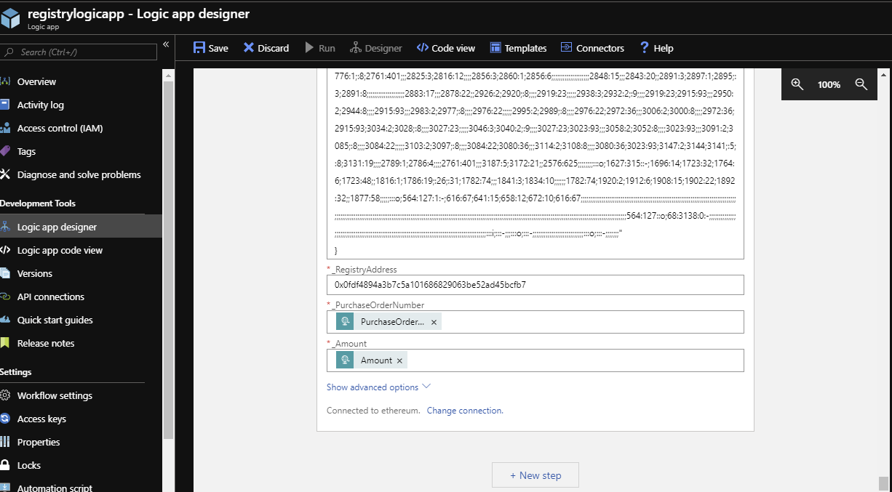

After entering the ABI and bytecode, three more fields will appear. These
identify the parameters for the constructor of the smart contract.

Enter the address for the PurchaseOrderRegistry2 contract instance that you
deployed earlier using Remix. For the PurchaseOrder and Amount fields, select
“Dynamic content” and use the outputs from the logic app trigger for the fields.

Your logic app is now complete. When a new record is added to CDS it will create
a new instance of the smart contract and put it into the registry.

Logic Apps provides the ability to review execution of “runs” of the code. If
everything is configured correctly, a green checkmark will appear in the Runs
History panel of the logic app to indicate a run was successful. After the
transaction has been mined, you will see the entity in the registry.
