# Azure Blockchain Workbench Release Notes - Version 1.5.0
This release contains changes in the following areas: 
- Simplified deployment experience – one required setup section with optional advanced settings
- Semi automated post deployment Azure Active Directory setup option
- New and improved ingress messaging API
- More detailed logging and error handling

Breaking changes in this release: 
- Existing integration with ingress messaging API will need to be rewritten
- Existing smart contract code will have warnings at upload time if not aligned with latest version of Solidity

Simplified deployment and setup
=================
We have made it easier to get started with Workbench. In previous versions of Workbench, there were many prerequisite steps that you need to take before deploying Workbench to properly set up integration with your Azure Active Directory (AAD) tenant. You also had to step through other setup blades in the Azure Portal to set up your Blockchain Network and Monitoring options. 

With version 1.5.0, only the Basic Settings blade is required for you to fill out to setup Workbench. The Advanced Settings is now optional, so you can get started with your deployment even faster. If you want to do more advanced setup like connecting to an existing blockchain network, setting up your AAD tenant, and selecting a specialized VM size, those options are still available to you in the Advanced Settings blade. 
 
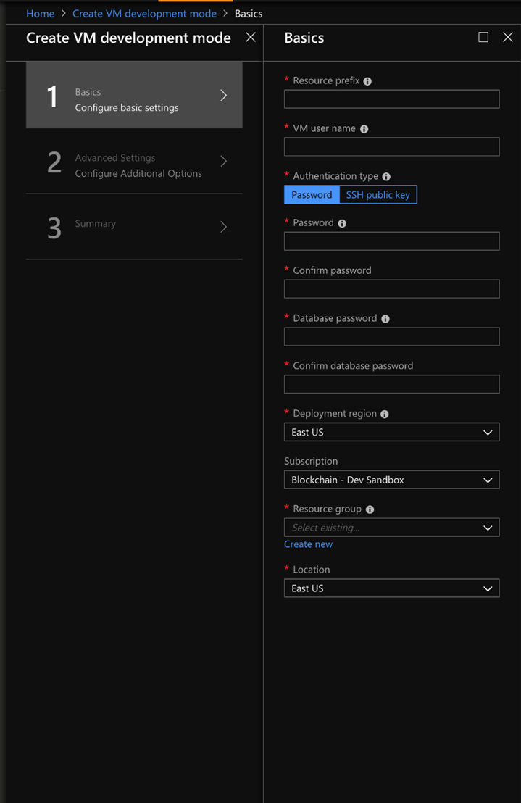

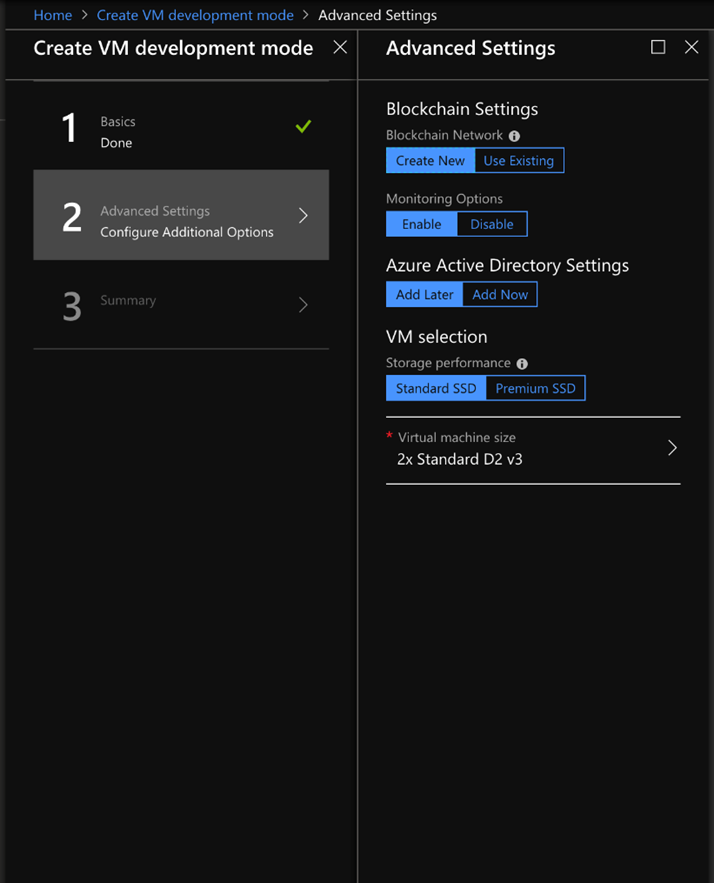

More flexibility and easier AAD integration
=================
We’ve also done a lot around the AAD integration to give you more options when choosing which tenant to connect to Workbench with. Before, there were a handful of administrator permissions that you had to have in order to set up the integration properly. We have updated the integration to reduce these requirements – you can now connect Workbench with a tenant where you are not an admin, so you no longer need to setup an entirely new tenant for Workbench. 

The AAD setup experience has also been simplified dramatically by allowing you to set up your AAD integration after Workbench has successfully deployed. Simply select the “Add Later” option in the Advanced Settings tab. 

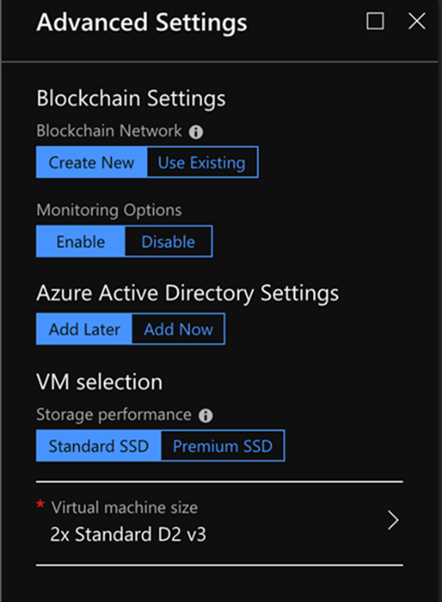

If you already have your AAD and application setup, you still have the option to set that up during deployment time. Note that we have simplified the AAD setup and you no longer need to provide an application key.

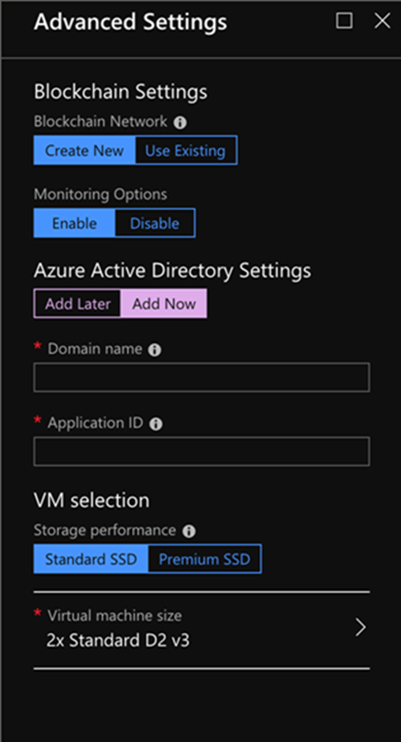

After Workbench is deployed, you will see a new setup page after navigating to the web app. Here, you’ll be able to run a script our team provides to do automated setup for you.

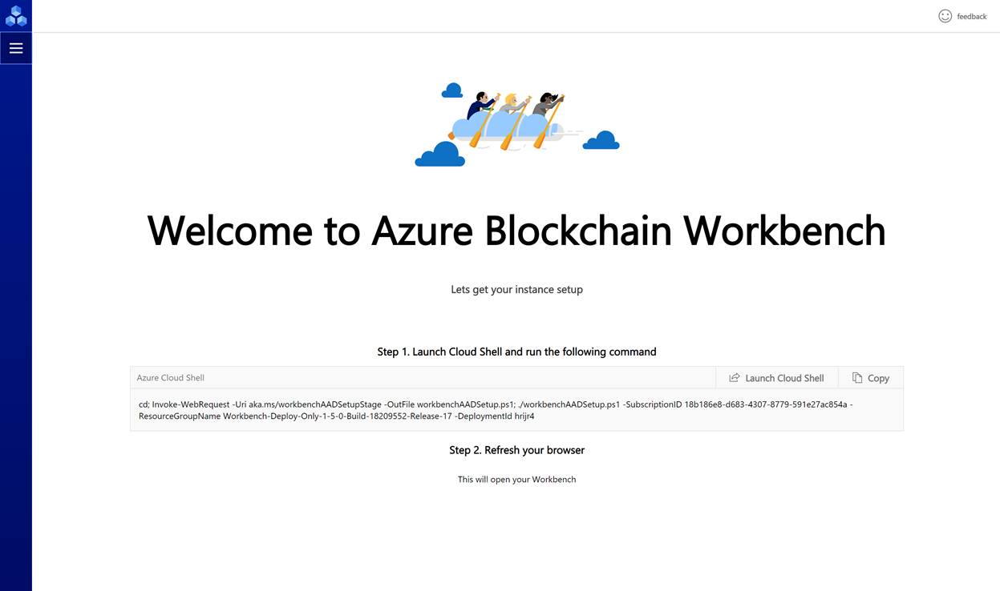

The script does all the prerequisite AAD related setup steps for you (guide on manual steps [here](https://aka.ms/workbenchAADsteps)):

	1. Creates and registers a new application registration.
	2. Modifies the application manifest to include the Workbench Administrator application role.
	3. Adds the required Graph API permissions to read basic user profiles. 
	
New input messaging API 
=================
Workbench provides a number of integration points out of the box, including via a REST API and a messaging API. The REST API provides developers a way to integrate to blockchain applications. For example, you can use the REST API and Power BI to create visualizations based on blockchain data. 

The messaging API is designed for system to system integrations. Currently, Workbench publishes blockchain events via Azure Event Grid and Azure Service Bus, which enables downstream consumers to take action based on these events and messages. 

Based on your feedback, we have improved and expanded to accommodate more scenarios with a newly designed input messaging API. This allows external systems to initiate transactions to create users, create contracts, and update contracts on a ledger.  Developers have continued to express interest in sending input via the Workbench messaging API to accomplish the scenarios above. With 1.5.0, we have designed an input messaging API to unlock even more system to system integration scenarios. 

Here is an example of a contract creation request with the new input messaging API. You need to provide details of the contract that you’d like to create, including the application, workflow, and parameter details, as well as information about the blockchain and other metadata such as the schema version and the type of message that is being sent.

			```
			
			{
			    "requestId": "ce3c429b-a091-4baa-b29b-5b576162b211",
			    "userChainIdentifier": "0x9a8DDaCa9B7488683A4d62d0817E965E8f248398",
			    "applicationName": "AssetTransfer",
			    "workflowName": "AssetTransfer",
			    "parameters": [
			        {
			            "name": "description",
			            "value": "a 1969 dodge charger"
			        },
			        {
			            "name": "price",
			            "value": "12345"
			        }
			    ],
			    "connectionId": 1,
			    "messageSchemaVersion": "1.0.0",
			    "messageName": "CreateContractRequest"
			}
			
			```
 
You will get an update message based on the status of the request. Here’s a corresponding example of a contract creation update for the above contract creation request.

			```
			
			{
			    "requestId": "ce3c429b-a091-4baa-b29b-5b576162b211",
			    "contractId": 55,
			    "contractLedgerIdentifier": null,
			    "connectionId": 1,
			    "messageSchemaVersion": "1.0.0",
			    "messageName": "CreateContractUpdate",
			    "status": "Failure"
			    "additionalInformation": {
			        "errorCode": 4000,
			        "errorMessage": "Contract cannot be provisioned on connection."
			    }
			}
			 
			```
 
You get the contract ID of the contract that was just created, metadata around the blockchain and message, as well as some additional information based on the status of the request update.

In the upcoming months, we will also be redesigning and enhancing the output messaging model, which may impact some of the existing work you have done. You can read more about the newly designed messaging API  [here](https://docs.microsoft.com/en-us/azure/blockchain/workbench/messages-overview).

More robust transaction submission pipeline
=================
One of the biggest improvements we’ve made in 1.5.0 is a new and improved submission pipeline. Many of you have told us that you’ve wanted better telemetry and more precise error handling in the web app to quickly troubleshoot issues. 

#### Error handling in the UX ####
Based on our rewrite of the submission pipeline, you will notice a significant improvement in stability and get more detailed error messages when transactions fail. You will now see two additional types of error messages surfaced. 
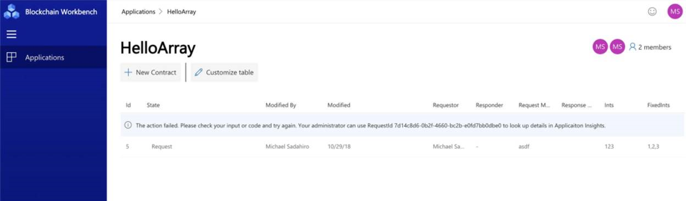

- *The action failed. Please check your input or code and try again. Your administrator can use RequestId to look up details in Application Insights.* One of the additions you will see is that we now provide a request ID with a failed action. This allows you to look up the failure details in Application Insights, enabling a better troubleshooting experience. 
	 
- *There are no events identified from this action. Please update your code to add an event for this action and try again.* You may see this error when you are expecting to see some update in the Workbench UI but nothing shows up. This is because there are no Workbench events identified from the action that was taken, and you will be prompted to update your contract code. To mitigate this issue, double check that you have called the ContractUpdated() or ContractCreated() function properly. You can read more about writing blockchain apps for Workbench [here](https://docs.microsoft.com/en-us/azure/blockchain/workbench/create-app). 

#### Logging and Telemetry ####
We have included better logging and telemetry to help with troubleshooting. Each Workbench instance has a corresponding Application Insights instance, where you can find logs to trace each request through the different Workbench components and services. You can find a step by step guide on how to do this on our [FAQ](https://aka.ms/workbenchFAQ) page.

Breaking Changes in 1.5.0
=================
1. **Updated ingress messaging API:** Due to the new and improved design for the ingress messaging API, you will need to update your existing integration code. We have renamed the service bus queues and topics.
	* ingressQueue - the input queue on which request messages arrive
	* egressTopic     - the output queue on which update and information messages are sent
2. **Workbench application sample updates:** Since we have updated the solidity compiler to the latest version, all Workbench application samples code will be updated as well. So, if you are on an older version of Workbench and want to use samples, you will see warnings or errors when the samples that we have on Github are uploaded. Upgrade to the latest version of Workbench if you want to use samples. 
3. **Workbench application checker:** There have been additional verifications introduced which may surface additional errors or warnings to your existing contract code. 
	* ContractUpdated verification: If the ContractUpdated call has a parameter that is either (a) not a workflow function, or (b) is different from the caller workflow function, you will get an error. 
	* Configuration and smart contract function verification: If the function in smart contract doesn’t exist or function signature is different (parameter names do not match), you will get a more descriptive error.

Upcoming Breaking Changes
=================
We appreciate your continued interest in Workbench. We have a few upcoming features which may impact you. 
1. **WorkbenchBase code generation:** The WorkbenchBase class is required for writing Blockchain Workbench specific apps, as it enables Blockchain Workbench to create and update contracts. With this upcoming change, you no longer need to include it in your contract code file, as Workbench will automatically generate the code for you. If you continue to include WorkbenchBase in your smart contracts, it will not upload successfully after 1.6.0. 
2. **Updated outbound messaging API:** Workbench has a messaging API for system to system integrations. We have had an outbound messaging API which we will be redesigning. The new schema will impact the existing integration work you have done with the current messaging API. If you want to use the new messaging API you will need to update your integration specific code. 


# Azure Blockchain Workbench Release Notes - Version 1.4.0
To use 1.4, you can either deploy a new instance of Workbench through the Azure Portal or upgrade your existing deployment to 1.3.0 using our upgrade script. This update includes the following improvements:

Better accessibility for screen readers and keyboard navigation
=================
Azure Blockchain Workbench is far more than UI within client apps. Workbench provides a rich developer scaffold for you to develop and integrate blockchain solutions within your enterprise. 


For this release, we focused on making Workbench more accessible for everyone. Accessibility is a key pillar in our vision of empowering every person and every organization to achieve more, and we’re excited to share some of the improvements we’ve made with accessibility in mind. The Web client gives you an easy to use environment to validate, test, and view blockchain applications. The application interface is dynamically generated based on smart contract metadata and can accommodate any use case. The client application delivers a user-facing front end to the complete blockchain applications generated by Blockchain Workbench. 
With version 1.4.0, the Web client now fully supports screen readers in terms of navigation and reading information. In addition, we updated the Web client to better support keyboard shortcuts and navigation. We hope these improvements can make you more productive when creating blockchain applications in Workbench. 

Customization of smart contract table columns
=================
Workbench dynamically creates Web client UI based on your smart contracts and application configuration. Workbench summarizes smart contract instances as a table in the Web client based on the properties specified in the application configuration. Depending on the blockchain scenario, developers may specify a lot of properties for any given application. Unfortunately, if many properties are specified, the smart contract table within the Web client UI will become hard to read due to the size and number of columns of the table (see below image). 
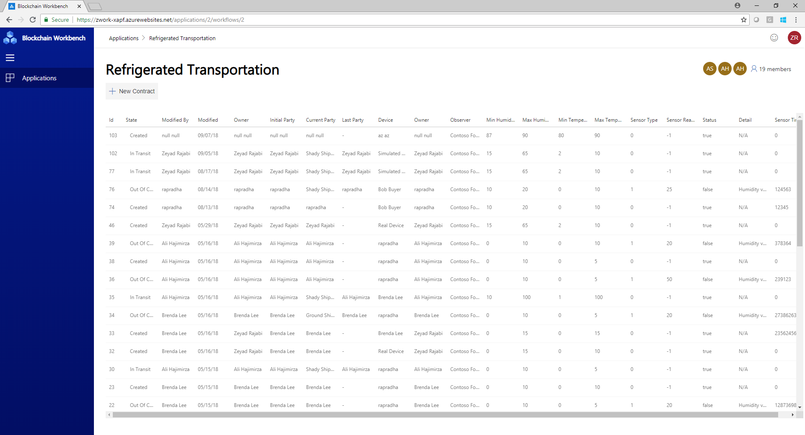

In some cases, properties may be more useful from a reporting perspective rather than a user experience perspective. To help with readability of the smart contract tables, we’ve introduced a new feature, which allows users to customize the smart contract table in terms of visible columns and order of columns. 
Below is a screenshot of the customize table pane, which allows each user to toggle the visibility of table columns as well as adjust the ordering of columns within the table. 
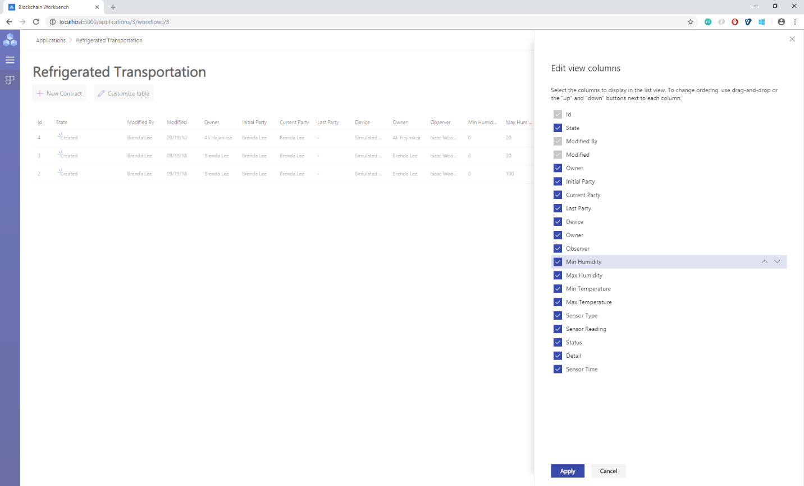

The smart contract table view will reflect all changes applied via the customize table pane. 
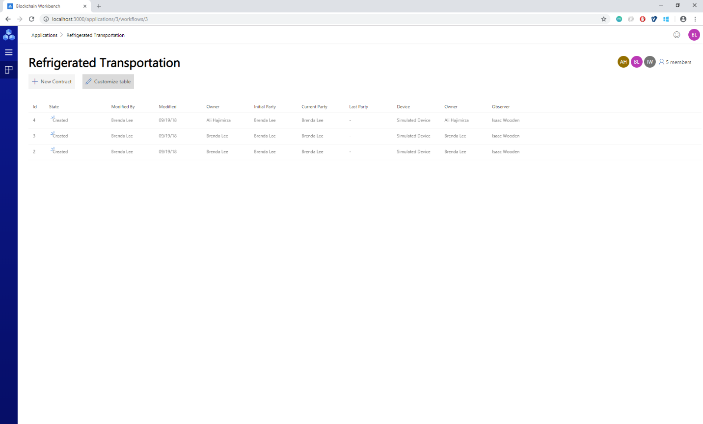

New supported datatype - Arrays 
=================
With 1.4.0, we now support array datatypes as part of constructor and function parameters as well as smart contract properties. Arrays allow you to create blockchain apps where you can input and represent a strongly typed list of content, such as a list of numbers or values. 
Workbench currently supports static and dynamic arrays of integers, Booleans, money, and time. Workbench does not yet support array of enums or array of arrays, including strings. Note, for string support we’re waiting for Solidity functionality to get out of preview. Let us know if these limitations are blockers for you.  
The array type is specified via the configuration file as follows:
			```
			
			"Properties": [
			{
			  {
				"Name": "PropertyType",
				"DisplayName": "Property Type",
				"Type": {
				"Name": "array",
				  "ElementType": {
				     "Name": "int"
				  }
				}
			  } 
			},
			
			```
 
There is a limitation is Solidity when it comes to public properties related to arrays. If you have a public state variable of an array type, Solidity only allows you to retrieve single elements of the array with auto-generated getter functions. To work around this limitation, you will need to provide an appropriate function to return arrays. For example:

			```
			
			function GetPropertyTypes() public constant returns (int[]) {
			     return PropertyType;
			}
			 
			```
 
If this function is not part of your Solidity code, we will show an error when uploading your blockchain application. 

Support for strings up to 4k characters
=================
One of the limitations in Workbench is the data type strings can only be 256 characters. We’ve received feedback from folks who wanted us to increase the limit. With 1.4.0, the new limit is 4000 characters. Note, using more characters will result in using more gas when processing transactions. When building your smart contracts, please be aware of the block gas limit and build your smart contracts with that limit in mind. 
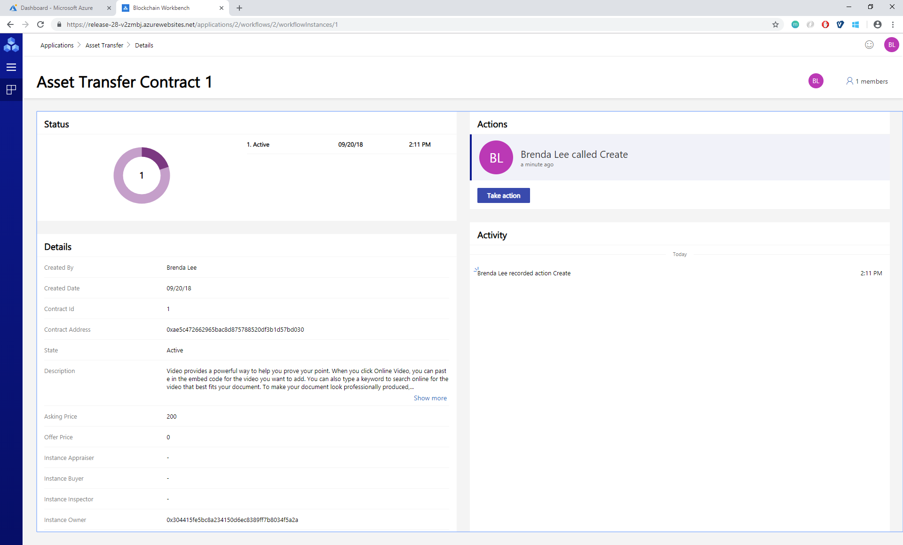
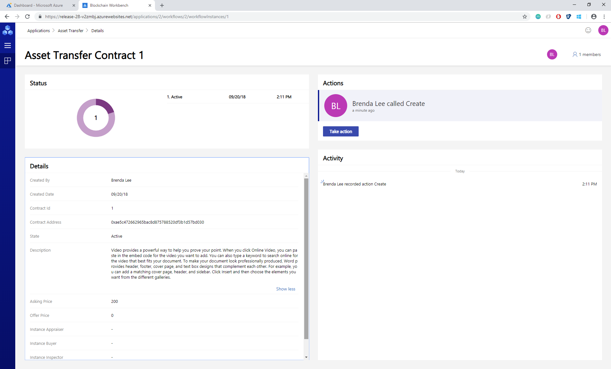

Faster and more reliable transaction processing
=================
With 1.4.0, we’ve made additional reliability improvements to the DLT Watcher microservice (see the [Blockchain Workbench architecture document](https://docs.microsoft.com/en-us/azure/blockchain-workbench/blockchain-workbench-architecture) for more information on this component). The Watcher has been rewritten and is able to process blocks at a much faster rate.

Please use our [Blockchain User Voice](https://aka.ms/blockchainuservoice) to provide feedback and suggest features/ideas for Workbench. Your input is helping make this a great service.  We look forward to hearing from you.


# Azure Blockchain Workbench Release Notes - Version 1.3.0
 
Faster and more reliable deployment
=================
We look at telemetry every day to identify issues that affect our customers, and as a result made some changes to make deploying Workbench not only more reliable, but faster as well. 
 
Better transaction reliability
=================
Continuing from the [monitoring improvements](https://azure.microsoft.com/en-us/blog/azure-blockchain-workbench-1-1-0-extends-capabilities-and-monitoring/) we made as part of 1.1.0, we’ve made reliability improvements to the DLT Watcher and DLT Consumer microservices (see the [Blockchain Workbench architecture document](https://docs.microsoft.com/en-us/azure/blockchain-workbench/blockchain-workbench-architecture) for more information on those components). Practically speaking, you’ll notice fewer errors saying “It looks like something went wrong…”.

 
Ability to deploy Workbench in a multi-member Ethereum PoA consortium
=================
With [release 1.2.0](https://azure.microsoft.com/en-us/blog/top-feature-requests-added-with-azure-blockchain-workbench-1-2-0/) you could deploy Workbench and connect that deployment to an existing Ethereum-based network. This past week we announced the availability of a [new standalone Ethereum PoA solution](https://azure.microsoft.com/en-us/blog/ethereum-proof-of-authority-on-azure/), which can be deployed across members within a consortium. With these two updates, you can deploy Workbench in three different configurations:

1.       **Single-Member System:** The default configuration of Workbench, where Workbench is deployed in a blockchain network with only one member.

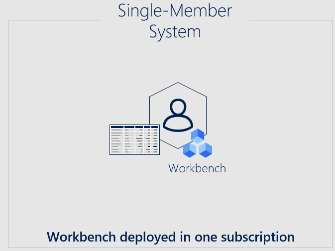

 
2.       **Multi-Member System Deployed in One Member’s Subscription:** You can use the new multi-member PoA consortium solution to deploy a blockchain network across several members. The, you can deploy Workbench in one member’s subscription. Everyone who wants to use Workbench will go through the one member’s Workbench deployment. This topology can be useful for PoCs and initial pilot deployments.

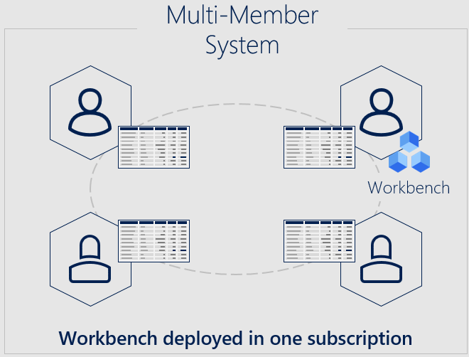
 
3.       **Multi-Member System Deployed in One Shared Subscription:** This configuration is similar to the topology described above, except that Workbench is deployed in a shared subscription. Think of this shared subscription as the operator subscription for the consortium.

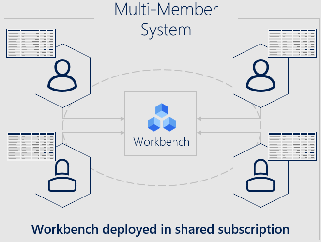
 
We are investigating other topologies, such as one where Workbench is deployed into each subscription. If that interests you, please upvote or request it on our [blockchain user voice](https://feedback.azure.com/forums/586780-blockchain).

 
Simpler pre-deployment script for AAD
=================
We know going through [Workbench deployment instructions](https://docs.microsoft.com/en-us/azure/blockchain-workbench/blockchain-workbench-deploy) can feel like a lot of work, especially setting up AAD and registering an app for the Workbench API. To make things easier, we’ve created a new PowerShell script, which automates most of the AAD setup steps and outputs the parameters you need for Workbench deployment. You can find the instructions and the script on our [GitHub](https://github.com/Azure-Samples/blockchain/tree/master/blockchain-workbench/scripts/aad-setup).
 
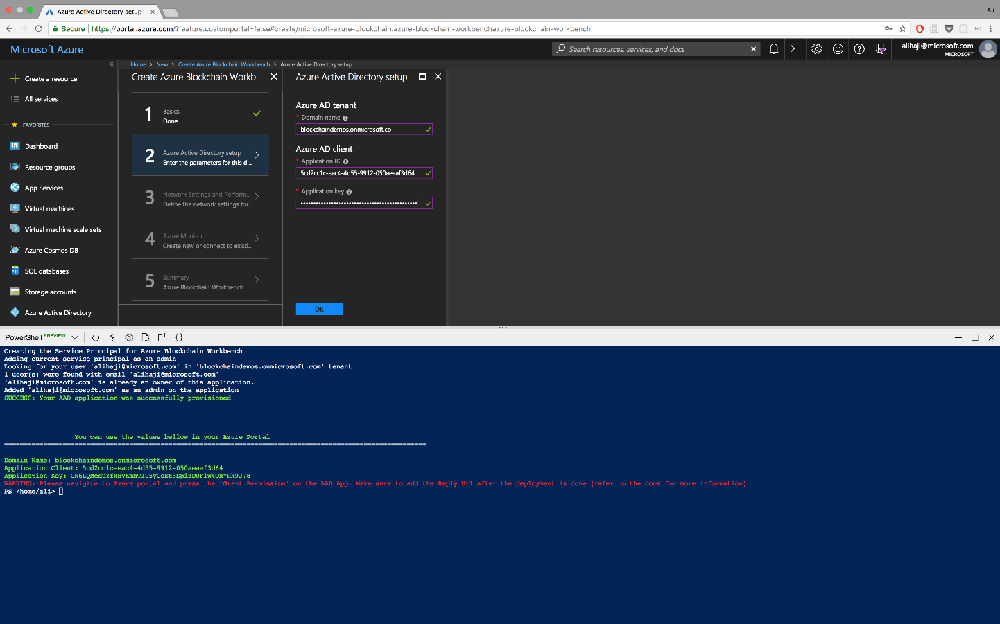
 
Sample code and tool for working with the Workbench API
=================
Some of you have asked for more sample code and tools related to generating authentication bearer tokens for Workbench API. We’re excited to announce a new [tool](https://github.com/Azure-Samples/blockchain/tree/master/blockchain-workbench/auth-samples/bearer-token-retrieval), which you can use to generate tokens for your Workbench instance. Source code is also available and can be used to create your own client authentication experience. Try it out by cloning the repo, running the Web page, and plugging in your Application Id.
 
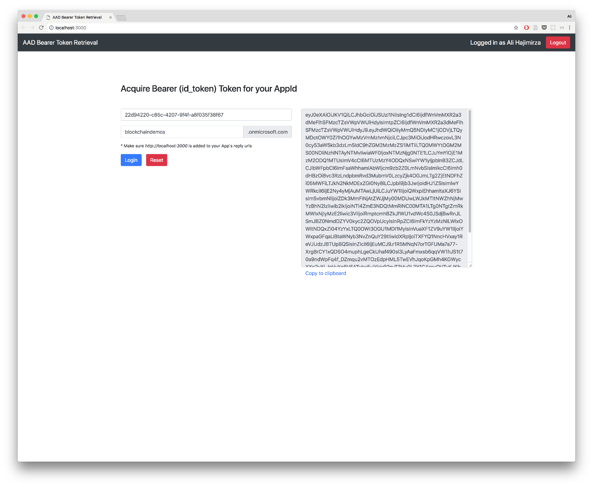
