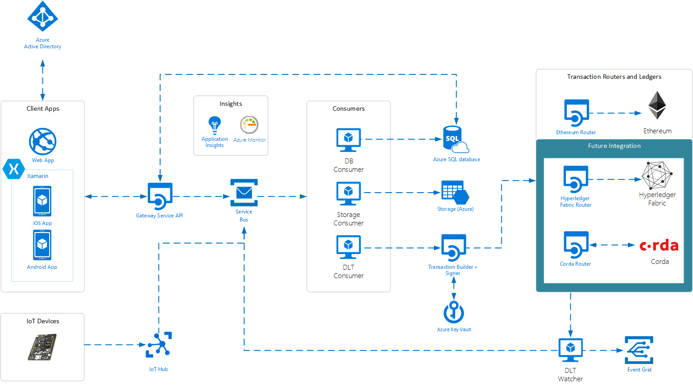

# Azure Blockchain Workbench Release Notes - Version 1.4.0

 
To use 1.4, you can either deploy a new instance of Workbench through the Azure Portal or upgrade your existing deployment to 1.3.0 using our upgrade script. This update includes the following improvements:

Better accessibility for screen readers and keyboard navigation
=================
Azure Blockchain Workbench is far more than UI within client apps. Workbench provides a rich developer scaffold for you to develop and integrate blockchain solutions within your enterprise. 


For this release, we focused on making Workbench more accessible for everyone. Accessibility is a key pillar in our vision of empowering every person and every organization to achieve more, and we’re excited to share some of the improvements we’ve made with accessibility in mind. The Web client gives you an easy to use environment to validate, test, and view blockchain applications. The application interface is dynamically generated based on smart contract metadata and can accommodate any use case. The client application delivers a user-facing front end to the complete blockchain applications generated by Blockchain Workbench. 
With version 1.4.0, the Web client now fully supports screen readers in terms of navigation and reading information. In addition, we updated the Web client to better support keyboard shortcuts and navigation. We hope these improvements can make you more productive when creating blockchain applications in Workbench. 

Customization of smart contract table columns
=================
Workbench dynamically creates Web client UI based on your smart contracts and application configuration. Workbench summarizes smart contract instances as a table in the Web client based on the properties specified in the application configuration. Depending on the blockchain scenario, developers may specify a lot of properties for any given application. Unfortunately, if many properties are specified, the smart contract table within the Web client UI will become hard to read due to the size and number of columns of the table (see below image). 


In some cases, properties may be more useful from a reporting perspective rather than a user experience perspective. To help with readability of the smart contract tables, we’ve introduced a new feature, which allows users to customize the smart contract table in terms of visible columns and order of columns. 
Below is a screenshot of the customize table pane, which allows each user to toggle the visibility of table columns as well as adjust the ordering of columns within the table. 


The smart contract table view will reflect all changes applied via the customize table pane. 


New supported datatype - Arrays 
=================
With 1.4.0, we now support array datatypes as part of constructor and function parameters as well as smart contract properties. Arrays allow you to create blockchain apps where you can input and represent a strongly typed list of content, such as a list of numbers or values. 
Workbench currently supports static and dynamic arrays of integers, Booleans, money, and time. Workbench does not yet support array of enums or array of arrays, including strings. Note, for string support we’re waiting for Solidity functionality to get out of preview. Let us know if these limitations are blockers for you.  
The array type is specified via the configuration file as follows:
			```
			
			"Properties": [
			{
			  {
				"Name": "PropertyType",
				"DisplayName": "Property Type",
				"Type": {
				"Name": "array",
				  "ElementType": {
				     "Name": "int"
				  }
				}
			  } 
			},
			
			```
 
There is a limitation is Solidity when it comes to public properties related to arrays. If you have a public state variable of an array type, Solidity only allows you to retrieve single elements of the array with auto-generated getter functions. To work around this limitation, you will need to provide an appropriate function to return arrays. For example:

			```
			
			function GetPropertyTypes() public constant returns (int[]) {
			     return PropertyType;
			}
			 
			```
 
If this function is not part of your Solidity code, we will show an error when uploading your blockchain application. 

Support for strings up to 4k characters
=================
One of the limitations in Workbench is the data type strings can only be 256 characters. We’ve received feedback from folks who wanted us to increase the limit. With 1.4.0, the new limit is 4000 characters. Note, using more characters will result in using more gas when processing transactions. When building your smart contracts, please be aware of the block gas limit and build your smart contracts with that limit in mind. 


Faster and more reliable transaction processing
=================
With 1.4.0, we’ve made additional reliability improvements to the DLT Watcher microservice (see the [Blockchain Workbench architecture document](https://docs.microsoft.com/en-us/azure/blockchain-workbench/blockchain-workbench-architecture) for more information on this component). The Watcher has been rewritten and is able to process blocks at a much faster rate.

Please use our [Blockchain User Voice](https://aka.ms/blockchainuservoice) to provide feedback and suggest features/ideas for Workbench. Your input is helping make this a great service.  We look forward to hearing from you.


# Azure Blockchain Workbench Release Notes - Version 1.3.0
 
Faster and more reliable deployment
=================
We look at telemetry every day to identify issues that affect our customers, and as a result made some changes to make deploying Workbench not only more reliable, but faster as well. 
 
Better transaction reliability
=================
Continuing from the [monitoring improvements](https://azure.microsoft.com/en-us/blog/azure-blockchain-workbench-1-1-0-extends-capabilities-and-monitoring/) we made as part of 1.1.0, we’ve made reliability improvements to the DLT Watcher and DLT Consumer microservices (see the [Blockchain Workbench architecture document](https://docs.microsoft.com/en-us/azure/blockchain-workbench/blockchain-workbench-architecture) for more information on those components). Practically speaking, you’ll notice fewer errors saying “It looks like something went wrong…”.

 
Ability to deploy Workbench in a multi-member Ethereum PoA consortium
=================
With [release 1.2.0](https://azure.microsoft.com/en-us/blog/top-feature-requests-added-with-azure-blockchain-workbench-1-2-0/) you could deploy Workbench and connect that deployment to an existing Ethereum-based network. This past week we announced the availability of a [new standalone Ethereum PoA solution](https://azure.microsoft.com/en-us/blog/ethereum-proof-of-authority-on-azure/), which can be deployed across members within a consortium. With these two updates, you can deploy Workbench in three different configurations:

1.       **Single-Member System:** The default configuration of Workbench, where Workbench is deployed in a blockchain network with only one member.


 
2.       **Multi-Member System Deployed in One Member’s Subscription:** You can use the new multi-member PoA consortium solution to deploy a blockchain network across several members. The, you can deploy Workbench in one member’s subscription. Everyone who wants to use Workbench will go through the one member’s Workbench deployment. This topology can be useful for PoCs and initial pilot deployments.


 
3.       **Multi-Member System Deployed in One Shared Subscription:** This configuration is similar to the topology described above, except that Workbench is deployed in a shared subscription. Think of this shared subscription as the operator subscription for the consortium.


 
We are investigating other topologies, such as one where Workbench is deployed into each subscription. If that interests you, please upvote or request it on our [blockchain user voice](https://feedback.azure.com/forums/586780-blockchain).

 
Simpler pre-deployment script for AAD
=================
We know going through [Workbench deployment instructions](https://docs.microsoft.com/en-us/azure/blockchain-workbench/blockchain-workbench-deploy) can feel like a lot of work, especially setting up AAD and registering an app for the Workbench API. To make things easier, we’ve created a new PowerShell script, which automates most of the AAD setup steps and outputs the parameters you need for Workbench deployment. You can find the instructions and the script on our [GitHub](https://github.com/Azure-Samples/blockchain/tree/master/blockchain-workbench/scripts/aad-setup).
 

 
Sample code and tool for working with the Workbench API
=================
Some of you have asked for more sample code and tools related to generating authentication bearer tokens for Workbench API. We’re excited to announce a new [tool](https://github.com/Azure-Samples/blockchain/tree/master/blockchain-workbench/auth-samples/bearer-token-retrieval), which you can use to generate tokens for your Workbench instance. Source code is also available and can be used to create your own client authentication experience. Try it out by cloning the repo, running the Web page, and plugging in your Application Id.
 

