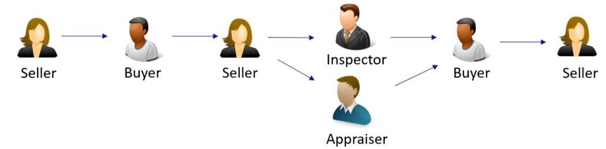

Asset Transfer Sample for Azure Blockchain Workbench
====================================================

Overview 
---------

The asset transfer smart contract covers the scenario for buying and selling
high value assets which require an inspector and appraiser. Sellers can list
their assets by instantiating an asset transfer smart contract. Buyers can make
offers by taking an action on the smart contract, and other parties can take
actions to inspect or appraise the asset. Once the asset is marked both
inspected and appraised, the buyer and seller will confirm the sale again before
the contract is set to complete. At each point in the process, all participants
have visibility into the state of the contract as it is updated. 

 

 

There are four personas in this demo contract – the seller as the initiator, and
the other three personas (buyer, appraiser, and inspector) as participants. As
indicated in the visual above, at certain stages in the contract, there are
various actions which participants can take. The logic written in the smart
contract will modify the state accordingly based on which actions are taken. 

 

Application Roles 
------------------

| Name       | Description                                                                                         |
|------------|-----------------------------------------------------------------------------------------------------|
| Seller     | A person who owns an asset and wants to sell the asset.                                             |
| Buyer      | A person who intends to buy the asset being sold by the seller.                                     |
| Inspector  | A person who is chosen by the buyer to be the inspector of the asset being considered for buying.   |
| Appraiser  | A person who is chosen by the buyer to be the appraiser for the asset being considered for buying.  |

 

States 
-------

| Name                 | Description                                                                                                 |
|----------------------|-------------------------------------------------------------------------------------------------------------|
| Active               | Indicates that an asset is available for being bought.                                                      |
| Offer Placed         | Indicates a buyer's intention to buy.                                                                       |
| Pending Inspection   | Indicates a buyer's request to the Inspector to inspect the asset under consideration.                      |
| Inspected            | Indicates the Inspector's approval to buy the asset under consideration.                                    |
| Appraised            | Indicates the Appraiser's approval to buy the asset under consideration.                                    |
| Notional Acceptance  | Indicates that both the Inspector and the Appraiser have approved buying the asset under consideration.     |
| Seller Accepted      | Indicates the owner's approval to accept the offer made by the buyer.                                       |
| Buyer Accepted       | Indicates the buyer's approval for the owner's approval.                                                    |
| Accepted             | Indicates that both the buyer and the seller have agreed to the transfer of the asset under consideration.  |
| Terminated           | Indicates owner's disapproval to continue with selling the asset under consideration.                       |

Workflow Details
----------------

 

 

The following state transition diagram articulates the possible flows, and the
various transition functions at each state. Each user is only allowed to take
certain actions depending on the application role. Instance roles indicate that
only the user with the application role assigned to the specific contract is
able to take actions on the contract. 

The happy path highlighted shows in a given asset transfer contract, an instance
owner can place an asset up for sale and a potential buyer can place an
offer. The two parties can negotiate and once an offer amount is agreed upon, an
inspector and an appraiser working for the instance buyer will
participate. After their involvement, the buyer and the owner can choose to move
forward and ultimately complete the transaction. 

 
