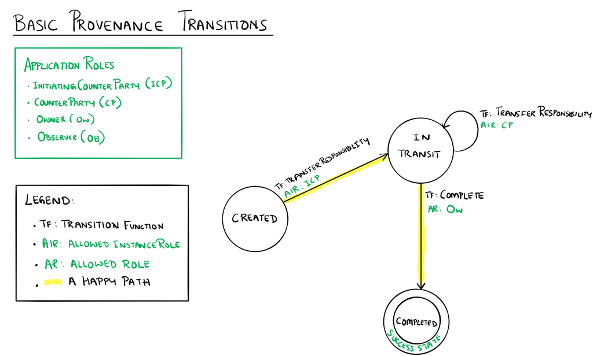

Basic Provenance Sample Application
for Azure Blockchain Workbench
==============================

Overview 
---------

 

The Basic Provenance application expresses a workflow for a simple record of
ownership or responsibility.  The state transition diagram below shows the
interactions among the states in this workflow. 

Application Roles 
------------------

InitiatingCounterParty 

Counterparty 

Owner 

Observed 

 

States 
-------

Created 

InTransit 

Completed 

 

Workflow Details
----------------

 

 

An instance of the Basic Provenance application's workflow starts in the Created
state when an owner wants to begin a process for tracking ownership or
responsibility.  An owner is also the InitiatingCounterParty since the owner
initiates the process for tracking the ownership or responsibility.  The state
changes to InTransit whenever a new counterparty that can take on the
responsibility is identified.  The owner in the InitiatingCounterParty role
calls a function to transfer responsibility by specifying a counterparty.  Upon
reaching the InTransit state, the counterparty can transfer the responsibility
to another counterparty or the owner can decide to complete the transfers of
responsibility and call the Complete function to reach the Completed state. 

 

The happy path shown in the transition diagram traces the owner transferring
responsibility to a counterparty once and then completing the workflow. 

Application Files
-----------------

[BasicProvenance.json](BasicProvenance.json)

[BasicProvenance.sol](BasicProvenance.sol)
