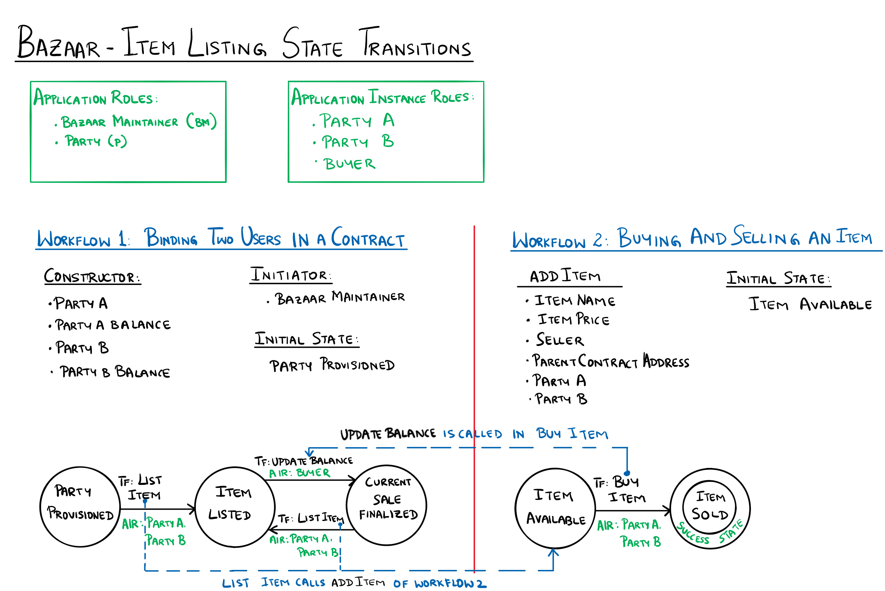

Bazaar - Item Listing Sample Application for Azure Blockchain Workbench
====================================================

Overview 
---------

The Bazaar - Item Listing scenario shows an example of how an application can have more than one workflow and how one contract can deploy another contract.
The Bazaar - Item Listing application has two workflows.  The first workflow binds two people through a smart contract.  The second workflow lets the two people bound by a smart contract list items that can be bought and sold between themselves.  The result of buying and selling an item, such as updating user balances, from the second workflow is reflected in the first workflow. 

Application Roles 
------------------

| Name       | Description                                                                                         |
|------------|-----------------------------------------------------------------------------------------------------|
| BazaarMaintainer     | A person who is responsible for pairing or binding two people through a smart contract.                                             |
| Party      | A person who is participant in the application.  A  person in a party role can be a part of one or more bindings, in that can be paired with more than one parties through multiple smart contracts (one smart contract for each pair).                                     |

Bazaar Workflow States 
-------

| Name                 | Description                                                                                                 |
|----------------------|-------------------------------------------------------------------------------------------------------------|
| PartyProvisioned               | Indicates that two persons in Party roles have been provisioned along with their monetary balance values.                                                      |
| ItemListed         | Indicates that a party has listed an item in the bazaar.                                                                       |
| CurrentSaleFinalized   | Indicates that the sale of an item currently listed  has been completed.                      |

Item Listing Workflow States 
-------

| Name                 | Description                                                                                                 |
|----------------------|-------------------------------------------------------------------------------------------------------------|
| ItemAvailable               | Indicates that an item is available for buying.                                                      |
| ItemSold         | Indicates that the item that was available for buying is now sold.                                                                       |

Workflow Details
----------------

An instance of the Bazaar - Item Listing application first creates a binding between two users (here Party A and Party B).  The two users are bound by a smart contract that tracks their balances (here Party A Balance and Party B Balance).  Once  the smart contract is created and deployed on the chain, the instance reaches the Party Provisioned state.

Party A and Party B, bound by the smart contract, can now begin to buy and sell items between themselves. A party can list the item by calling the transition function List Item in Workflow 1. The List Item function takes in the item name and the item price and calls Workflow 2's constructor with the correct set of arguments. A successful completion of List Item creates an instance of the second workflow and places that workflow instance in the Item Available state. An item that is available can be bought using the Buy Item function. The Buy Item function checks if the buyer has sufficient balance and proceeds to buy the item by way of updating the parties' balances. Now, since the parent contract's address is known, a direct call can be made to the parent contract's Update Balance function. The Update Balance function appropriately updates the balance of the two parties. A successful execution puts the second workflow instance in the Item Sold state and the first workflow instance in the Current Sale Finalized state.

The List Item function is always available to create new items and consequently new instances of the second workflow.  The List Item function is available to both parties so that either party can list an item for sale.  Please note that the first workflow does not have a final state indicating that the two parties can continue to buy and sell more than one item in the Bazaar.  The second workflow, however, does have a final state indicating that an instance of the second workflow captures the sale of exactly one item between the two parties.

Application Files
-----------------
[BazaarItemListing.json](./ethereum/BazaarItemListing.json) : This is the meta-data file and contains information on the two workflows, their properties, functions, and state transition rules.

[BazaarItemListing.zip](./ethereum/BazaarItemListing.zip) : This file contains three solidity files. 
* BazaarItemListing.sol - This file contains the code for Workflow 1 in the diagram, binding two users in a contract. 
* ItemListing.sol - This file contains the code for Workflow 2 in the diagram, buying and selling an item.
* WorkbenchBase.sol - This file contains the Workbench base class and the event definitions.
