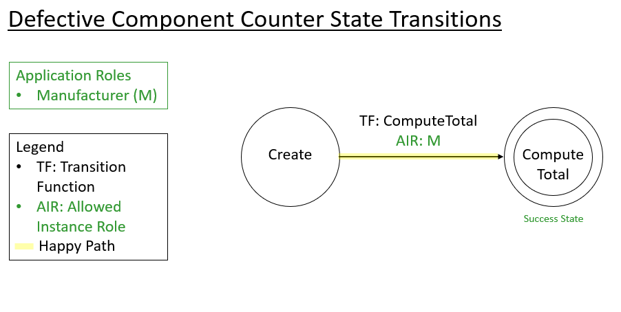

Defective Component Counter Application for Azure Blockchain Workbench
====================================================

Overview 
---------
The Defective Component Counter application is an example of using a fixed length array of integers in Azure Blockchain Workbench.  The application lets a manufacturer get the total number of defective components over twelve months. The main objective of this simple application is to show how arrays of fixed length can be declared in a contract's configuration file and used in the corresponding contract code file in Azure Blockchain Workbench.

Application Roles 
------------------
| Name       | Description                                                                                         |
|------------|-----------------------------------------------------------------------------------------------------|
| Manufacturer| A person manufacturing the components.                                             |

States 
-------
| Name                 | Description                                                                                                 |
|----------------------|-------------------------------------------------------------------------------------------------------------|
| Create | The state that is reached when a contract is created.                                                    |
| Compute Total | The state that is reached when the total number of defective component is computed.                                                                       |

Workflow Details
----------------

An instance of the Defective Component Counter application's workflow starts when a Manufacturer creates a contract by specifying the number of defective components for the last twelve months.  The manufacturer calls the function 'ComputeTotal' to compute the total number of defective components after the contract is created.  The total number of defective components is tracked as a property in the contract and is updated when the ComputeTotal function executes. 

Application Files
-----------------
[DefectiveComponentCounter.json](./ethereum/DefectiveComponentCounter.json)

[DefectiveComponentCounter.sol](./ethereum/DefectiveComponentCounter.sol)

[DefectiveComponentCounter.zip](./ethereum/DefectiveComponentCounter.zip)
