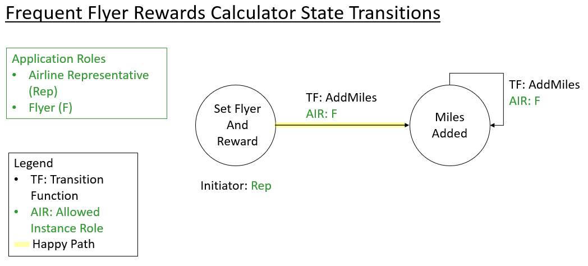

Frequent Flyer Rewards Calculator Application for Azure Blockchain Workbench
====================================================

Overview 
---------
The Frequent Flyer Rewards Calculator application is an example of using a dynamic length array of integers in Azure Blockchain Workbench.  The application binds an airline representative, a flyer, and the number of rewards per mile in a smart contract.  The flyer can continually add miles to the contract and have their reward points automatically calculated. The main objective of this simple application is to show how arrays of dynamic length can be declared in a contract's configuration file and used in the corresponding contract code file in Azure Blockchain Workbench. 

Application Roles 
------------------
| Name       | Description                                                                                         |
|------------|-----------------------------------------------------------------------------------------------------|
| Airline Representative| A person representing an airline.                                           |
| Flyer| A person using an airline to fly to their destination.                                           |

States 
-------
| Name                 | Description                                                                                                 |
|----------------------|-------------------------------------------------------------------------------------------------------------|
| Set Flyer and Reward| The state that is reached after the contract is created upon setting the flyer and a rewards per mile value.                                                    |
| Miles Added | The state that is reached each time the flyer adds one or more values for miles flown on one or more occasions.                                                                       |

Workflow Details
----------------

An instance of Frequent Flyer Rewards Calculator is created when an airline representative creates a contract by specifying a flyer and the rewards per mile.  The flyer associated with the contract can add miles after the contract is created.  The miles can be added as an array of integers and the size of this array need not have to be specified in the contract.  The miles are all stored as a part of a monotonically growing dynamic array.  The value for the total rewards accrued is computed as and when miles are added.

Application Files
-----------------
[FrequentFlyerRewardsCalculator.json](./ethereum/FrequentFlyerRewardsCalculator.json)

[FrequentFlyerRewardsCalculator.sol](./ethereum/FrequentFlyerRewardsCalculator.sol)
