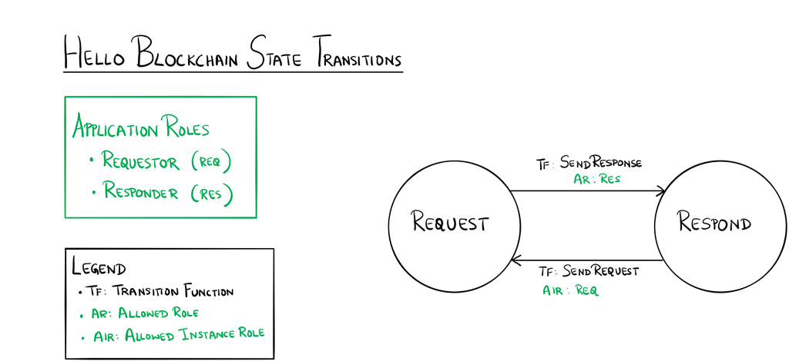

Hello Blockchain Sample Application for Azure Blockchain Workbench
==================================================================

Overview 
---------

The Hello Blockchain application expresses a workflow between a person sending
a request and a person responding to the request.  The state transition diagram
below shows the interactions between the states in this workflow. 

Application Roles 
------------------

| Name  |  Description |
|------------|-------------------------------------------------------------------------------------------|
| Requestor  |  The party that initiates the "Hello blockchain!" request                                 |
| Responder  |  The party that responds to the Requestor |

States 
-------

| Name  |  Description |
|----------|-------------------------------------------------------------------------------------------|
| Request  | The state that occurs when a request has been made.  |
| Respond  | The state that occurs after a response has been made to the request.  |

 

Workflow Details
----------------

 
An instance of the Hello Blockchain application's workflow starts in the Request
state when a Requestor makes a request.  The instance transitions to the Respond
state when a Responder sends a response.  The instance transitions back again to
the Request state when the Requestor makes another request.  These transitions
continue for as long as a Requestor sends a request and a Responder sends a
response. 

Application Files
-----------------

[HelloBlockchain.json](HelloBlockchain.json)

[HelloBlockchain.sol](HelloBlockchain.sol)
