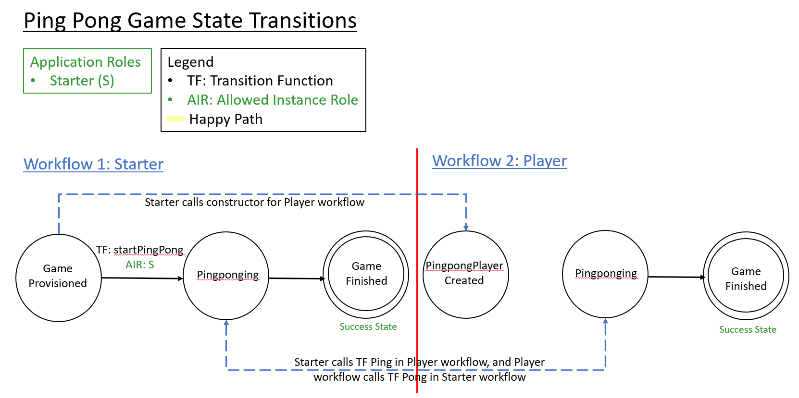

Ping Pong Game Application for Azure Blockchain Workbench
====================================================
	
Overview 
---------
The Ping Pong Game application is an example smart contract which has multiple workflows in Azure Blockchain Workbench.  The application showcases how one contract can create another contract as well as how a contract function in one workflow can call another contract function for another workflow.   
	
Application Roles 
------------------
| Name       | Description                                                                                         |
|------------|-----------------------------------------------------------------------------------------------------|
| Starter | Starter of the ping pong game.                                        |
	
Starter Workflow States 
-------
| Name                 | Description                                                                                                 |
|----------------------|-------------------------------------------------------------------------------------------------------------|
| Game Provisioned| The state that is reached after the contract is created.                                                    |
| PingPonging | The state that is reached when the game starter and the ping pong "player" contract are engaged in a ping pong game. |
| Game Finished| The state that is reached when the ping pong game is finished.     |
	
	
Player Workflow States 
-------
| Name                 | Description                                                                                                 |
|----------------------|-------------------------------------------------------------------------------------------------------------|
| Pingpong Player Created| The state that is reached after the contract is created and a ping pong player is created from the Starter contract.|
| PingPonging | The state that is reached when the game starter and the ping pong "player" contract are engaged in a ping pong game.  |
| Game Finished| The state that is reached when the ping pong game is finished. |
	
	
Workflow Details
---------------

	
The ping pong game starts when the Starter workflow is created. This instantiates a Player workflow and the player is created as well. To start the game, the Starter role takes the action to start ping pong and enters the number of times to ping pong between the starter and player. Once the number specified is reached, the game is finished. 
	
	
Application Files
-----------------
[PingPongGame.json](./ethereum/PingPongGame.json)

[PingPongGame.sol](./ethereum/PingPongGame.sol)
