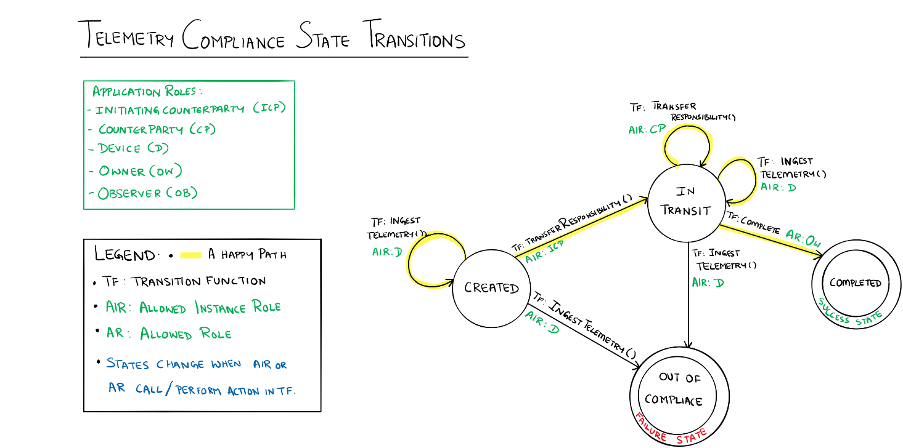

Refrigerated Transportation Sample Application for Azure Blockchain Workbench
=============================================================================

Overview  
----------

The refrigerated transportation smart contract covers a provenance scenario with
IoT monitoring. You can think of it as a supply chain transport scenario where
certain compliance rules must be met throughout the duration of the
transportation process. The initiating counterparty specifies the humidity and
temperature range the measurement must fall in to be compliant. At any point, if
the device takes a temperature or humidity measurement that is out of range, the
contract state will be updated to indicate that it is out of compliance.  

All participants can view the state and details of the contract at any point in
time. The counterparty doing the transportation will specify the next
counterparty responsible, and the device will ingest temperature and humidity
data, which gets written to the chain. This allows the Supply Chain Owner and
Supply Chain Observer to pinpoint which counterparty did not fulfill the
compliance regulations if at any point in the process either the temperature or
humidity requirements were not met.   

Application Roles 
------------------
| Name                   | Description                                       |
|------------------------|---------------------------------------------------|
| InitiatingCounterParty | The first participant in the supply chain.        |
| Counterparty           | A party to whom responsibility for a product has been assigned. For example, a shipper |
| Device                 | A device used to monitor the temperature and humidity of the environment the good(s) are being shipped in.
| Owner                  | The organization that owns the product being transported. For example, a manufacturer |
| Observer               | The individual or organization monitoring the supply chain. For example, a government agency |

States 
-------

| Name                   | Description                                       |
|------------------------|---------------------------------------------------|
|Created |Indicates that the contract has initiated and tracking is in progress. |
|InTransit |Indicates that a Counterparty currently is in possession and responsible for goods being transported.|
|Completed |Indicates the product has reached it's intended destination.| 
|OutOfCompliance|Indicates that the agreed upon terms for temperature and humidity conditions were not met.|

Workflow Details
----------------

The following state transition diagram articulates the possible flows, and the
various transition functions at each state. Each user is only allowed to take
certain actions depending on the application role. Instance roles indicate that
only the user with the application role assigned to the specific contract is
able to take actions on the contract. 

This contract demonstrates how to collect telemetry information and enforce
contract specifics related to conditions during transport. Specifically,
receiving and evaluating temperature and humidity data against an agreed upon
acceptable range. If the IoT device identifies that the telemetry is out of the
acceptable range, the contract will shift into an out of compliance state and
appropriate remedies can be sought. In the highlighted happy path, the device
ingests readings, which are in compliance throughout the transportation process,
while the involved counterparties transfer responsibility until the
transportation is completed.  

Application Files
-----------------
[RefrigeratedTransportation.json](./ethereum/RefrigeratedTransportation.json)

[RefrigeratedTransportation.sol](./ethereum/RefrigeratedTransportation.sol)
