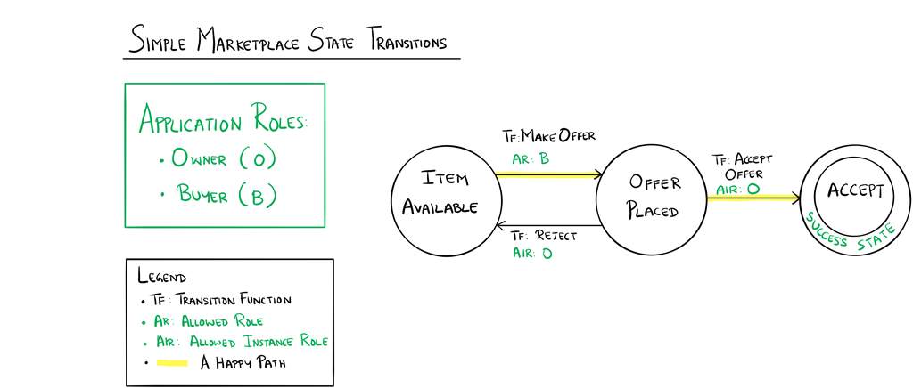

Simple Marketplace Sample Application for Azure Blockchain Workbench
====================================================================

Overview 
---------

 

The Simple Marketplace application expresses a workflow for a simple transaction
between an owner and a buyer in a marketplace.  The state transition diagram
below shows the interactions among the states in this workflow. 

Application Roles 
------------------

Owner 

Buyer 

 

States 
-------

ItemAvailable 

OfferPlaced 

Accepted 

Workflow Details
----------------

 

 

An instance of the Simple Marketplace application's workflow starts in the
ItemAvailable state when an Owner makes an item available for sale by specifying
its description and price.  A buyer can then make an offer by specifying their
price for the item.  This action causes the state to change from ItemAvailable
to OfferPlaced.  Now, if the owner agree to the buyer's offer, then owner calls
the function to accept an offer, and the workflow reaches a successful
conclusion state denoted by the Accepted state.  If the owner, however, is not
satisfied with the offer, then the owner can call the function to reject the
offer.  On rejection, the state changes to ItemAvailable indicating that the
item is still up for sale.  The transitions between the ItemAvailable and the
OfferPlaced states can continue until the owner is satisfied with the offer
made. 

A happy path shown in the transition diagram traces an owner making an item
available, a buyer making an offer, and the owner accepting the offer. 

 
 
Application Files
-----------------

[SimpleMarketplace.json](SimpleMarketplace.json)

[SimpleMarketplace.sol](SimpleMarketplace.sol)
