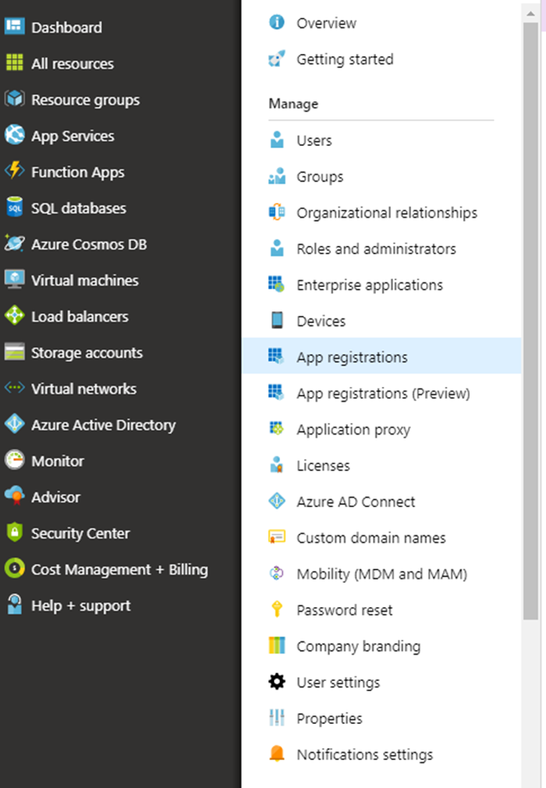
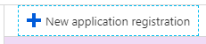
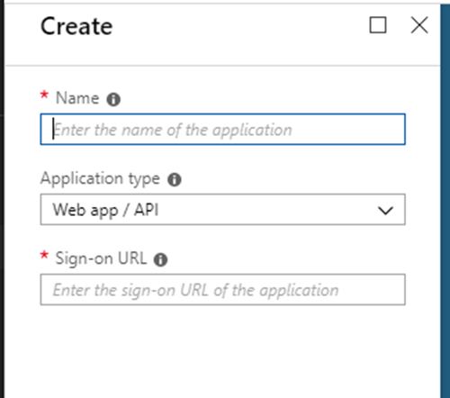
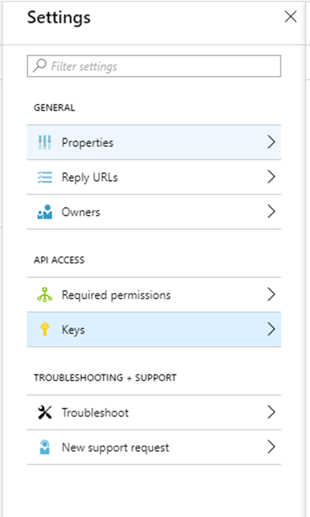

# Auth Samples and Code Snippets for Workbench

## Overview
### Steps for Workbench Authentication

1. Create a Service Principle

Instruction for Creating a Service Principle on the Azure Portal:

Go to Azure Active Directory --> App Registrations
<br>

<br>

Create a New Application Registration
<br>

<br>

<br>

To get the Client Id: Go to the Application you have just created --> Settings --> Keys
<br>

<br>
Generate a New Key and be sure to save this. This is your Client App Secret.

2. Get the latest version of the ADAL Package (Instructions Provided Below)
3. Use the code samples below as a guideline of how to get a bearer token for your Workbench Application

#### C# Sample

Getting the ADAL Nuget Package:
1. Go to Nuget Package Manager
2. Install the latest version of Microsoft.IdentityModel.Clients.ActiveDirectory
 
Code Sample:
```
AuthenticationContext authenticationContext = new AuthenticationContext("https://login.microsoftonline.com/{YOUR-TENANT-ID}");
ClientCredential clientCredential = new ClientCredential("{YOUR-CLIENT-APP-ID}", "{YOUR-CLIENT-SECRET}");
AuthenticationResult result = await authenticationContext.AcquireTokenAsync("{WORKBENCH-APP-ID}", clientCredential).ConfigureAwait(false);
var token = result.AccessToken;
```

#### Node.JS Sample

Getting the ADAL Node Package:
1. Go to Node Package Manager
2. Install the latest version of 'adal-node'
 
Code Sample:
```
var AuthenticationContext = require('adal-node').AuthenticationContext;
var authorityHostUrl = 'https://login.windows.net';
var tenant = '{YOUR-TENANT-NAME}'; // AAD Tenant name.
var authorityUrl = authorityHostUrl + '/' + tenant;
var applicationId = '{YOUR-CLIENT-APP-ID}'; // Application Id of app registered under AAD.
var clientSecret = '{YOUR-CLIENT-SECRET}'; // Secret generated for app. Read this environment variable.
var resource = '{WORKBENCH-APP-ID}'; // Application Id that identifies the resource for which the token is valid.
 
var context = new AuthenticationContext(authorityUrl);
 
context.acquireTokenWithClientCredentials(resource, applicationId, clientSecret, function (err, tokenResponse) {
    if (err) {
        console.log('well that didn\'t work: ' + err.stack);
    } else {
        console.log(tokenResponse);
    }
});
```

#### Python Sample

Getting the ADAL Package:
1. Go to Python Package Manager
2. Run command 'pip install adal'
 
Code Sample:
```
auth_context = AuthenticationContext("https://login.microsoftonline.com/{YOUR-TENANT-ID}")
token = auth_context.acquire_token_with_client_credentials("{WORKBENCH-APP-ID}", "{YOUR-CLIENT-APP-ID}", "{YOUR-CLIENT-SECRET}")
```

#### [Bearer Token Retrieval tool](./bearer-token-retrieval)
A simple tool that allows you to obtain a bearer token for your Workbench instance to be used for development purposes or through Postman.