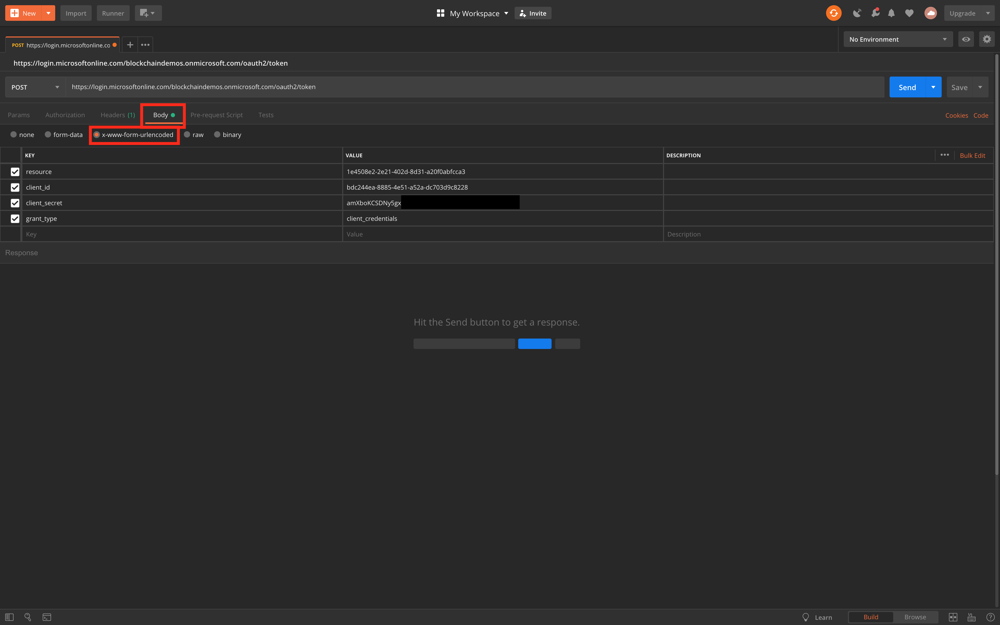
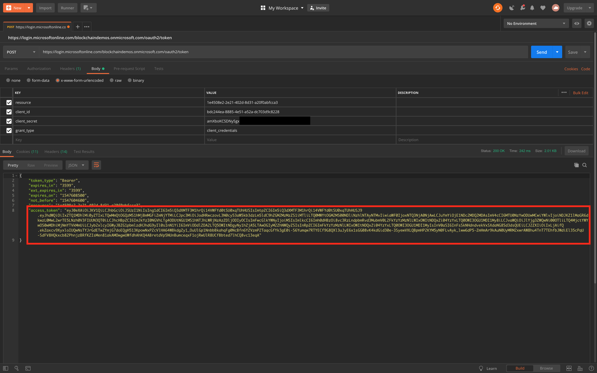
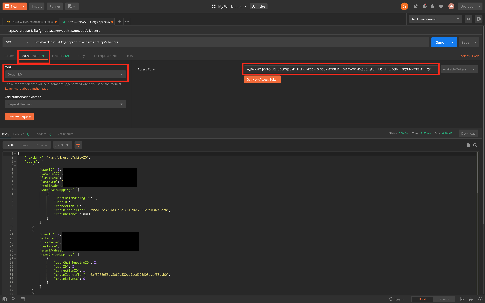

# Using Postman with a Service Principal

## Overview
You can use Postman to obtain a token by using a service principal through the [client credential](https://docs.microsoft.com/en-us/azure/active-directory/develop/v1-oauth2-client-creds-grant-flow) flow.

## Prerequisite for Workbench Authentication
To use Postman with service principal you need to first create a service principal with certain configuration. Here is a guide on how to [create a service principal for Workbench](../../scripts/workbench-serviceprincipal).

## Instructions 
1. Open Postman. You can download [Postman here](https://www.getpostman.com/downloads/). 
2. We need to make a Post request to AAD's token service
  * Set the method to `POST`
  * Set the URL to `https://login.microsoftonline.com/<tenant_name>/oauth2/token`
  * Navigate to the `body` tab
  * Set the body type to `x-www-form-urlencoded`
  * Add the following parameters:
     * `resource`: Workbench's AppId
     * `client_id`: service principal AppId
     * `client_secret`: service principal app key (secret)
     * `grant_type`: `client_credentials`
  * Click on `Send` to make the call

2. If the call is successful you will receive a JSON containing the `access_token` (bearer token). Copy this token.

3. In this example we are going to make a `GET` call to `/api/v1/users` to get all the users. Set the operation to `GET` and the url to `<workbench_url>/api/v1/users`

4. Navigate to the `Authorization` tab
	* select `OAuth 2.0` from the dropdown menu
	* Paste your `access_token` in the text box

5. Click on send and you should get a list of users

> Note: This token will expire in an hour, you need to make another post call to get a new token.
 
> Some API calls need Admin privileges, make sure when you're [creating your service principal for Workbench](../../scripts/workbench-serviceprincipal) that the service principal has adequate permissions for the operation that you are trying to perform. 
