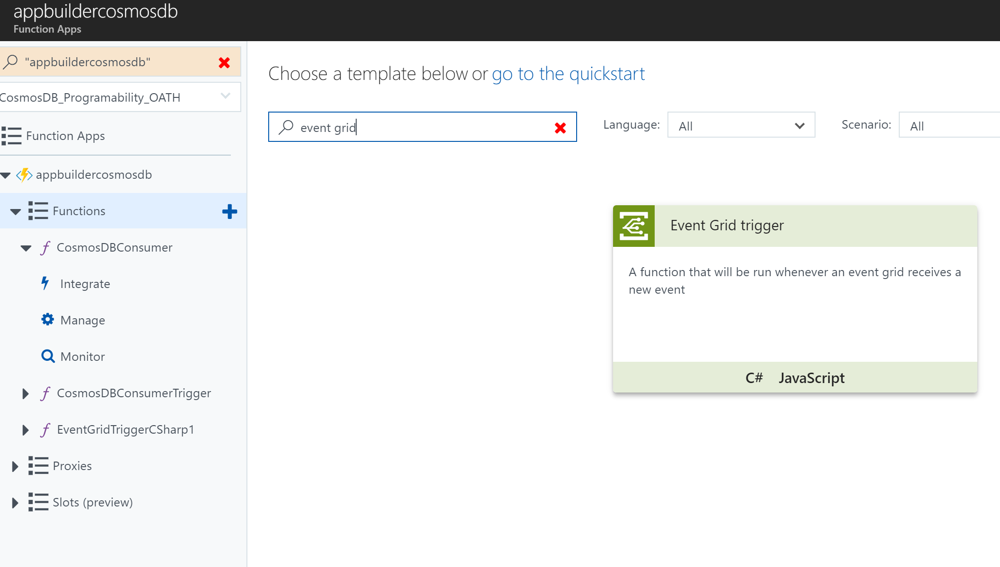

Store Blockchain Workbench messages in Cosmos DB 
=================================================

Overview
--------

This sample shows how you can store blockchain workbench messages in Cosmos DB
using an Azure function with an Event Grid trigger and a Cosmos DB output
binding.

Provision a new Cosmos DB account
---------------------------------

If not present already, provision a new Cosmos DB account.


Create and configure a new Function App
=======================================

1.  If not already present, create a new function app :

    

2.  Use the template to create a function with the EventGrid Trigger.

    

3.  Choose C\# as the programming language and give an appropriate name. Once
    the function is created, go to the integrate tab to add an output trigger to
    CosmosDB.

    For the Cosmos DB account connection, choose the account created in the
    above section. Make sure you check the flag to create a Cosmos DB database
    and collection.

    

4.  In the function body, paste the following snippet :

    ``` csharp
    public static void Run(JObject eventGridEvent, TraceWriter log, out object document)
    {
        document = null;
        String messageName = eventGridEvent["data"]["messageName"].ToString();
        switch(messageName)
        {
            case "BlockMessage":
            case "ContractMessage":
            case "EventMessage":
                document = eventGridEvent["data"];
                log.Info("Storing " + messageName + " transaction in Cosmos DB")
                break;
            }
        }
    ```

5.  Add the Event Grid subscription by clicking on the link next to the Run
    button. Choose the topic type as “Event Grid Topics” and select the event
    grid from your workbench deployment to listen to the messages.

6.  Once the event grid subscription is added successfully, you can run the
    Azure function.

7.  Validate that you are seeing the messages in Cosmos DB . You can run queries
    on top of this to filter or project what you need.
