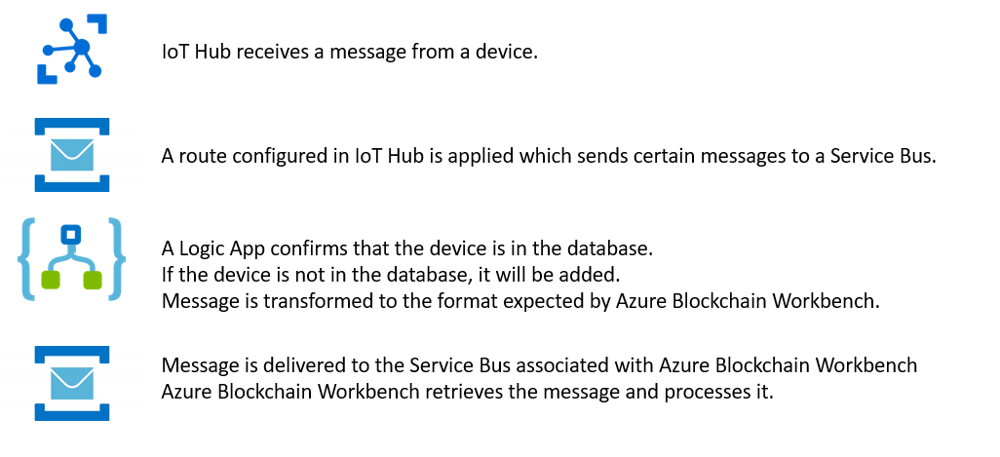

Delivering Data from IoT Hub to Azure Blockchain Workbench
==========================================================

Version 1.0

Overview
--------

This sample focuses on the receipt, transformation, and delivery of messages
from IoT devices to Azure Blockchain Workbench.

Specifically, this sample provides guidance on –

-   Deploy an IoT Hub

-   How to deploy services on a Rapsberry Pi or a simulated device

-   How to configure IoT Hub’s Routes functionality to deliver messages to a
    Service Bus

-   Develop a Logic App which will receive those messages, transform them, and
    subsequently deliver them to Azure Blockchain Workbench

This sample is designed to work with the Refrigerated Transportation sample
application and contracts but can be easily adapted to other contracts by making
changes to Service Bus – Send a Message action at the end of the sample to
reflect the specifics of the new contract.

Of Note
-------

This is a complex sample, including devices, IoT Hub, multiple service buses,
stored procedures, and a logic app connected to Azure Blockchain Workbench.

The high level flow of the sample is below.


----------------------------------------

After delivery to the Azure Blockchain Workbench, it is often desirable to have
alerts, e.g. emails or SMS text messages, delivered based on changes in a
contract. For example, if a contract changes it’s state to “OutOfCompliance”, it
would be appropriate to send an alert. Examples for how to deliver each of these
can be found in Office Samples and Technology Samples sections of the SDK.

Deploy an IoT Hub and a Raspberry Pi Client
-------------------------------------------

Deploy an IoT Hub and a Raspberry Pi Client following the instructions in the
IoT Hub documentation at the following link -

<https://docs.microsoft.com/en-us/azure/iot-hub/iot-hub-raspberry-pi-kit-node-get-started>

Note – the demonstration done at the //build conference in May, 2018 used a
custom service to read data from Thunderboard React hardware and that delivered
a payload in the schema listed below. The Thunderboard sensor has a superset of
sensors used in this sample and this is reflected in the messaging schema it
delivers to IoT Hub.

The only properties leveraged from the payload are the deviceId, temperature,
and humidity. You can have your clients (real or simulated) deliver the same
schema or deliver a different schema that includes these values. For the latter,
past that schema in the “Parse JSON” action the Logic App that will be created
later in this sample.

Note – in a future version of this sample, it will be adapted to IoT Hub’s
simulated device.

``` json
{
    "properties": {
        "agent": {
            "type": "string"
        },
        "service": {
            "properties": {
                "data": {
                    "properties": {
                        "acceleration": {
                            "properties": {
                                "x": {
                                    "type": "number"
                                },
                                "y": {
                                    "type": "number"
                                },
                                "z": {
                                    "type": "number"
                                }
                            },
                            "type": "object"
                        },
                        "ambientLight": {
                            "type": "number"
                        },
                        "battery": {
                            "type": "number"
                        },
                        "deviceId": {
                            "type": "string"
                        },
                        "humidity": {
                            "type": "number"
                        },
                        "orientation": {
                            "properties": {
                                "x": {
                                    "type": "number"
                                },
                                "y": {
                                    "type": "number"
                                },
                                "z": {
                                    "type": "number"
                                }
                            },
                            "type": "object"
                        },
                        "temperature": {
                            "type": "number"
                        },
                        "uvIndex": {
                            "type": "number"
                        },
                        "ver": {
                            "type": "string"
                        }
                    },
                    "type": "object"
                },
                "name": {
                    "type": "string"
                }
            },
            "type": "object"
        },
        "ver": {
            "type": "string"
        }
    },
    "type": "object"
}
```
Route messages to a queue in your IoT hub
-----------------------------------------

In this section, you:

-   Create a Service Bus queue.
-   Connect it to your IoT hub.
-   Configure your IoT hub to send messages to the queue based on the presence
    of a property on the message.

Create a Service Bus queue as described in [Get started with
queues](https://docs.microsoft.com/en-us/azure/service-bus-messaging/service-bus-dotnet-get-started-with-queues).
The queue must be in the same subscription and region as your IoT hub. Make
a note of the namespace and queue name.

>   **Note:**
>   Service Bus queues and topics used as IoT Hub endpoints must not have
>   **Sessions** or **Duplicate Detection** enabled. If either of those options
>   are enabled, the endpoint appears as **Unreachable** in the Azure portal.

In the Azure portal, open your IoT hub and click **Endpoints**.


### Endpoints in IoT hub

In the **Endpoints** blade, click **Add** at the top to add your queue to
your IoT hub. Name the endpoint **iotingest** and use the drop-downs to
select **Service Bus queue**, the Service Bus namespace in which your queue
resides, and the name of your queue. When you are done, click **Save** at
the bottom.


### Adding an endpoint

Now click **Routes** in your IoT Hub. Click **Add** at the top of the blade
to create a routing rule that routes messages to the queue you just added.
Select **DeviceTelemetry** as the source of data. Enter the condition that
is relevant for your smart contract, and choose the queue you just added as
a custom endpoint as the routing rule endpoint. When you are done, click
**Save** at the bottom.

>   **Note:**
>   The wording of the condition will vary based on the schema that is
>   used by your client. Ultimately, it should reflect the general rules for
>   upper and lower boundaries of the values for temperature and humidity.


### Adding a route

Make sure the fallback route is set to **ON**. This value is the default
configuration for an IoT hub.


### Fallback route

The IoT Hub is now configured to identify those device messages that meet the
criteria relevant to your smart contract and deliver them to a Service Bus named
iotingest..

Logic App Overview
------------------

There is a single logic app that performs two actions – one related to user
creation and the other is tied to delivering the telemetry data. The logic app
is pointed at the Service Bus that is populated by the IoT Hub.

The logic app by default is configured to get triggered every minute to process
any new messages that are delivered by the IoT Hub. Upon finding a new message,
the logic app creates messages as appropriate for user creation or executing the
“IngestTelemetry” function.

### Calling “IngestTelemetry”

The logic app creates a new action message corresponding to each received from
IoT Hub.

Prior to adding the newly-created message onto the Workbench Service Bus, the
Logic App first makes a SQL call to the GetContractInstanceInfoForDeviceId
Stored Procedure in the Workbench db.

This stored procedure takes a DeviceID as an input (again, taken from the IoT
Service Bus message) and returns the data for the specific contract instance
that the device has been added to in Workbench with the "Device" role. *(Each
device can only be mapped to a single instance with this role.)*

Once this message has been placed onto the Azure Blockchain Workbench Service
Bus, it is picked up by Workbench and the appropriate actions(s) are taken to
execute the request on the blockchain.

Deploy the Stored Procedures
----------------------------

Download the file with the stored procedures to support the IoT sample. They are
in a single file that can be downloaded from this location.

Open a web browser and navigate to the Azure portal at
<http://portal.azure.com>

Navigate to the database for your Azure Blockchain Workbench deployment.

Select the query editor


Click Login and provide your database credentials. The username will be
‘dbadmin’ and the password is the one your provided during the installation of
Azure Blockchain Workbench.


Click Load Query and select the stored procedure file you downloaded earlier.


Click the run button to create the stored procedures in the database.

### User Creation

The external ID of the User table is used to hold the id of the device.

Add a user to Azure Blockchain Workbench that will represent your device using
[the guidance in the
documentation](https://docs.microsoft.com/en-us/azure/blockchain-workbench/blockchain-workbench-manage-users).

Identify the device ID for your device that will be sent with the telemetry
message.

In the query window, enter and execute the following SQL

Update [User] Set External Id = ‘\<your device id here\>’ where EmailAddress =
‘\<insert email address here\>’

Note – when provisioning a user in AAD, an email address will be assigned, e.g.
username\@yourdomain.onmicrosoft.com

Creating the Logic App
----------------------


For the content, to be evaluated it must be converted from a Base64 string.
Click in the content field, select Expression and enter the following -
`json(base64ToString(triggerBody()?['ContentData']))`

For the schema property, enter the schema created by your device code.

The following text is the schema used by the client demonstrated at the //build
conference and reflects sensor data available from a Thunderboard React device -

``` json
{
    "properties": {
        "agent": {
            "type": "string"
        },
        "service": {
            "properties": {
                "data": {
                    "properties": {
                        "acceleration": {
                            "properties": {
                                "x": {
                                    "type": "number"
                                },
                                "y": {
                                    "type": "number"
                                },
                                "z": {
                                    "type": "number"
                                }
                            },
                            "type": "object"
                        },
                        "ambientLight": {
                            "type": "number"
                        },
                        "battery": {
                            "type": "number"
                        },
                        "deviceId": {
                            "type": "string"
                        },
                        "humidity": {
                            "type": "number"
                        },
                        "orientation": {
                            "properties": {
                                "x": {
                                    "type": "number"
                                },
                                "y": {
                                    "type": "number"
                                },
                                "z": {
                                    "type": "number"
                                }
                            },
                            "type": "object"
                        },
                        "temperature": {
                            "type": "number"
                        },
                        "uvIndex": {
                            "type": "number"
                        },
                        "ver": {
                            "type": "string"
                        }
                    },
                    "type": "object"
                },
                "name": {
                    "type": "string"
                }
            },
            "type": "object"
        },
        "ver": {
            "type": "string"
        }
    },
    "type": "object"
}
```

Click “More” and add a new action.

Select “SQL Stored Procedure”

Select the stored procedure named “GetContractInfoForDeviceID”

Using Dynamic Properties, select “deviceId


Click the “More” link and select add action.

Select the Parse JSON action.

Click in the Content field and then select the ResultSets item for content.

``` json
{
    "properties": {
        "Table1": {
            "items": {
                "properties": {
                    "ConnectionId": {
                        "type": "number"
                    },
                    "ContractCodeBlobStorageUrl": {
                        "type": "string"
                    },
                    "ContractId": {
                        "type": "number"
                    },
                    "ContractLedgerIdentifier": {
                        "type": "string"
                    },
                    "IngestTelemetry_ContractPersonaID": {},
                    "IngestTelemetry_ContractWorkflowFunctionID": {
                        "type": "number"
                    },
                    "IngestTelemetry_Humidity_WorkflowFunctionParameterID": {
                        "type": "number"
                    },
                    "IngestTelemetry_Temperature_WorkflowFunctionParameterID": {
                        "type": "number"
                    },
                    "IngestTelemetry_Timestamp_WorkflowFunctionParameterID": {
                        "type": "number"
                    },
                    "UserChainIdentifier": {
                        "type": "string"
                    },
                    "WorkflowFunctionId": {
                        "type": "number"
                    },
                    "WorkflowFunctionName": {
                        "type": "string"
                    },
                    "WorkflowName": {
                        "type": "string"
                    }
                },
                "required": [
                    "ContractId",
                    "WorkflowFunctionId",
                    "ConnectionId",
                    "ContractLedgerIdentifier",
                    "ContractCodeBlobStorageUrl",
                    "UserChainIdentifier",
                    "WorkflowFunctionName",
                    "WorkflowName",
                    "IngestTelemetry_ContractWorkflowFunctionID",
                    "IngestTelemetry_ContractPersonaID",
                    "IngestTelemetry_Humidity_WorkflowFunctionParameterID",
                    "IngestTelemetry_Temperature_WorkflowFunctionParameterID",
                    "IngestTelemetry_Timestamp_WorkflowFunctionParameterID"
                ],
                "type": "object"
            },
            "type": "array"
        }
    },
    "type": "object"
}
```

Click the “Add step” link and select the “Initialize Variable” action

This new variable will be used to specify a unique id for the request that can
be tracked in Application Insights.

Set the Name property to RequestId.

Set the Type property to String.

In the Value property, use the Dynamic Content window, select Expression and
enter `guid()`.


Next you will want to define the Unix Epoch time to include as the timestamp for
the message.

Click the “Add step” link and select the “Initialize Variable” action.

Set the Name property to TicksNow.

Set the Type property to Integer.

Click on the Value property field and then in the Dynamic Content window enter
the following in the Expression tab – `ticks(utcNow())`


Click the “Add step” link and select the “Initialize Variable” action.

Set the Name property to TicksNow.

Set the Type property to Integer.

Click on the Value property field and then in the Dynamic Content window enter
the following in the Expression tab – `ticks(‘1970-01-01’)`


Click the “Add step” link and select the “Initialize Variable” action.

Set the Name property to Timestamp.

Set the Type property to Integer.

Click on the Value property field and then in the Dynamic Content window enter
the following in the Expression tab –
`div(sub(variables('TicksNow'),variables('TicksTo1970')),10000000)`


Click the “More” link and select “add a for each”

For the Select an output from previous steps property, click in the field and
select Table1 from Dynamic Content list.

Within the “for each”, click the “Add an action” link and select “Service Bus –
Send a message”


Configure the Service Bus action to use the connection pointed at the Service
Bus in the Blockchain Workshop deployment.

Set the “Queue/Topic” property to activityhub

Set the SessionId property to RequestId

The template of the message to be put in the Content property is below -

``` json
{
    "ContractActionId": null,
    "ConnectionId":,
    "UserChainIdentifier": "",
    "ContractCodeArtifactBlobStorageURL": "",
    "OperationName": "CreateContractAction",
    "ContractLedgerIdentifier": "",
    "WorkflowFunctionName": "IngestTelemetry",
    "WorkflowName": "RefrigeratedTransportation",
    "ContractActionParameters": [
        {
            "name": "humidity",
            "value": ""
        },
        {
            "name": "temperature",
            "value": ""
        },
        {
            "name": "timestamp",
            "value":
        }
    ],
    "RequestId": ""
}
```

Augment this with values from the Dynamic Content window to match the screenshot
below -


Testing
-------

There are multiple places to perform testing –

-   Testing delivery of messages from device to IoT Hub
-   Testing delivery of messages from IoT Hub to Service Bus
-   Testing receipt and usage of messages by the Logic App
-   Testing delivery of the message to Azure Blockchain Workbench

For the first three, the Azure portal can be used to monitor message delivery.

Review
------

This sample deployed and configured an IoT Hub, multiple service buses, and a
logic app that will deliver messages from a device to a smart contract in an
Azure Blockchain Workbench application.

This sample is designed to work with the Refrigerated Transportation sample
application and contracts but can be easily adapted to other contracts by making
changes to Service Bus – Send a Message action at the end of the sample to
reflect the specifics of the new contract.

This sample can also be extended to use alerts by combining it with examples in
the office (Outlook) and technology samples (SMS) sections of the SDK.
