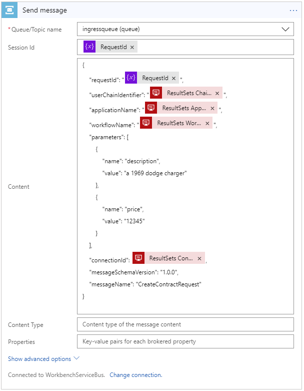

Create a Smart Contract in Azure Blockchain Workbench via Messaging 
====================================================================

Overview

This sample provides step by step instructions for using message to create a
contract on the blockchain.

Deploy the Stored Procedures
----------------------------

Download the file with the stored procedures to support messaging integration.
They are in a single file that can be downloaded from [this location](https://github.com/Azure-Samples/blockchain/blob/master/blockchain-workbench/messaging-integration-samples/SQL/LogicAppStoredProcedures.sql).

Open a web browser and navigate to the Azure portal at
<http://portal.azure.com>

Navigate to the database for your Azure Blockchain Workbench deployment.

Select the query editor


Click Login and provide your database credentials. The username will be
‘dbadmin’ and the password is the one your provided during the installation of
Azure Blockchain Workbench.


Click Load Query and select the stored procedure file you downloaded earlier.


Click the run button to create the stored procedures in the database.


Create the Logic App
--------------------


Click the + symbol in the upper left corner of the screen to add a new resource

Search for and select Logic App and then click Create.

When asked to select a template, select blank template.


A logic app is initiated by a trigger. Depending on your scenario this trigger
may be a message arriving via service bus, event grid, HTTP, or another
mechanism.

For this walk through, select Recurrence. Recurrence occurs at a regular
interval. It’s selected because you can easily test the trigger without writing
additional code.


Click “New Step” and then select “New Action”

Select the SQL Connector and then select the “Execute Stored Procedure” action.


Select the appropriate Azure Workbench SQL DB server from the list.


Next, select the database for your Azure Blockchain Workbench deployment and
enter your database credentials.


Select the stored procedure named “LogicAppGetContractCreationDetails”

Provide the name of the application and workflow to be created, for example
“AssetTransfer”, “AssetTransfer.” Also provide the email address for the user on
whose behalf this transaction will be sent.

Note – the name of the application and contract is the “Name” from the
configuration file. It is not the “DisplayName”


Click “New Step” and select “New Action”

Select the Variable connector and then select the “Initialize Variable” action.


Name the field “RequestId”

Select the type of “String”

Provide a value of “guid()”


Click “New Step” and select “New Action”

Select the Service Bus connector and then select the “Send Message” action.


Select “ingressqueue”

In the Session Id field, select RequestId from the Dynamic content dialog

In the content field, enter the below –

```
{
    "requestId": "",
    "userChainIdentifier": "",
    "applicationName": "AssetTransfer",
    "workflowName": "AssetTransfer",
    "parameters": [
        {
            "name": "description",
            "value": "a 1969 dodge charger"
        },
        {
            "name": "price",
            "value": "12345"
        }
    ],
    "connectionId": ,
    "messageSchemaVersion": "1.0.0",
    "messageName": "CreateContractRequest"
}
```


Using the dynamic content dialog to insert the values that were generated from
the stored procedures. The result should resemble the image below.



Click Save

Click Run


If you check Azure Blockchain Workbench you will see that a new contract has
been added.
