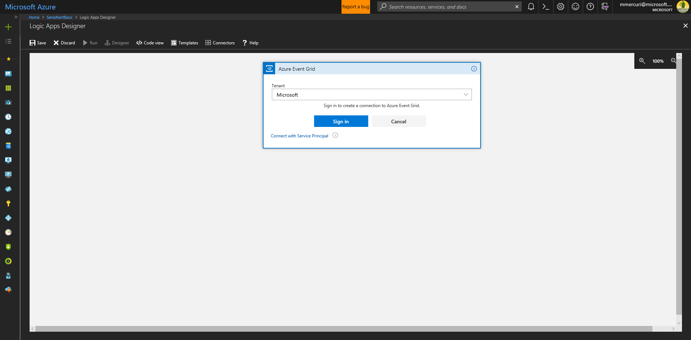

Execute Logic Based on Contract State After a Contract Update
=============================================================

Overview
--------

This logic app performs the following analysis on an incoming message, evaluates
the state of the contract and allows you to take appropriate action.

Specifically –

-   It identifies if the message is of type ContractMessage

-   If true, it identifies if this is an update to an existing contract or a new
    contract

-   It will cycle through the parameters in the message to find the parameter
    named “State”

-   Once found, it evaluates the value of the state.

-   It then implements a switch that allows you to take different actions based
    on the state.

Once the state is identified, common next steps can include

-   If it is a final state, sending a notification

-   If it is a state in which an outside process must take an action, it will
    initiate that action, e.g. making a service call to a third party service

-   If an action should be taken based on a combination of state and property
    values, it may do further evaluation of other parameters and taking any
    appropriate action

This sample is designed to work with the [Simple Marketplace application and
associated
contract](https://github.com/Azure-Samples/blockchain/tree/master/blockchain-workbench/application-and-smart-contract-samples/simple-marketplace)
but can be easily adapted to other contracts by making changes to the value of
the “State” being checked and its associated conditional logic.

Of Note
-------

This sample checks the state on every update, regardless of whether or not a
specific action was taken. In some cases, you may want to only take action based
on the state at the end of a specific action on a smart contract. For example,
in the refrigerated transportation sample, if the state is “OutOfCompliance”
after the IngestTelemetry function is called then perform certain actions. That
more complex version of this scenario is implemented in the sample
ExecutingLogicBasedOnContractStateAfterASpecificAction.

Create the Logic App
--------------------

Navigate to the Azure Portal at http://portal.azure.com

Click the + symbol in the upper left corner of the screen to add a new resource

Search for and select Logic App and then click Create.

A logic app is initiated by a trigger. In this scenario, the trigger will be an
event from Azure Blockchain Workbench delivered via the Event Grid.

Within the Logic App Designer select the trigger “When an Event Grid event
occurs”

Within the Logic App Designer, click the Sign In button.

Select the Azure Active Directory Tenant that the Azure Blockchain Workbench was
deployed to in the drop-down list and either sign in or connect using a Service
Principal. For this basic sample, you will sign in using your credentials.

Clicking Sign In will display a login dialog.

Once connected successfully, the trigger will show a check mark in a green
circle as demonstrated below.

Click the Continue button.

Next select the subscription for the Azure Blockchain Workbench, specify a
Resource Type of “Microsoft.EventGrid.Topics” and the resource name for the
Event Grid topic in the resource group for the Azure Blockchain Workbench
deployment.

Click New Step.

Click “More” and click “add a switch case”.

For the switch case, there is an “On” configuration that identifies what value
will be evaluated.

Click the text box and then select “Subject” from the Dynamic Content window.
This contains the name of the message type being delivered.

In the Case message on the right, enter the value of ContractMessage

Click the “…” in the upper right of the case and select Rename.

Rename the case to ContractMessage.

For the action, select “Data Operations – Parse Json”

In the Content field select Body from the Dynamic Content window.

In the Schema field, enter the following –

{

"properties": {

"data": {

"properties": {

"BlockId": {

"type": "number"

},
"BlockHash": {

"type": "string"

},

"ModifyingTransactions": {

"items": {

"properties": {

"TransactionId": {

"type": "number"

},
"TransactionHash": {

"type": "string"

},
"From": {

"type": "string"

},
"To": {

"type": "string"

},

},

"required": [

"TransactionId",

"TransactionHash",

"From",

"To"

],

"type": "object"

},

"type": "array"

},

"ContractId": {

"type": "number"

},

"ContractLedgerIdentifier": {

"type": "string"

},

"ContractProperties": {

"items": {

"properties": {

"WorkflowPropertuId": {

"type": "number"

},
"Name": {

"type": "string"

},
"Value": {

"type": "string"

}

},

"required": [

"WorkflowPropertyId",

"Name",

"Value"

],

"type": "object"

},

"type": "array"

},

"IsNewContract": {

"type": "boolean"

},

"ConnectionId": {

"type": "number"

},

"MessageSchemaVersion": {

"type": "string"

},

"MessageName": {

"type": "string"

}

},

"type": "object"

},

},

"type": "object"

}

Click the “More” link and select “add a condition”

Click in the box at the left of the condition. It will display the Dynamic
Content window, select “IsUpdate” from the Dynamic Content list.

Set the condition to “is equal to”

Set the condition value to true.

This identifies that this is an update to a contract and not the creation of a
new contract.

Click the three dots in the upper right corner of the Condition action and
select Rename. Rename this action to “Check to See If This is a New Contract or
an Action”

Click the “More” link and “add a for each” action.

Click in the “Select an output from previous steps” field and select
“Parameters” from the Dynamic Content window.

Within the for each action, click the “More” link and then select “add a switch
case”.

In the “On” field in the switch case action, click in the field and select
“Name” from the Dynamic Properties dialog.

Click on the newly created item on the left, and set the “Equals” field value to
State

Click on the three dots in the upper right of the action and select Rename.
Rename this to “Confirm this is the State parameter”

Underneath that action, click the “More” link and then “add new switch case”.

In the “On” field, click it select Value from the dynamic properties.

For the item on the left of the switch case, set the Equals property to
ItemAvailable

Click on the three dots in the corner of this case and select Rename. Rename it
to “In the ItemAvailable state”

Click the (+) in the center of the switch case to add a new case.

For the new case, set the Equals property to OfferPlaced

Click on the three dots in the corner of this case and select Rename. Rename it
to “In the OfferPlaced state”

Click the (+) in the center of the switch case to add a new case.

For the new case, set the Equals property to Accepted

Click on the three dots in the corner of this case and select Rename. Rename it
to “In the Accepted state”

You can now write code that can evaluate the current state of the contract and
take action.

At this point, common scenarios include –

-   If it is a final state, sending a notification

-   If it is a state in which an outside process must take an action, it will
    initiate that action, e.g. making a service call to a third party service

-   If an action should be taken based on a combination of state and property
    values, it may do further evaluation of other parameters and taking any
    appropriate action

Testing
-------

You can test this functionality by taking the following steps –

1.  Navigate to the overview page of for the logic app in the portal and confirm
    that it is enabled (if it is not, click on the “disabled” link at the top of
    the screen to transition the logic app to an enabled state).

2.  Deploy the [Simple Marketplace
    application](https://github.com/Azure-Samples/blockchain/tree/master/blockchain-workbench/application-and-smart-contract-samples/simple-marketplace)
    in Azure Blockchain Workbench.

3.  Create a contract for the application.

4.  The logic app should now be triggered and the code will be executed.
    Navigate to the logic app in the portal. At the bottom of the screen you
    will detail for Runs history.

1.  Click on the most recent execution of your logic app in the list. You should
    see that the logic app executed successfully and view how the trigger and
    each action were executed by the logic app based on your creation of the
    contract.

2.  If you find and error and want to re-test, navigate back to the logic app
    page in the portal, select a prior run, and click “Resubmit” This will call
    the current version of your logic app with the values provided by the
    previous run.

### In Review

In many real world scenarios, there is a need to execute logic based on the
state of a contract after an action has been taken.

The logic app created in this sample facilitates this need by –

-   Identifies the event that occurred.

-   Parses the event into a message that reflects this, making properties of the
    message available for use in your custom logic as Dynamic Content.

-   Identifies the value of the current state

-   Establishes different cases for each state which can be used to execute
    custom logic
