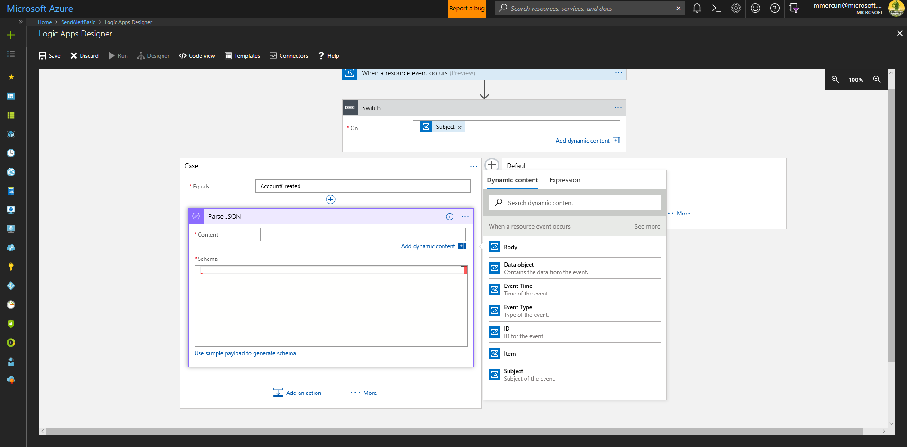
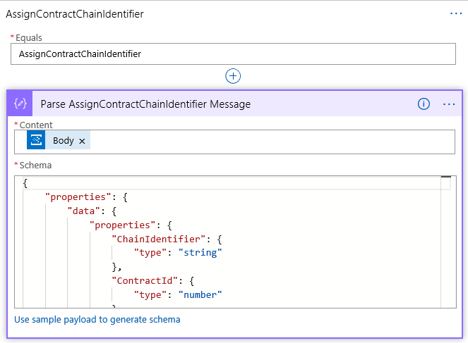

Execute Logic Based on Events from Azure Blockchain Workbench
=============================================================

Overview
--------

This sample provides step by step instructions for setting up a logic app that
connects to the Event Grid exposed by Azure Blockchain workbench, identifies
which messages are being sent, and facilitates writing code to perform logic
when certain events occurs.

The sample includes responding to events exposed during public preview and
includes parsing logic with the schemas for each of the associated message
types. Using the dynamic properties dialog within logic apps, this allows you to
easily reference properties of those messages by name when adding logic.

Of Note
-------

This is a baseline sample that responds to all events delivered for all smart
contract implementations deployed for your workflows in Azure Blockchain
Workbench.

Other samples showcase how to extend this to take action based on the state of a
contract (generally), the state of the contract after a specific action on the
contract was taken, or the value of a property after a specific action was
taken.

It may also be desired to send an alert based on data found within an event.
There are samples that show how to deliver alerts using email (Outlook), sms
(Twilio), and voice (Twilio).

Create the Logic App
--------------------

Navigate to the Azure Portal at http://portal.azure.com

Click the + symbol in the upper left corner of the screen to add a new resource

Search for and select Logic App and then click Create.

A logic app is initiated by a trigger. In this scenario, the trigger will be an
event from Azure Blockchain Workbench delivered via the Event Grid.

Within the Logic App Designer select the trigger “When an Event Grid event
occurs”

Within the Logic App Designer, click the Sign In button.

Select the Azure Active Directory Tenant that the Event Grid was deployed to in
the drop-down list and either sign in or connect using a Service Principal. For
this basic sample, you will sign in using your credentials.

Clicking Sign In will display a login dialog.

Once connected successfully, the trigger will show a check mark in a green
circle as demonstrated below.

Click the Continue button.

Next select the subscription for the Azure Blockchain Workbench, specify a
Resource Type of “Microsoft.EventGrid.Topics” and the resource name for the
Event Grid topic in the resource group for the Azure Blockchain Workbench
deployment.

Click New Step

Click More and click the Add a Switch Case

For the Switch, there is an “On” configuration that identifies what value will
be reviewed.

Click the text box and then select “Subject” which contains the name of the
message type being delivered.

In the Case message on the right, enter the value of AccountCreated

Click the “…” in the upper right of the case and select Rename.

Rename the case to AccountCreated

For the action, select “Data Operations – Parse Json”

In the Content field select Body.

In the Schema field, enter the following –

{

"properties": {

"data": {

"properties": {

"ChainIdentifier": {

"type": "string"

},

"OperationName": {

"type": "string"

},

"RequestId": {

"type": "string"

},

"UserID": {

"type": "number"

}

},

"type": "object"

},

"dataVersion": {

"type": "string"

},

"eventTime": {

"type": "string"

},

"eventType": {

"type": "string"

},

"id": {

"type": "string"

},

"metadataVersion": {

"type": "string"

},

"subject": {

"type": "string"

},

"topic": {

"type": "string"

}

},

"type": "object"

}

Click on the + button in the middle of the screen to create the case for the
next message.

In the Case message on the right, enter the value of
AssignContractChainIdentifier

Click the “…” in the upper right of the case and select Rename.

Rename the case to AssignContractChainIdentifier

For the action, select “Data Operations – Parse Json”

In the Content field select Body.

In the Schema field, enter the following –

{

"properties": {

"data": {

"properties": {

"ChainIdentifier": {

"type": "string"

},

"ContractId": {

"type": "number"

},

"OperationName": {

"type": "string"

},

"RequestId": {

"type": "string"

}

},

"type": "object"

},

"dataVersion": {

"type": "string"

},

"eventTime": {

"type": "string"

},

"eventType": {

"type": "string"

},

"id": {

"type": "string"

},

"metadataVersion": {

"type": "string"

},

"subject": {

"type": "string"

},

"topic": {

"type": "string"

}

},

"type": "object"

}

Click on the + button in the middle of the screen to create the case for the
next message.

In the Case message on the right, enter the value of ContractInsertedOrUpdated

Click the “…” in the upper right of the case and select Rename.

Rename the case to ContractInsertedOrUpdated

For the action, select “Data Operations – Parse Json”

In the Content field select Body.

In the Schema field, enter the following –

{

"properties": {

"data": {

"properties": {

"ActionName": {

"type": "string"

},

"BlockId": {

"type": "number"

},

"ChainId": {

"type": "number"

},

"ContractAddress": {

"type": "string"

},

"ContractId": {

"type": "number"

},

"IsTopLevelUpdate": {

"type": "boolean"

},

"IsUpdate": {

"type": "boolean"

},

"OperationName": {

"type": "string"

},

"OriginatingAddress": {

"type": "string"

},

"Parameters": {

"items": {

"properties": {

"Name": {

"type": "string"

},

"Value": {

"type": "string"

}

},

"required": [

"Name",

"Value"

],

"type": "object"

},

"type": "array"

},

"TopLevelInputParams": {

"type": "array"

},

"TransactionHash": {

"type": "string"

}

},

"type": "object"

},

"dataVersion": {

"type": "string"

},

"eventTime": {

"type": "string"

},

"eventType": {

"type": "string"

},

"id": {

"type": "string"

},

"metadataVersion": {

"type": "string"

},

"subject": {

"type": "string"

},

"topic": {

"type": "string"

}

},

"type": "object"

}

Click on the + button in the middle of the screen to create the case for the
next message.

In the Case message on the right, enter the value of InsertBlock

Click the “…” in the upper right of the case and select Rename.

Rename the case to InsertBlock

For the action, select “Data Operations – Parse Json”

In the Content field select Body from the Dynamic Content window.

In the Schema field, enter the following –

{

"properties": {

"data": {

"properties": {

"BlockHash": {

"type": "string"

},

"BlockId": {

"type": "number"

},

"BlockTimestamp": {

"type": "number"

},

"ChainId": {

"type": "number"

},

"OperationName": {

"type": "string"

}

},

"type": "object"

},

"dataVersion": {

"type": "string"

},

"eventTime": {

"type": "string"

},

"eventType": {

"type": "string"

},

"id": {

"type": "string"

},

"metadataVersion": {

"type": "string"

},

"subject": {

"type": "string"

},

"topic": {

"type": "string"

}

},

"type": "object"

}

Click on the + button in the middle of the screen to create the case for the
next message.

In the Case message on the right, enter the value of InsertTransaction

Click the “…” in the upper right of the case and select Rename.

Rename the case to InsertTransaction

For the action, select “Data Operations – Parse Json”

In the Content field select Body.

In the Schema field, enter the following –

{

"properties": {

"data": {

"properties": {

"BlockId": {

"type": "number"

},

"ChainId": {

"type": "number"

},

"From": {

"type": "string"

},

"IsAppBuilderTx": {

"type": "boolean"

},

"OperationName": {

"type": "string"

},

"To": {},

"TransactionHash": {

"type": "string"

},

"Value": {

"type": "string"

}

},

"type": "object"

},

"dataVersion": {

"type": "string"

},

"eventTime": {

"type": "string"

},

"eventType": {

"type": "string"

},

"id": {

"type": "string"

},

"metadataVersion": {

"type": "string"

},

"subject": {

"type": "string"

},

"topic": {

"type": "string"

}

},

"type": "object"

}

Click on the + button in the middle of the screen to create the case for the
next message.

In the Case message on the right, enter the value of InsertTransaction

Click the “…” in the upper right of the case and select Rename.

Rename the case to InsertTransaction

For the action, select “Data Operations – Parse Json”

In the Content field select Body.

In the Schema field, enter the following –

{

"properties": {

"data": {

"properties": {

"BlockId": {

"type": "number"

},

"ChainId": {

"type": "number"

},

"From": {

"type": "string"

},

"IsAppBuilderTx": {

"type": "boolean"

},

"OperationName": {

"type": "string"

},

"To": {},

"TransactionHash": {

"type": "string"

},

"Value": {

"type": "string"

}

},

"type": "object"

},

"dataVersion": {

"type": "string"

},

"eventTime": {

"type": "string"

},

"eventType": {

"type": "string"

},

"id": {

"type": "string"

},

"metadataVersion": {

"type": "string"

},

"subject": {

"type": "string"

},

"topic": {

"type": "string"

}

},

"type": "object"

}

Click on the + button in the middle of the screen to create the case for the
next message.

In the Case message on the right, enter the value of UpdateContractAction

Click the “…” in the upper right of the case and select Rename.

Rename the case to UpdateContractAction

For the action, select “Data Operations – Parse Json”

In the Content field select Body.

In the Schema field, enter the following –

{

"properties": {

"data": {

"properties": {

"BlockId": {

"type": "number"

},

"ChainId": {

"type": "number"

},

"From": {

"type": "string"

},

"IsAppBuilderTx": {

"type": "boolean"

},

"OperationName": {

"type": "string"

},

"To": {},

"TransactionHash": {

"type": "string"

},

"Value": {

"type": "string"

}

},

"type": "object"

},

"dataVersion": {

"type": "string"

},

"eventTime": {

"type": "string"

},

"eventType": {

"type": "string"

},

"id": {

"type": "string"

},

"metadataVersion": {

"type": "string"

},

"subject": {

"type": "string"

},

"topic": {

"type": "string"

}

},

"type": "object"

}

Testing
-------

You can test this functionality by taking the following steps –

1.  Navigate to the overview page of for the logic app in the portal and confirm
    that it is enabled (if it is not, click on the “disabled” link at the top of
    the screen to transition the logic app to an enabled state).

2.  Deploy any application in Azure Blockchain Workbench.

3.  Create a contract for the specified application.

4.  The logic app should now be triggered and the code will be executed.
    Navigate to the logic app in the portal. At the bottom of the screen you
    will detail for Runs history.

1.  Click on the most recent execution of your logic app in the list. This will
    show details on the trigger and actions executing within the logic app and
    allow you to validate success or troubleshoot reasons for failure.  
      
    Note – there will likely be multiple events in this list as certain events,
    such as InsertBlock, are happening regularly. If the most recent run does
    not reflect the creation of your contract, click on other runs and it will
    be displayed.

2.  If you find and error and want to re-test, navigate back to the logic app
    page in the portal, select a prior run, and click “Resubmit” This will call
    the current version of your logic app with the values provided by the
    previous run.

### In Review

In many real world scenarios, there is a need to execute logic based on events
emitted from the blockchain and Azure Blockchain Workbench.

The logic app created in this sample facilitates this need by –

-   Identifies the event that occurred.

-   Parses the event into a message that reflects this, making properties of the
    message available for use in your custom logic as Dynamic Content.
