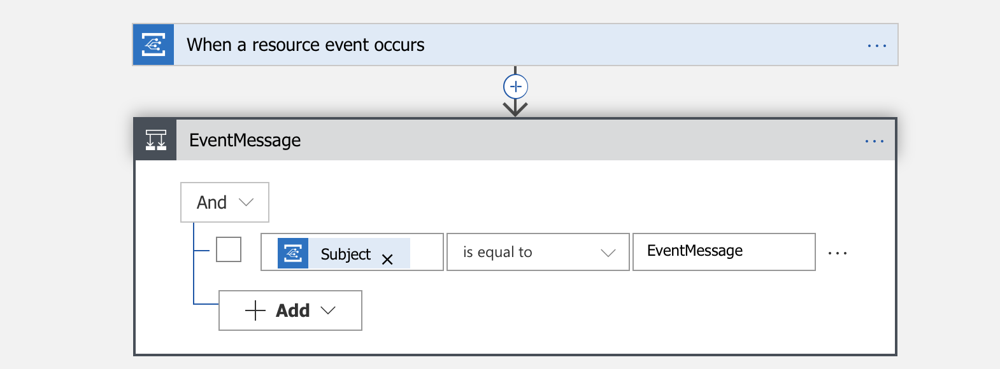
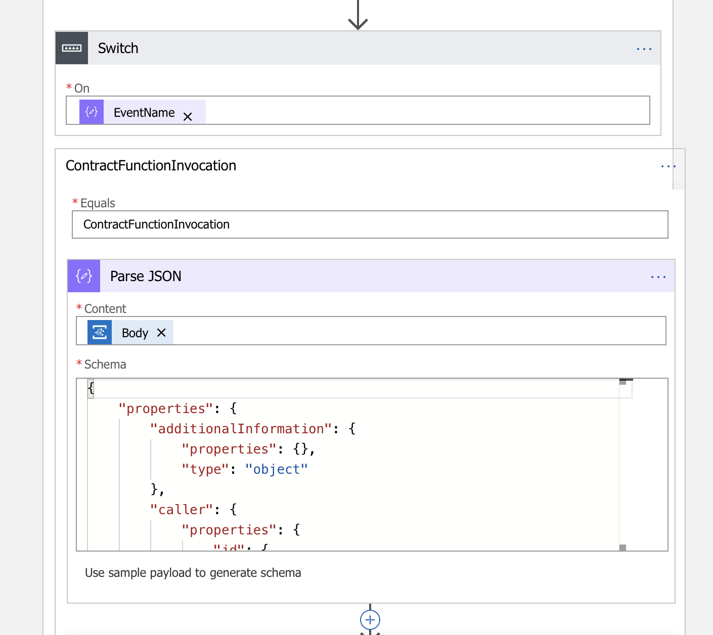
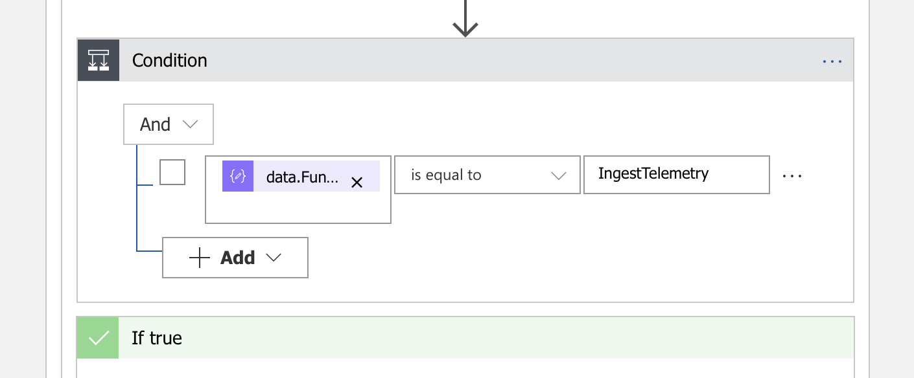

Execute Logic Based on a Specific Contract Property Value After a Specific Action Was Taken
===========================================================================================

Overview
--------

This logic app performs the following analysis on an incoming message, evaluates
the state of property and allows you to take appropriate action.

Specifically –

-   It identifies if the message is of type ContractFunctionInvocation.

-   If true, it identifies if the contract function invoked was named "IngestTelemetry".

-   If true, it evaluates the value of the current contract state so that the appropriate logic can be executed. 

Of Note
-------

This sample is designed to work with the [RefrigeratedTransportation application
and associated smart
contract](https://github.com/Azure-Samples/blockchain/tree/master/blockchain-workbench/application-and-smart-contract-samples/refrigerated-transportation)
but can be easily adapted to other contracts by making changes to the name of
the action (“IngestTelemetry”) or the logic related to identifying the parameter
(“ComplianceStatus”) and its associated conditional logic.

Other samples will further extend this to send alerts via Outlook, SMS (Twilio)
and voice (Twilio).

Create the Logic App
--------------------

Navigate to the Azure Portal at http://portal.azure.com


Click the + symbol in the upper left corner of the screen to add a new resource

Search for and select Logic App and then click Create.


A logic app is initiated by a trigger. In this scenario, the trigger will be an
event from Azure Blockchain Workbench delivered via the Event Grid.

Within the Logic App Designer select the trigger “When an Event Grid event
occurs”


Within the Logic App Designer, click the Sign In button.


Select the Azure Active Directory Tenant that the Azure Blockchain Workbench was
deployed to in the drop-down list. Sign in with user credentials or connect
using a Service Principal. For this basic sample, you will sign in using your
credentials.

Clicking Sign In will display a login dialog.


Once connected successfully, the trigger will show a check mark in a green
circle as demonstrated below.


Click the Continue button.

Next select the subscription for the Azure Blockchain Workbench, specify a
Resource Type of “Microsoft.EventGrid.Topics” and the resource name for the
Event Grid topic in the resource group for the Azure Blockchain Workbench
deployment.


Edit the default parameters.

In the Prefix filter, add EventMessage.

Click the “+ New Step” button.

Search for control, then select Condition.

In the And field, select "Subject" and in the second field write EventMessage



In the "If True" section, click on "Add an action".

Add the action “Data Operations – Parse Json”.

In the content field, select dynamic object "Data object".

In the schema field, enter the following -

``` json

{
    "properties": {
        "AdditionalInformation": {},
        "Caller": {},
        "ConnectionId": {
            "type": "integer"
        },
        "ContractId": {
            "type": "integer"
        },
        "ContractLedgerIdentifier": {
            "type": "string"
        },
        "EventName": {
            "type": "string"
        },
        "FunctionName": {
            "type": "string"
        },
        "InTransactionSequenceNumber": {
            "type": "integer"
        },
        "MessageName": {
            "type": "string"
        },
        "MessageSchemaVersion": {
            "type": "string"
        },
        "Parameters": {
            "items": {
                "properties": {
                    "Name": {
                        "type": "string"
                    },
                    "Value": {
                        "type": "string"
                    }
                },
                "required": [
                    "Name",
                    "Value"
                ],
                "type": "object"
            },
            "type": "array"
        },
        "Transaction": {
            "properties": {
                "From": {
                    "type": "string"
                },
                "ProvisioningStatus": {
                    "type": "integer"
                },
                "To": {
                    "items": {
                        "type": "string"
                    },
                    "type": "array"
                },
                "TransactionHash": {
                    "type": "string"
                },
                "TransactionId": {
                    "type": "integer"
                }
            },
            "type": "object"
        }
    },
    "type": "object"
}

```


Click More and click the Add a Switch Case

For the Switch, there is an “On” field that identifies what value will be
evaluated.

In the On field, put EventName.

In the Case message on the right, enter the value of ContractFunctionInvocation.

Click the “…” in the upper right of the case and select Rename.

Rename the case to ContractFunctionInvocation.

Add the action “Data Operations – Parse Json” to the case.

In the Content field, select Body.

In the Schema field, enter the following –

``` json

{
    "properties": {
        "additionalInformation": {
            "properties": {},
            "type": "object"
        },
        "caller": {
            "properties": {
                "id": {
                    "type": "integer"
                },
                "ledgerIdentifier": {
                    "type": "string"
                },
                "type": {
                    "type": "string"
                }
            },
            "type": "object"
        },
        "connectionId": {
            "type": "integer"
        },
        "contractId": {
            "type": "integer"
        },
        "contractLedgerIdentifier": {
            "type": "string"
        },
        "eventName": {
            "type": "string"
        },
        "functionName": {
            "type": "string"
        },
        "inTransactionSequenceNumber": {
            "type": "integer"
        },
        "messageName": {
            "type": "string"
        },
        "messageSchemaVersion": {
            "type": "string"
        },
        "parameters": {}
    },
    "type": "object"
}

```



Click the “More” link and then select “add a condition”.

Click in the box at the left of the condition. It will display the Dynamic
Content window, select “data.FunctionName”.

Set the condition to “is equal to”.

Set the condition value to IngestTelemetry.

This identifies that the contract function called was IngestTelemetry.

Now you can add an action in the "if true" section so you can execute logic of your choice. 




Testing
-------

You can test this functionality by taking the following steps –

1.  Navigate to the overview page of for the logic app in the portal and confirm
    that it is enabled (if it is not, click on the “disabled” link at the top of
    the screen to transition the logic app to an enabled state).

2.  Deploy the RefrigeratedTransportation sample application in Azure Blockchain
    Workbench.

3.  Add members to the new application for the roles of Owner, Counterparty,
    Device, and Observer.

4.  Create a new contract instance. Specify values of 1 and 15 for both the
    minimum and maximum values for temperature and humidity.

5.  Transfer responsibility to a party in the Counterparty role.

6.  Log out of Workbench and log in as the account associated with the Device

7.  Navigate to the contract you just created within Workbench.

8.  Take the action of “IngestTelemetry” and enter values of 50 for both
    temperature and humidity.

9.  The logic app should now be triggered and the code will be executed.
    Navigate to the logic app in the portal. At the bottom of the screen you
    will detail for Runs history


1.  Click on the most recent execution of your logic app in the list.  
    This will show details on the trigger and actions executing within the logic
    app and allow you to validate success or troubleshoot reasons for failure.


1.  If you made a mistake or need to make changes to your logic, you can re-test
    your  
    changes easily.

-   After making changes in your logic app, navigate back to this same screen
    and click “Resubmit” and it will call the current version of your logic app
    with the values provided by the previous run.

### In Review

In many workflows, there is a need to execute logic after an action has occurred
and when a contract property is set to a specific value.

The logic app created in this sample facilitates this need by –

-   Identifying if the message is of type ContractFunctionInvocation

-   Confirming that the action executed was IngestTelemetry

-   User can write logic so the appropriate action can be taken.

This sample is designed to work with the [RefrigeratedTransportation application
and associated smart
contract](https://github.com/Azure-Samples/blockchain/tree/master/blockchain-workbench/application-and-smart-contract-samples/refrigerated-transportation)
but can be easily adapted to other contracts by making changes to the name of
the action (“IngestTelemetry”) or the logic related to identifying the parameter
(“ComplianceStatus”) and its associated conditional logic.
