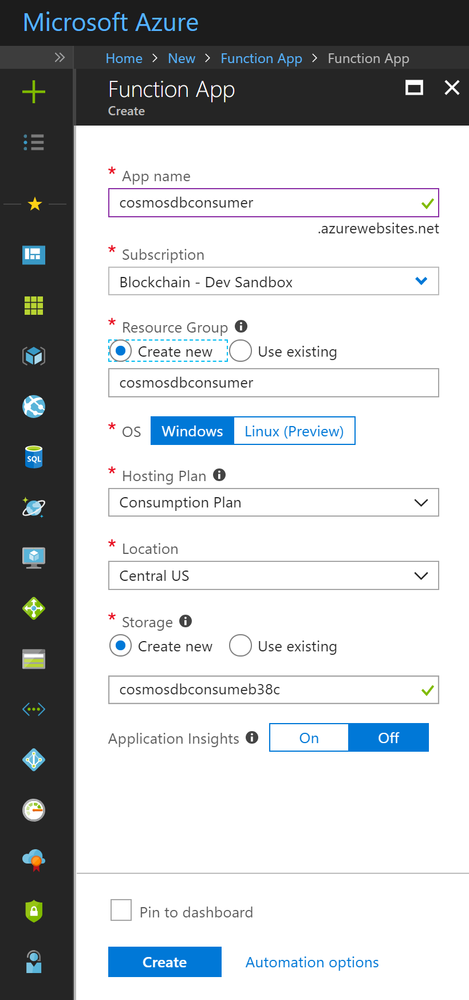

Store Blockchain Workbench messages in Cosmos DB 
=================================================

Overview
--------

This sample shows how you can use Azure Functions to react to events published
by Azure Blockchain Workbench to Event Grid

Create and configure a new Function App
=======================================

1.  If not already present, create a new function app :

    

2.  Use the template to create a function with the EventGrid Trigger

1.  Choose C\# as the programming language and give an appropriate name. Once
    the function is created, go to the integrate tab to add an output trigger to
    CosmosDB

    For the Cosmos DB account connection, choose the account created in the
    above section. Make sure you check the flag to create a Cosmos DB database
    and collection

    

2.  In the function body, paste the following snippet :

>   public static void Run(JObject eventGridEvent, TraceWriter log, out object
>   document)

>   {

>   document = null;

>   String messageName = eventGridEvent["data"]["messageName"].ToString();

>   switch(messageName)

>   {

>   case "BlockMessage":

>   case "ContractMessage":

>   case "EventMessage":

>   break;

>   }

>   }

Each of the case statements identifies which type of message is being delivered from Workbench via the event grid.

You can now add your own code to examine the data in the JSON message format for the specific message type. This may be taking action based on specific data in a message or taking action based on every message delivered.

Full details on the data contained within the different message types and C\# representations of them can be found
[here](https://docs.microsoft.com/en-us/azure/blockchain-workbench/blockchain-workbench-messages-overview).

1.  Add the Event Grid subscription by clicking on the link next to the Run
    button. Choose the topic type as “Event Grid Topics” and select the event
    grid from your workbench deployment to listen to the messages.

2.  Once the event grid subscription is added successfully, you can run the
    Azure function.

3.  Validate that you are seeing the expected output of your logic.
