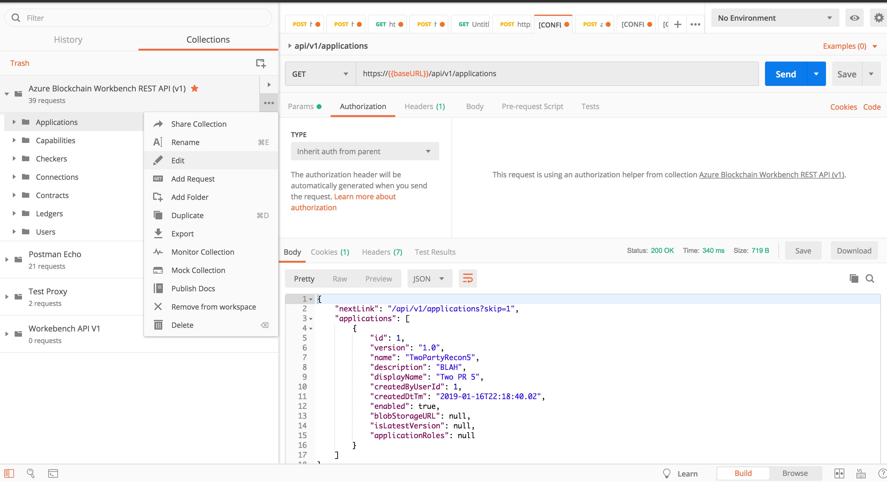
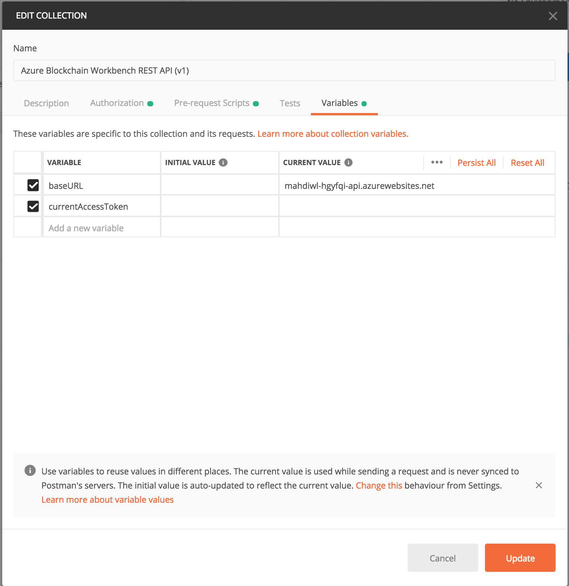
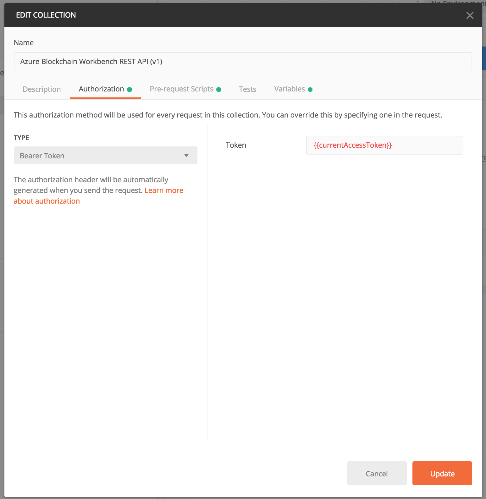
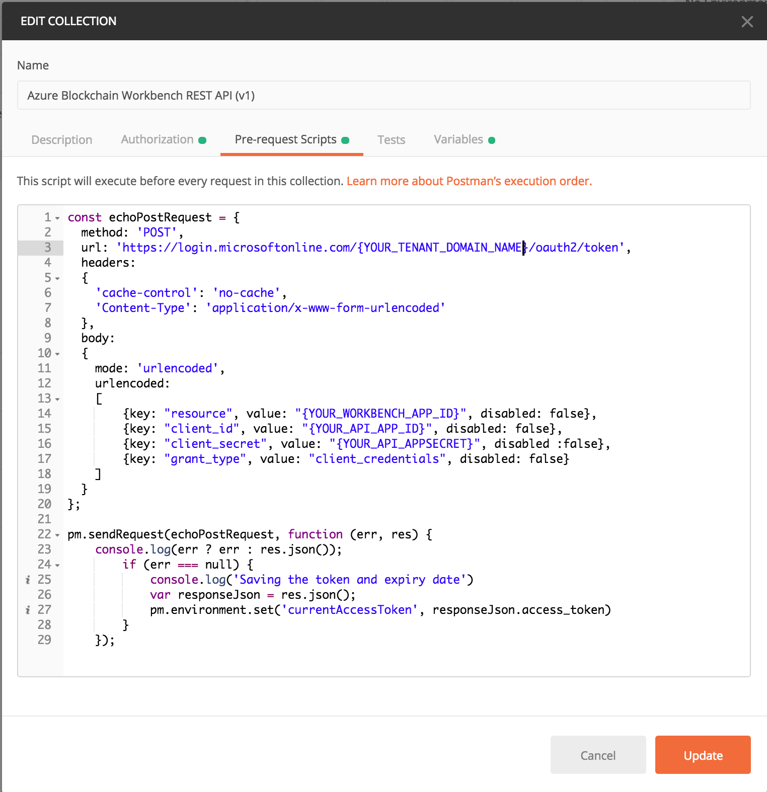

# Blockchain Workbench Postman Collection With Pre-request Script

## Overview
You can use this Postman collection to interact with Workbench APIs. 

## Prerequisite for Workbench Authentication
To use this Postman collection with service principal you need to first create a service principal with certain configuration. Here is a guide on how to [create a service principal for Workbench](../../scripts/workbench-serviceprincipal). 

You can also follow this [step-by-step guide on Medium.](https://medium.com/@malirezaie/how-to-enable-programmatic-interaction-with-azure-blockchain-workbench-apis-56c0d95c79c0)

## Instructions

First, import the collection into Postman. 

The collection has two Environment Variables set - the "baseURL" as well as the "currentAccessToken".

Modify the baseURL to the API of your own Workbench instance. 

The entire collection uses the same "baseURL" variable for every request, and the same "currentAccessToken" for the bearer token.

By modifying the pre-request script, you can ensure that EVERY request to the Workbench APIs will grab a valid authentication token as the Service Principal first. 

Everything else is set for you in the collection to interact with the Workbench API's. 

