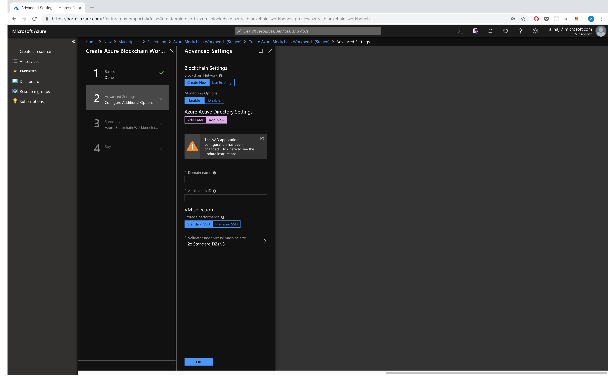
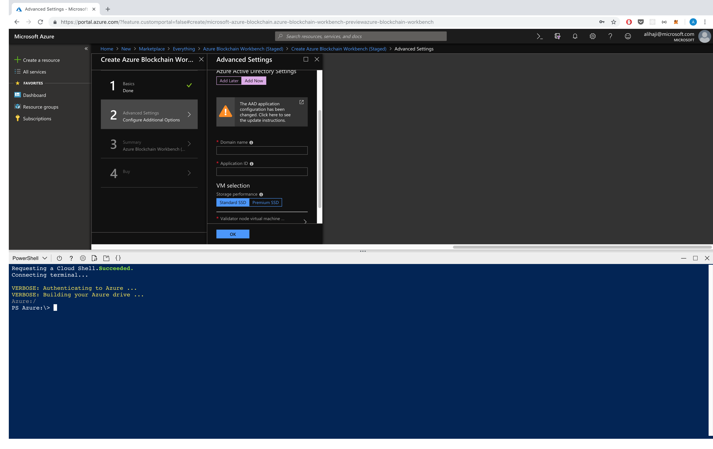
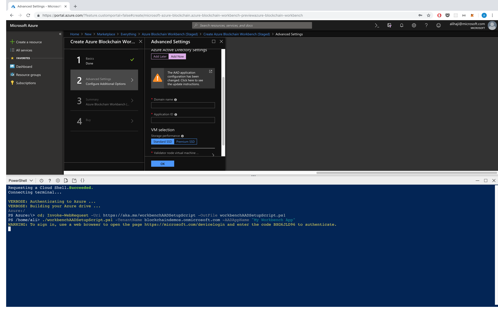

# Azure Blockchain Workbench AAD Setup Script


Overview
=================
Azure Blockchain Workbench utilizes Azure Active Directory for authentication and authorization purposes. This script automates the necessary steps for creating the AAD application Registration.

This [documentation](https://aka.ms/workbenchAADSteps) provides details on the steps required to do this configuration via the Azure Portal.

> Note - If you are using Cloud Shell to run this script it must be run in the same subscription that you will be deploying Azure Blockchain Workbench to. If you do not have access to a storage account with the subscription you've chosen, you should follow the deployment instructions in the [documentation](https://aka.ms/workbenchAADSteps).

Execution Instructions
=======================
This script can be run pre or post deployment to setup the AAD Application. The instructions provided in this document guides you through the **pre deployment** steps.

If you chose to select the "Add Now" option under the Azure Active Directory section of Workbench deployment, you will see the two required fields `Domain Name` and `Application Id`. These instructions will guide you through using our automated script to generate the AAD application.



Click on the `>_` icon on the top right corner to open Cloud Shell.


Make sure to select the PowerShell option. (ignore the warnings if any)



Run the following commands to setup your AAD application

> Note: You need to have an existing Azure Ad Domain (tenant). This script does not create a new tenant.

```powershell
# Navigate to your home directory and downloading the script
cd; Invoke-WebRequest -Uri https://aka.ms/workbenchAADSetupScript -OutFile workbenchAADSetupScript.ps1

# Running the script
./workbenchAADSetupScript.ps1 -TenantName <domainName>.onmicrosoft.com -AADAppName "<Your app name [optional]>"
```


You will be provided with a link and a code to Authenticate to Azure AD. Click on the link and copy the code




Upon returning to the Tab with your Cloud Shell open, you will be presented with your AAD `Domain Name` `Application Client`, `Application Key`. You can plug those values into the text boxes.


After deployment
=======================
After the deployment is finished you need to set the `replyUrl` of your application and `Grant Permission` to your app's requested resources.

First we need to locate your App.

1. Login to Azure and click on the list of Active Directories
2. Select the directory you used for Workbench


1. Then click on the Azure Active Directory resource.
2. Click on App Registrations
3. Select `All Apps`
4. Look for your app by `Client Id` or the name you provided.
5. Select your app


To `Grant Permission` to your application for the required resources:

1. Click on Settings
2. Click on Required Permissions
3. Click on Grant Permission


To add the reply url to your application, first find the url for your UI Web app (the one without `-api` in the name)

1. Click on Reply URLs
2. Paste in your url


Congrats, you've setup your Workbench instance.


