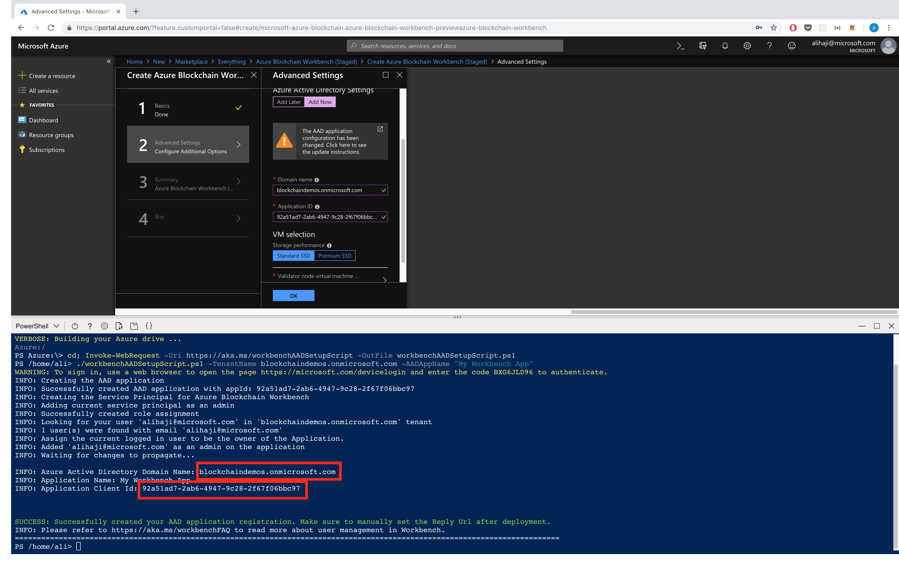
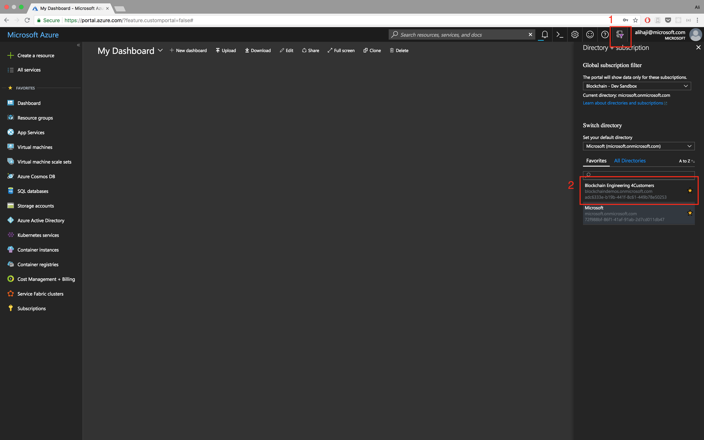

# Azure Blockchain Workbench AAD Setup Script


Overview
=================
Azure Blockchain Workbench utilizes Azure Active Directory, which must be configured prior to deployment.

The [documentation](http://aka.ms/workbenchdocs/) provides details on the steps required to do this configuration via the Azure Portal.

This script automates most of those steps and deliver the information necessary to complete the second tab of the Azure Blockchain Workbench template deployment.

> Note - If you are using Cloud Shell to run this script it must be run in the same subscription that you will be deploying Azure Blockchain Workbench to. If you do not have access to a storage account with the subscription you've chosen, you should follow the deployment instructions in the [documentation](http://aka.ms/workbenchdocs/).

Execution Instructions
=======================

This script is made to be run prior or upon getting to the second step of deploying Azure Blockchain Workbench through the portal.


Click on the `>_` icon on the top right corner to open Cloud Shell.


Make sure to select the PowerShell option. (ignore the warnings)


Run the following commands to setup your AAD application

```powershell
# Downloading the script
Invoke-WebRequest -Uri aka.ms/AADSetup -OutFile AADSetup.ps1

# Running the script
./AADSetup.ps1 -TenantName <domainName>.onmicrosoft.com -AADAppName "<Your app name [optional]>"
```


You will be provided with a link and a code to Authenticate to Azure AD. Click on the link and copy the code


Upon returning to the Tab with your Cloud Shell open, you will be presented with your AAD `Domain Name` `Application Client`, `Application Key`. You can plug those values into the text boxes.




After deployment
=======================
After the deployment is finished you need to set the `replyUrl` of your application and `Grant Permission` to your app's requested resources.

First we need to locate your App.

1. Login to Azure and click on the list of Active Directories
2. Select the directly you used for Workbench



1. Then click on the Azure Active Directory resource.
2. Click on App Registrations
3. Select `All Apps`
4. Look for your app by `Client Id` or the name you provided.
5. Select your app


To `Grant Permission` to your application for the required resources:

1. Click on Settings
2. Click on Required Permissions
3. Click on Grant Permission


To add the reply url to your application, first find the url for your UI Web app (the one without `-api` in the name)

1. Click on Reply URLs
2. Paste in your url


Congrats, you've setup your Workbench instance.


