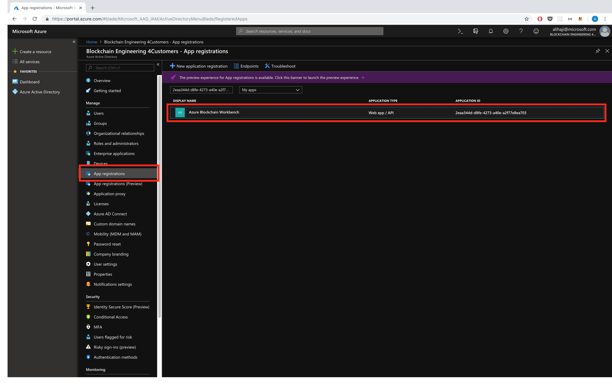
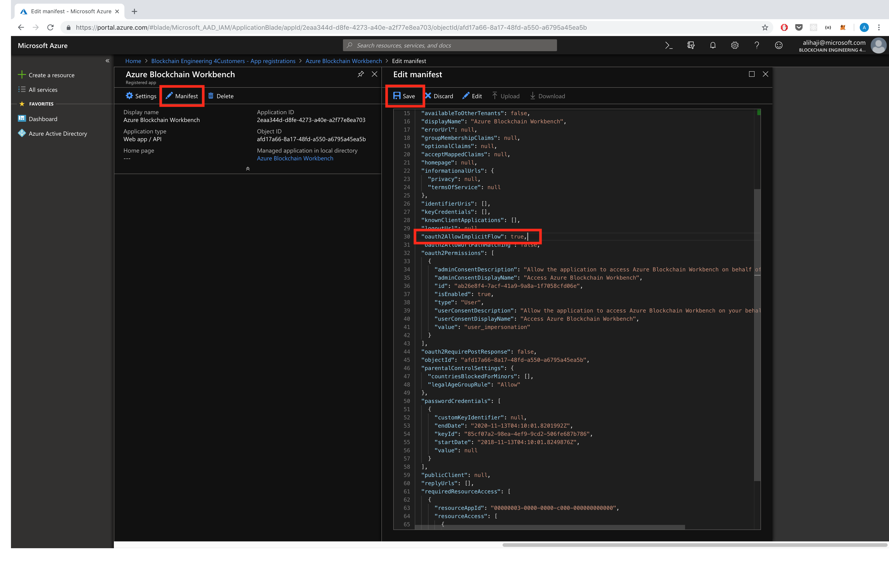
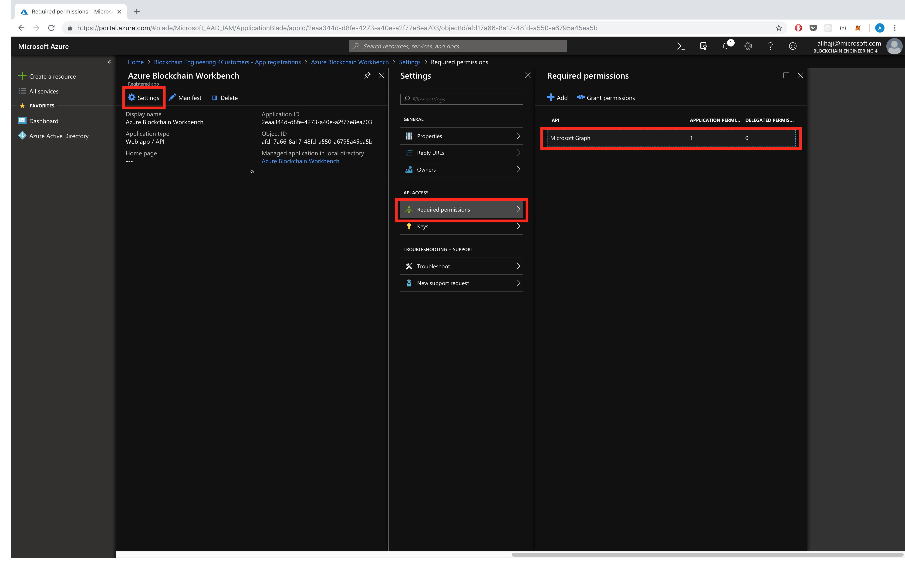
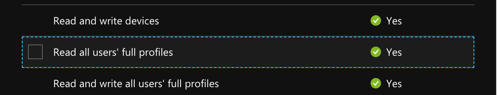
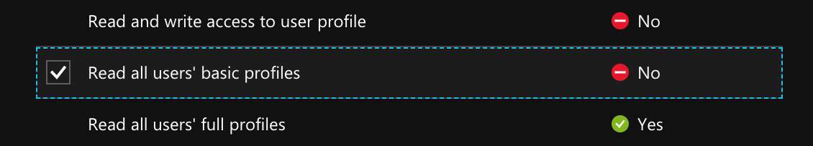
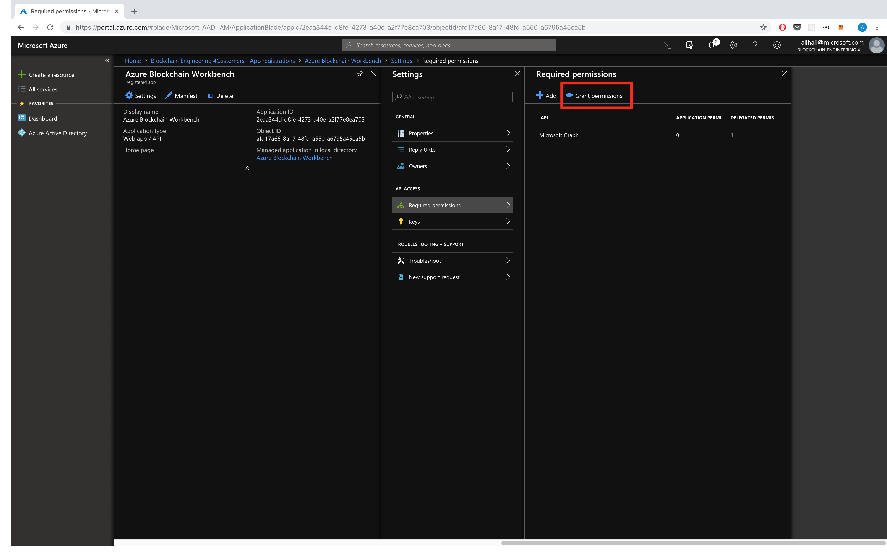

# Upgrading AAD App Registration for Workbench 1.5

The AAD App Registration configuration for Workbench 1.5.0 has slightly changed. If you would prefer to use your old AAD app registration, you need to follow the AAD upgrade instructions.

## Upgrade Instructions
### Script Instructions
Navigate to [CloudShell](https://shell.azure.com/powershell) and run the following command:

```powershell
# To download the script (you can also clone this repo)
cd; Invoke-WebRequest -Uri https://aka.ms/workbenchAADUpgradeScript -OutFile workbenchAADUpgradeScript.ps1

```

If upgrading the App Registration using `SubscriptionId` and `ResourceGroupName` on a deployed Workbench instance 

```powershell

./workbenchAADUpgradeScript.ps1 -SubscriptionId <SubscriptionId> -ResourceGroupName <ResourceGroupName>

```

If upgrading App Registration using `AppId` and `TenantName`

```powershell
./workbenchAADUpgradeScript.ps1 -TenantName <tenantName> -AppId <appId>

```

### Manual Instructions
1. Navigate to [Azure Portal](https://portal.azure.com) and go the Active Directory Settings.
2. Go to the "Application Registration" tab and find your AAD Application that is used for Workbench

3. Click on "manifest" and set the `"oauth2AllowImplicitFlow"` to `true` and save the settings.

4. Navigate to "Settings" and click on "Required Permissions". Click on "Microsoft Graph"

4. Remove `Read all users's full profile` under "Application Permissions"

5. Add `Read all users' basic profile` under "Delegated Permissions". Then click on save.

6. Click on grant permission.


You can now use this App registration with Workbench 1.5 and above.