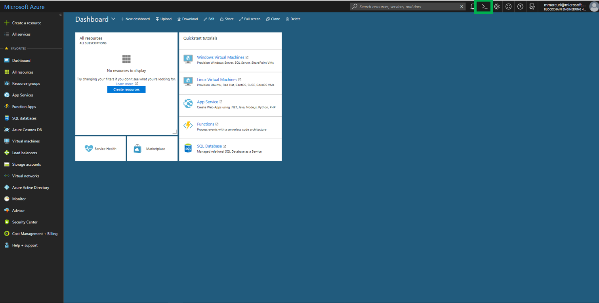
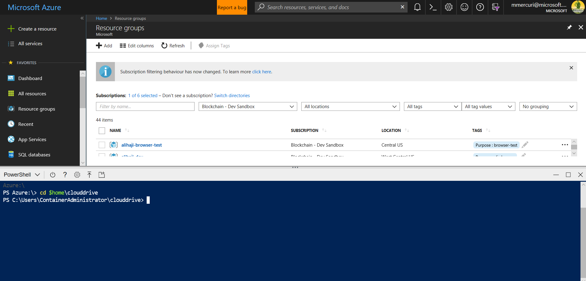

# Azure Blockchain Workbench Upgrade

Overview
=================
An existing deployment of Azure Blockchain Workbench can be upgraded to the latest version. 

This script automates the upgrade of your Azure Blockchain Workbench deployment. It can be easily invoked from Azure Cloud Shell.

To learn what's new in this release, please check our [release notes](releasenotes.md).

Execution Instructions
=======================
If you haven't already download the [script](azureBlockchainWorkbenchUpgradeTov1_2_0.ps1)

Log in to the Azure Portal

Click on the Cloud Shell Icon in the upper right of the screen.

This is the Cloud Shell Icon  

This will launch the Cloud Shell within the browser. You’ll be asked to select
Bash (Linux) or PowerShell (Windows). Click the “PowerShell (Windows)” link.

Note – Windows refers to the type of operating system and version that
PowerShell that is being used in Cloud Shell. You can use this version
regardless of the operating system you’re using the shell from, e.g. MacOS, etc.

This will launch the Cloud Shell. This can take up to 60 seconds to deploy.

Click on the Upload button at the top of the PowerShell button

Select the file azureBlockchainWorkbenchUpgradeTov1_2_0.ps1 and click ok.

In the Cloud Shell, navigate to your cloud drive by typing the following -

cd \$home\\CloudDrive

Locate your Azure subscription ID, and the resource group name where you deployed Azure Blockchain Workbench.

Next, run the script by typing the following –

.\\azureBlockchainWorkbenchUpgradeTov1_2_0.ps1 -SubscriptionID "subscription_id" -ResourceGroupName "workbench-resource-group-name"

The script will then upgrade your Workbench deployment. It will show its progress along the way.

When the script completes, it will provide a message informing you of the operation status.

