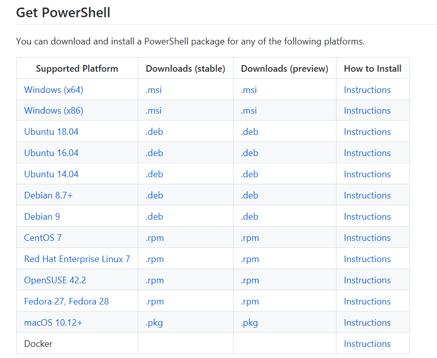
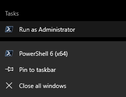
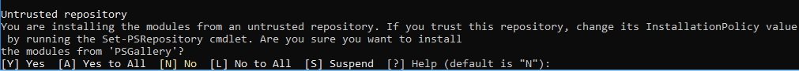
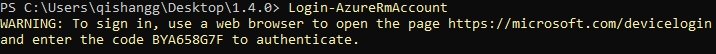

# Azure Blockchain Workbench Upgrade


Overview
=================
An existing deployment of Azure Blockchain Workbench can be upgraded to the latest version.

This script automates the upgrade of your Azure Blockchain Workbench deployment. It can be easily invoked from latest Powershell.

To learn what's new in this release, please check our [release notes](releasenotes.md).

Execution Instructions
=======================
1. Install PowerShell 6 for your operating system from https://github.com/PowerShell/PowerShell




2. Run PowerShell 6 as administrator:




3. Enable running unsigned scripts in PowerShell:

```powershell
Set-ExecutionPolicy -ExecutionPolicy Unrestricted -Scope Process
```
(Note: command above needs to be run each time before running upgrade script.)
For more information about running scripts and setting execution policy, see about_Execution_Policies at https://go.microsoft.com/fwlink/?LinkID=135170

4. Install Azure PowerShell module:
```powershell
Install-Module -Name AzureRM.NetCore -AllowClobber
```
Select A (Yes to All) in the next prompt:




5. Next, please go to https://aka.ms/workbenchUpgradeScript and download the upgrade script “azureBlockchainWorkbenchUpgradeTov1_4_0.ps1” to local directory.


6. Sign in to your azure account:

```powershell
Login-AzureRmAccount
```


You may be asked to authenticate if you're not currently authenticated. In this case, you will be provided with a link and a code to Authenticate to Azure. Follow the instructions shows after running this command.


7. Locate your Azure subscription ID, and the resource group name where you deployed Azure Blockchain Workbench.


8. Next, run the downloaded upgrade script by typing the following;

```powershell
# Navigate to the directory which contains the downloaded script
cd 

# Running the script
./ azureBlockchainWorkbenchUpgradeTov1_4_0.ps1 -SubscriptionID <subscription_id> -ResourceGroupName <workbench-resource-group-name>

```

When the upgrade completes, you will see the following message:
```powershell
Azure Blockchain Workbench in Resource Group <ResourceGroupName> was succesfully updated to version 1.4.0.
```
