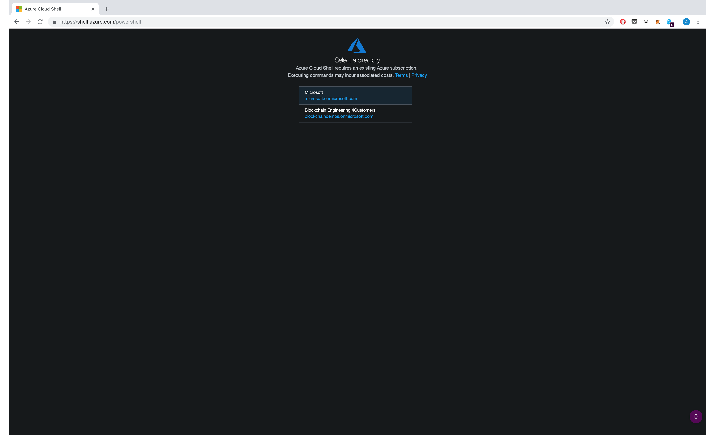
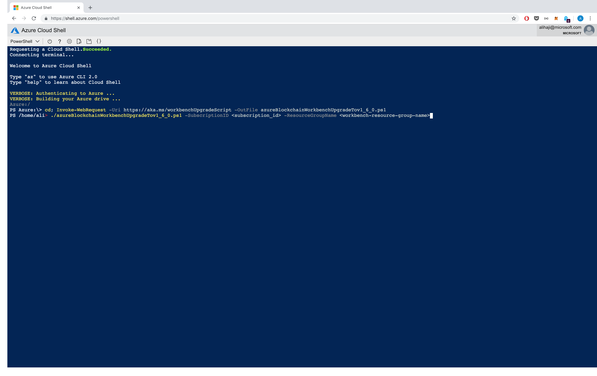

# Azure Blockchain Workbench Upgrade


Overview
=================
An existing deployment of Azure Blockchain Workbench can be upgraded to the latest version. This PowerShell script automates the upgrade of your Azure Blockchain Workbench deployment. 

To learn what's new in this release, please check our [release notes](releasenotes.md).

Execution Instructions
=======================
To run this script you need to have the cross-platform [Azure PowerShell](https://docs.microsoft.com/en-us/powershell/azure/install-az-ps) module installed.

We recommend using [Azure CloudShell](https://shell.azure.com/powershell) since it comes with with all dependencies installed, however, you can run this script on any operating system that has [PowerShell](https://docs.microsoft.com/en-us/powershell/scripting/install/installing-powershell?view=powershell-6) and [Az PowerShell](https://docs.microsoft.com/en-us/powershell/azure/install-az-ps) installed.


1. Open [Azure CloudShell](https://shell.azure.com/powershell) and select the tenant Workbench is deployed to. 



2. Download the script. You can download the upgrade script automatically by using the command bellow, or you can download it from this repository manually

```powershell
cd; Invoke-WebRequest -Uri https://aka.ms/workbenchUpgradeScript -OutFile azureBlockchainWorkbenchUpgradeTov1_7_0.ps1

```

3. Locate your Azure subscription ID, and the resource group name where you deployed Azure Blockchain Workbench and Execute the script.


```powershell
./azureBlockchainWorkbenchUpgradeTov1_7_0.ps1 -SubscriptionID <subscription_id> -ResourceGroupName <workbench-resource-group-name>

```



When the upgrade completes, you will see the following message:

```powershell
Azure Blockchain Workbench in Resource Group $ResourceGroupName was successfully updated to version 1.7.0.

WARNING: Important: If you are upgrading from a version older than 1.5.0 you will need to upgrade your AAD application registration as well. Please visit https://aka.ms/workbenchAADUpgrade to perform the necessary updates.

```

> Note: The AAD Application Registration configuration has changed for Workbench 1.5.0. This script does **not** automatically update your Application Registration. If you are upgrading from a version prior to 1.5.0 you need to upgrade your AAD application. Please visit [AAD Upgrade Instructions](https://aka.ms/workbenchAADUpgrade) to update your AAD application.
