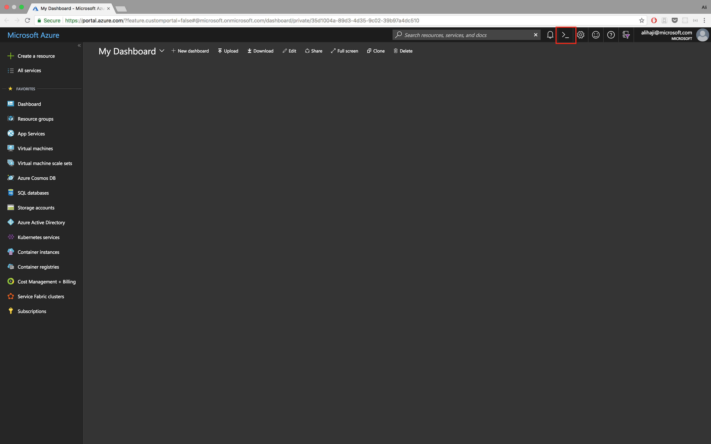
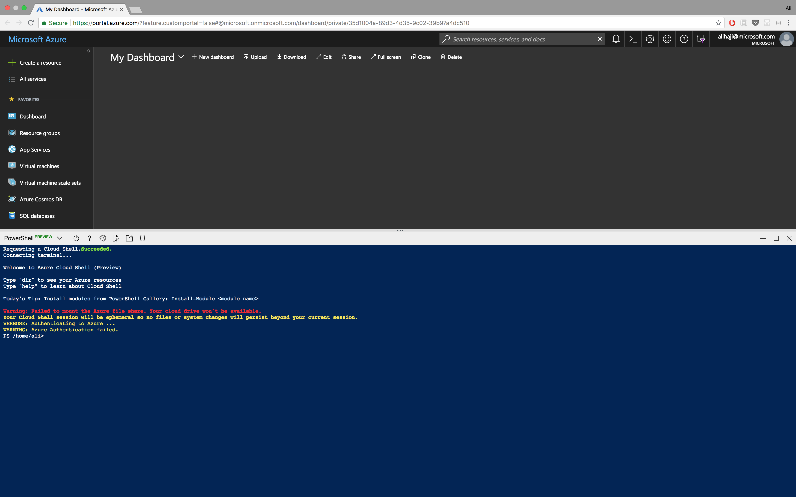
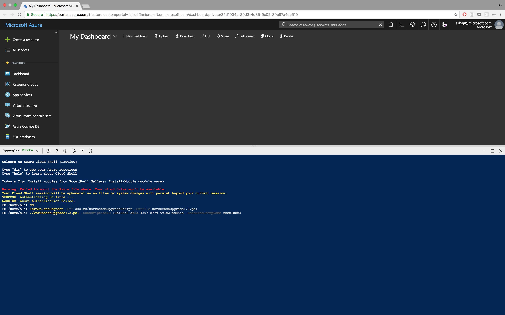
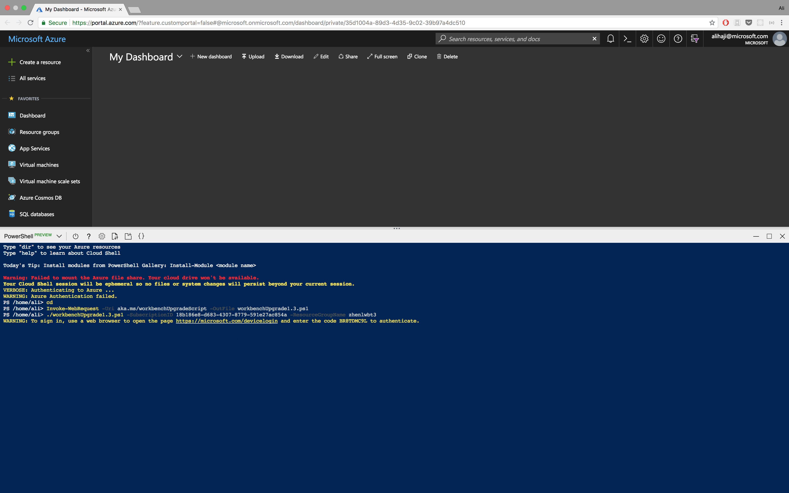
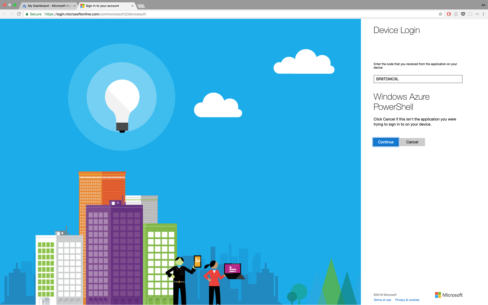
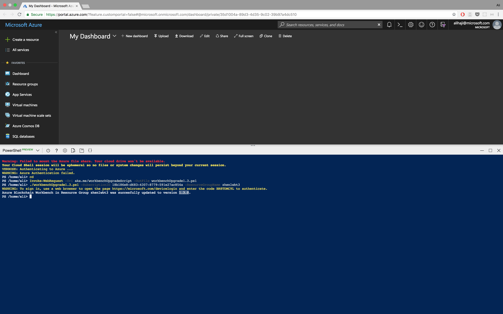

# Azure Blockchain Workbench Upgrade


Overview
=================
An existing deployment of Azure Blockchain Workbench can be upgraded to the latest version.

This script automates the upgrade of your Azure Blockchain Workbench deployment. It can be easily invoked from Azure Cloud Shell.

To learn what's new in this release, please check our [release notes](releasenotes.md).

Execution Instructions
=======================
Log in to the Azure Portal.

Click on the `>_` icon on the top right corner to open Cloud Shell.



This will launch the Cloud Shell within the browser. You’ll be asked to select
Bash (Linux) or PowerShell (Windows). Click the “PowerShell” link. (ignore the warnings)




Locate your Azure subscription ID, and the resource group name where you deployed Azure Blockchain Workbench.

Next, run the script by typing the following;

```powershell
# Navigate to your home directory
cd

# Downloading the script
Invoke-WebRequest -Uri aka.ms/workbenchUpgradeScript -OutFile workbenchUpgradeScript.1.3.ps1

# Running the script
./workbenchUpgradeScript.1.3.ps1 -SubscriptionID <subscription_id> -ResourceGroupName <workbench-resource-group-name>
```



You will be provided with a link and a code to Authenticate to Azure. Click on the link and copy the code




When the script completes, it will provide a message informing you of the operation status.




