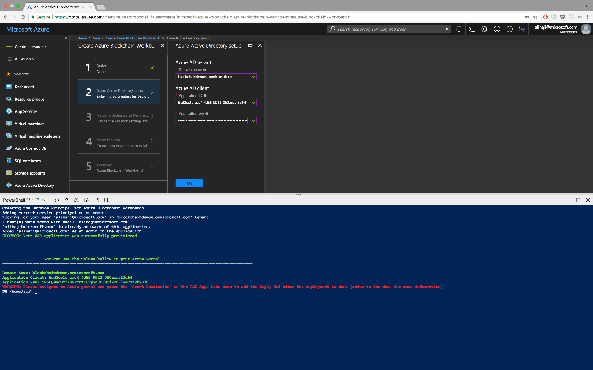

# Azure Blockchain Workbench Release Notes - Version 1.3.0
 
Faster and more reliable deployment
=================
We look at telemetry every day to identify issues that affect our customers, and as a result made some changes to make deploying Workbench not only more reliable, but faster as well. 
 
Better transaction reliability
=================
Continuing from the [monitoring improvements](https://azure.microsoft.com/en-us/blog/azure-blockchain-workbench-1-1-0-extends-capabilities-and-monitoring/) we made as part of 1.1.0, we’ve made reliability improvements to the DLT Watcher and DLT Consumer microservices (see the [Blockchain Workbench architecture document](https://docs.microsoft.com/en-us/azure/blockchain-workbench/blockchain-workbench-architecture) for more information on those components). Practically speaking, you’ll notice fewer errors saying “It looks like something went wrong…”.

 
Ability to deploy Workbench in a multi-member Ethereum PoA consortium
=================
With [release 1.2.0](https://azure.microsoft.com/en-us/blog/top-feature-requests-added-with-azure-blockchain-workbench-1-2-0/) you could deploy Workbench and connect that deployment to an existing Ethereum-based network. This past week we announced the availability of a [new standalone Ethereum PoA solution](https://azure.microsoft.com/en-us/blog/ethereum-proof-of-authority-on-azure/), which can be deployed across members within a consortium. With these two updates, you can deploy Workbench in three different configurations:

1.       **Single-Member System:** The default configuration of Workbench, where Workbench is deployed in a blockchain network with only one member.

 
2.       **Multi-Member System Deployed in One Member’s Subscription:** You can use the new multi-member PoA consortium solution to deploy a blockchain network across several members. The, you can deploy Workbench in one member’s subscription. Everyone who wants to use Workbench will go through the one member’s Workbench deployment. This topology can be useful for PoCs and initial pilot deployments.

 
3.       **Multi-Member System Deployed in One Shared Subscription:** This configuration is similar to the topology described above, except that Workbench is deployed in a shared subscription. Think of this shared subscription as the operator subscription for the consortium.

 
We are investigating other topologies, such as one where Workbench is deployed into each subscription. If that interests you, please upvote or request it on our [blockchain user voice](https://feedback.azure.com/forums/586780-blockchain).

 
Simpler pre-deployment script for AAD
=================
We know going through [Workbench deployment instructions](https://docs.microsoft.com/en-us/azure/blockchain-workbench/blockchain-workbench-deploy) can feel like a lot of work, especially setting up AAD and registering an app for the Workbench API. To make things easier, we’ve created a new PowerShell script, which automates most of the AAD setup steps and outputs the parameters you need for Workbench deployment. You can find the instructions and the script on our [GitHub](https://github.com/Azure-Samples/blockchain/tree/master/blockchain-workbench/scripts/aad-setup).
 

 
Sample code and tool for working with the Workbench API
=================
Some of you have asked for more sample code and tools related to generating authentication bearer tokens for Workbench API. We’re excited to announce a new [tool](https://github.com/Azure-Samples/blockchain/tree/master/blockchain-workbench/auth-samples/bearer-token-retrieval), which you can use to generate tokens for your Workbench instance. Source code is also available and can be used to create your own client authentication experience. Try it out by cloning the repo, running the Web page, and plugging in your Application Id.
 
