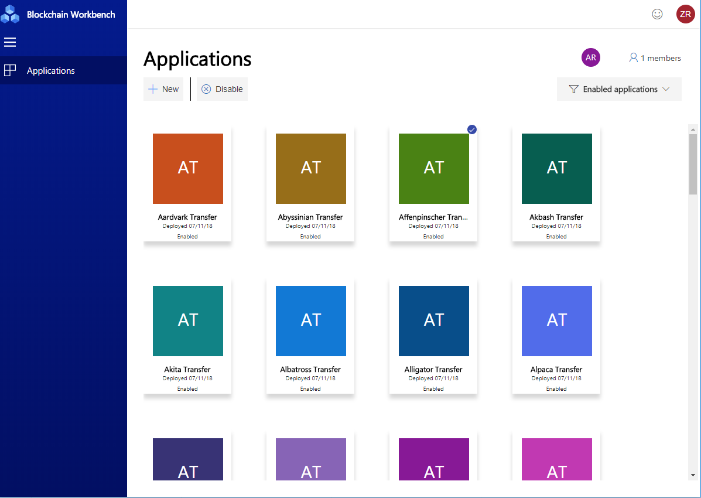
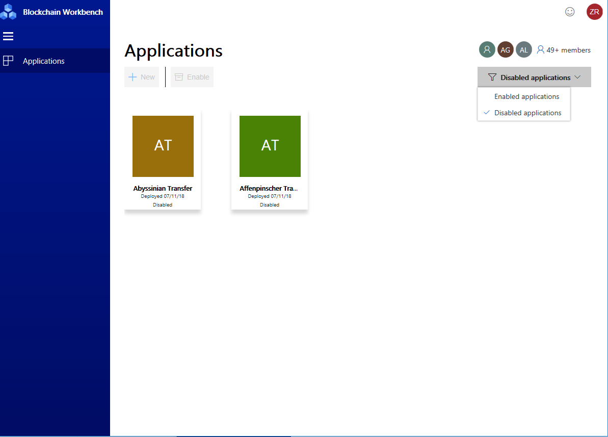
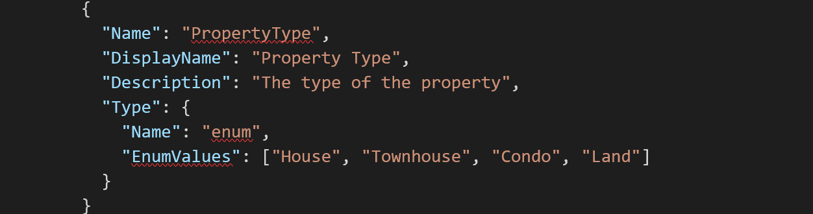
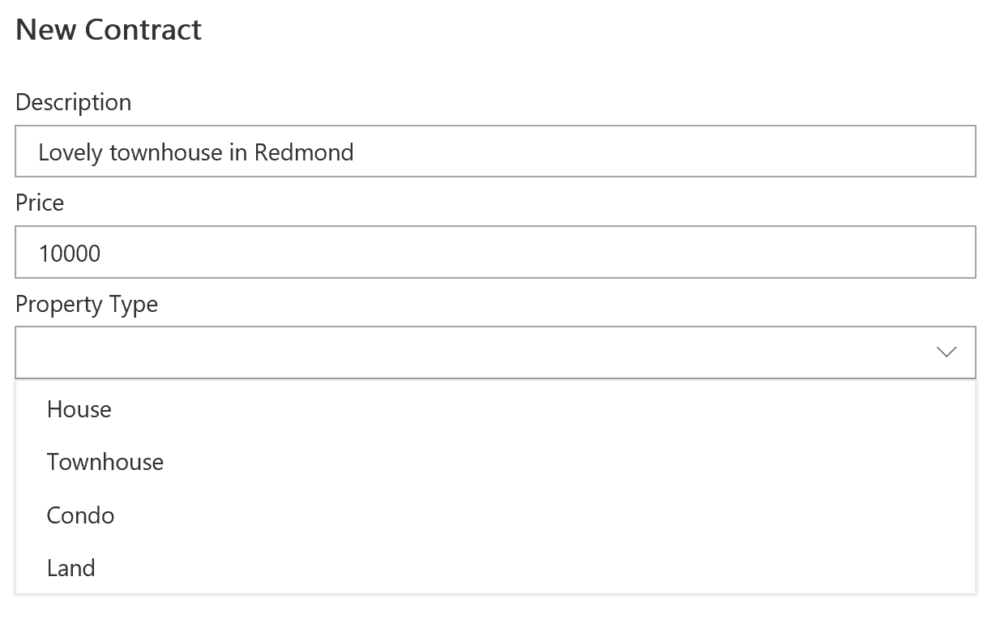
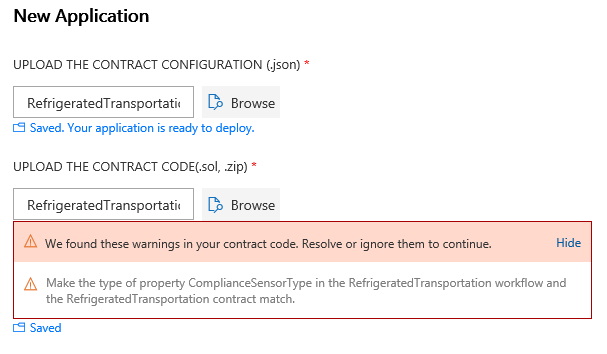
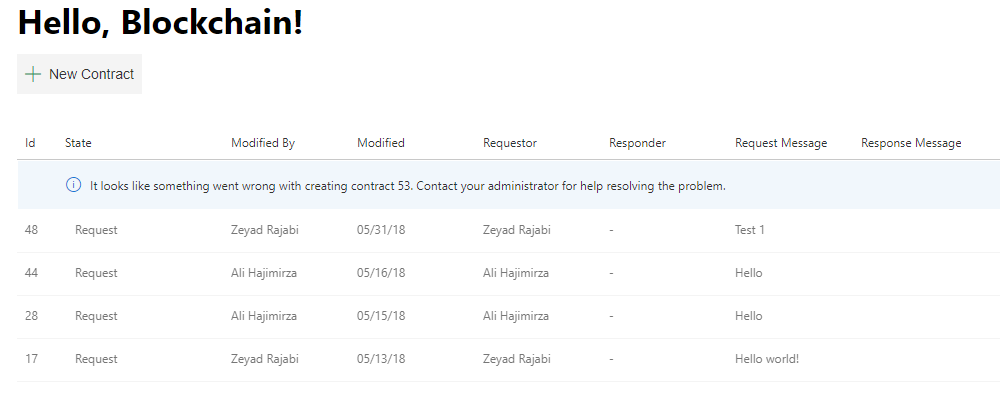
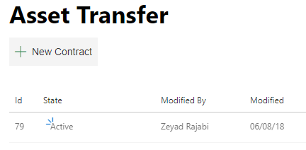

# Azure Blockchain Workbench Release Notes - Version 1.2.0
 
Enable/Disable Apps
=================
Many of you have started to iterate and create multiple blockchain apps using Workbench. One of the most requested features we’ve heard is the ability to disable unused blockchain apps within the Workbench Web app. With 1.2.0, you will be able to enable or disable applications. In addition, the UI will allow you to filter the list of applications to only show enabled or disabled applications.  
 

 
BYOB - Bring Your Own Blockchain 
=================
As part of the Workbench deployment, we deploy a set of Ethereum Proof-of Authority (PoA) nodes within a single member’s subscription. This topology works great for situations where it’s OK to have one member manage all the blockchain nodes. With version 1.2.0 customers will have the choice to deploy Workbench and point that deployment to an existing Ethereum PoA network. The topology of the network can be anything you want, including a multi-member blockchain network. The network can exist anywhere, which means the network can be on prem, a hybrid deployment, or even on another cloud. The requirements are:
* The endpoint must be an Ethereum Proof-of-Authority (PoA) blockchain network. Coming soon will be a new standalone Ethereum PoA solution, which can be used across members within a consortium.
* The endpoint must be publicly accessible over the network. 
* The PoA blockchain network should be configured to have gas price set to zero (note, Workbench accounts are not funded, so if funds are required, transactions will fail)
 
The interface that allows connecting to an existing network is shown below. 
 

 
Note that we have only tested Workbench against a PoA network and while other protocols may work, we cannot provide support for them at this time. We plan to release a PoA single/multi-member solution template similar to our Proof-of-Work solution template in the Azure Marketplace soon and that will be compatible with BYOB.  
 
New Supported Datatype - Enum
=================
 
Workbench supports several basic datatypes, such as strings and integers. With 1.2.0, we now support a the enum datatype. Enums will allow you to create blockchain apps where you can narrow selection for certain fields to a specific list. The Workbench Web app UI will show enums as a dropdown list of single-select options. The enum type is specified via the configuration file as follows:
 
 
 
This configuration corresponds to the code within the smart contract. For example:
 
 
 
In the Web app, you will see the following dropdown UI:
 
You can reference how to use the enum type in the [Room Thermostat sample application](https://github.com/Azure-Samples/blockchain/blob/master/blockchain-workbench/application-and-smart-contract-samples/room-thermostat/readme.md).
 
 
Better Visibility into Workbench Application Deployment Errors
=================
To make it easier to deploy a working Workbench application, we will show Solidity warnings. These warnings don’t necessarily mean you have bugs, which need to be fixed. Instead, warnings indicate potential errors you might encounter when running your application.
 
 
 
 
Improvements and Bug Fixes
=================
We also made several other improvements to Workbench, including:
*The Workbench frontend and backend now fully works with more than 100 provisioned users. You will be able to connect to Azure Active Directories with more than 100 users and the Workbench client allows you to search and add users within large directories. 
*Deployment of Workbench is more reliable as we’ve addressed the top failure cases, such as database initialization and naming conflicts.  
*Performance of the Workbench REST API has been improved by moving App Service plan to Premium V2. The higher end CPU will result in better overall performance. Note, there is no change in cost from moving to this plan.
  
Please use our [Blockchain User Voice](https://aka.ms/blockchainuservoice) to provide feedback and suggest features/ideas for Workbench. Your input is helping make this a great service.  We look forward to hearing from you. 

***

***

# Previous Releases

# Azure Blockchain Workbench Release Notes - Version 1.1.0

Multi Workflow and Contract Support 
=================
You may have noticed that our [Blockchain Workbench configuration documentation](https://docs.microsoft.com/en-us/azure/blockchain-workbench/blockchain-workbench-configuration-overview) and [Workbench API](https://docs.microsoft.com/en-us/rest/api/azure-blockchain-workbench/) reference the ability to have multiple workflows within one application. Our initial release didn’t provide the UI to showcase more than one workflow per application, but we've now added this feature. With 1.1.0, you can now have multiple workflows for a single application show in the Workbench UI.  

In addition to this UI update, we have published a new Bazaar Marketplace sample application on our [Workbench Github](https://github.com/Azure-Samples/blockchain/tree/master/blockchain-workbench/application-and-smart-contract-samples) showcasing the use of multiple workflows and smart contracts. Try it out and let us know what you think.  

Monitoring Improvements 
=================
Reference the [Blockchain Workbench architecture document](https://docs.microsoft.com/en-us/azure/blockchain-workbench/blockchain-workbench-architecture).  

The Workbench DLT watcher monitors events occurring on the attached blockchain network. If something goes wrong with this service, Workbench will no longer be able to process and understand transactions going through the blockchain. In that state, the UI looks like this: 

With 1.1.0, we’ve improved the reliability of the watcher, which means if there is a disruption with the service, Workbench can recover and process all transactions missed during the disruption.  

Usability and Polish 
=================

We made several improvements to the overall usability of Workbench. New items will now show a “new” icon, which will make it easier for you to see new contracts, actions, members, etc.  

 
Another improvement relates to how you find people when assigning roles or assignments within contracts. We now have a richer search algorithm, which will make it easier to find people when you only have a partial name.  

Improvements and Bug Fixes  
=================
We also made several other improvements to Workbench. Some of the top bugs we addressed are: 
 * Workbench is now able to support Azure Active Directories of any size.  
 * All users who have the right to create contracts can create a contract, even if the user is not an administrator.  
 * Deployment of Workbench is more reliable as we’ve addressed the top failure cases. 
 * Database views have been fixed to return the right set of data to address a bug where a few columns did not display the correct information in a couple of views.
   
Please use our [Blockchain User Voice](https://aka.ms/blockchainuservoice) to provide feedback and suggest features/ideas for Workbench. Your input is helping make this a great service.  We look forward to hearing from you.  