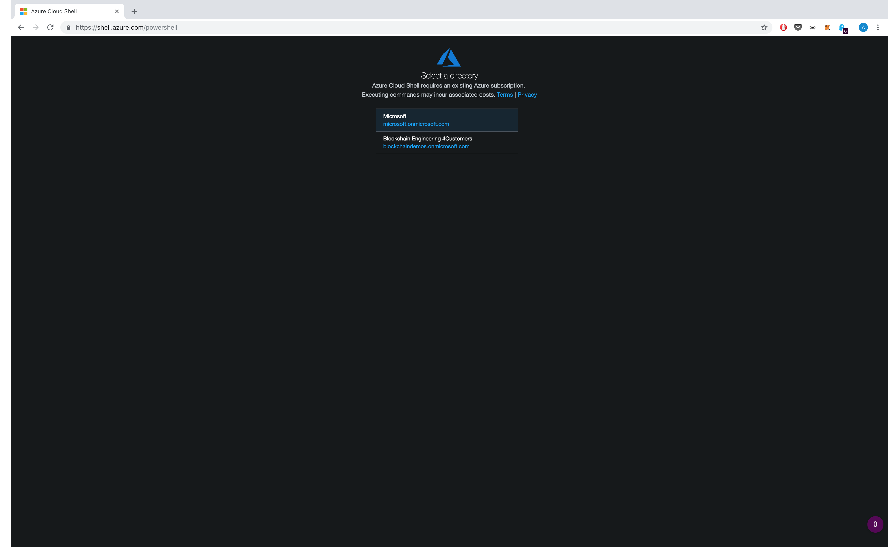
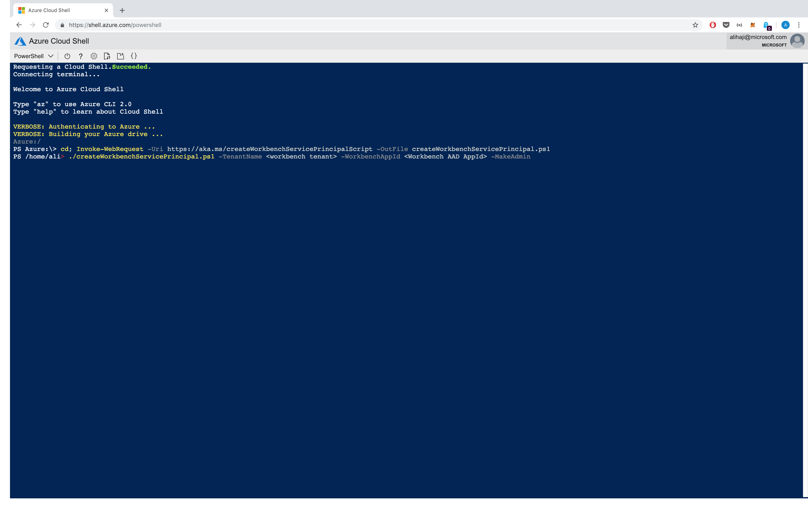
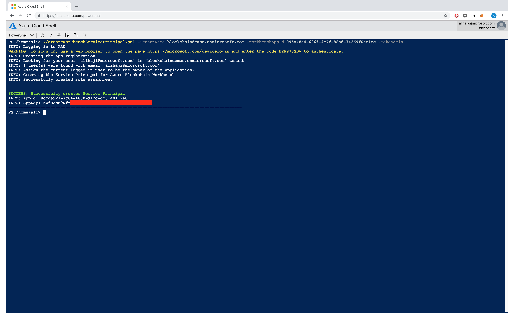

# Creating a Service Principal to Access Workbench API


Overview
=================
Workbench uses OAuth 2.0 to secure its resources. The Auth provider for Workbench is [Azure Active Directory](https://docs.microsoft.com/en-us/azure/active-directory/develop/authentication-scenarios). 

In order to use Workbench's API you need to set the `Authorization: Bearer <access_token>` in your HTTP header. This access token can be obtained in a number of different ways depending on the [authentication scenarios](https://docs.microsoft.com/en-us/azure/active-directory/develop/app-types).

If you are trying to consume Workbench's [API programmatically](https://docs.microsoft.com/en-us/azure/active-directory/develop/service-to-service), you need to use the [client credentials flow](https://docs.microsoft.com/en-us/azure/active-directory/develop/v1-oauth2-client-creds-grant-flow) using a [service principal](https://docs.microsoft.com/en-us/azure/active-directory/develop/app-objects-and-service-principals). This document will provide you a script that will create a service principal for you in order to access Workbench programatically. 


Access Control
=================
By default any service principal in Workbench's active directory has access to Workbench resources just like any user in that directory. However, just like any user, all service principals by default only have User level access and not Admin level access.

Admin level access is needed if you are trying to create Applications, read all applications, create users, and create role assignments.

> Note: Since service principals act like users in a directory they can be assigned to different Workbench "application roles". For example if you are trying to use a service principal to create contracts, you need to assign that service principal to the "creator" role of that application. Today this operation has to be done using the Workbench API as the UI does not allow for service principal role assignment. 


It can be tricky to create a service principal and assign it to Workbench as an Admin, so we've provided an automated a script to create a service principal and you have the option to make that service principal an Admin.

Execution Instructions
=================
To run this script you need to have the [AzureAD](https://docs.microsoft.com/en-us/powershell/module/azuread/?view=azureadps-2.0) module installed. Since the AzureAD PowerShell module only works on Windows, we recommend using [Azure CloudShell](https://shell.azure.com/powershell) since it comes with with all dependencies installed.


1. Open [Azure CloudShell](https://shell.azure.com/powershell) and select the tenant tied to your Azure Subscription.



2. Download the script. You can download the upgrade script automatically by using the command bellow, or you can download it from this repository manually

```powershell
cd; Invoke-WebRequest -Uri https://aka.ms/createWorkbenchServicePrincipalScript -OutFile createWorkbenchServicePrincipal.ps1

```



3. Locate your Workbench AAD AppId and Tenant and run the following commands. The `-MakeAdmin` parameter is optional and is only needed if want your service principal to have Admin level access.


```powershell
./createWorkbenchServicePrincipal.ps1 -TenantName <workbench tenant> -WorkbenchAppId <Workbench AAD AppId> -MakeAdmin (optional)

```



4. You can now use this `AppId` and `Key` with any [ADAL](https://docs.microsoft.com/en-us/azure/active-directory/develop/active-directory-authentication-libraries) library to obtain an access token.

> Note: The target resource (audience) for accessing Workbench is the Workbench AppId, and the authority is https://login.microsoftonline.com/[tenantName]

Here is an [example](https://docs.microsoft.com/en-us/azure/active-directory/develop/v1-oauth2-client-creds-grant-flow#service-to-service-access-token-request) of a raw http call.:

```
Method: POST
URL: https://login.microsoftonline.com/<tenant>/oauth2/token
Content-Type: application/x-www-form-urlencoded
Body:
grant_type=client_credentials
&client_id=<service_principal_appId>
&client_secret=<service_principal_key>
&resource=<workbench_appId>
```