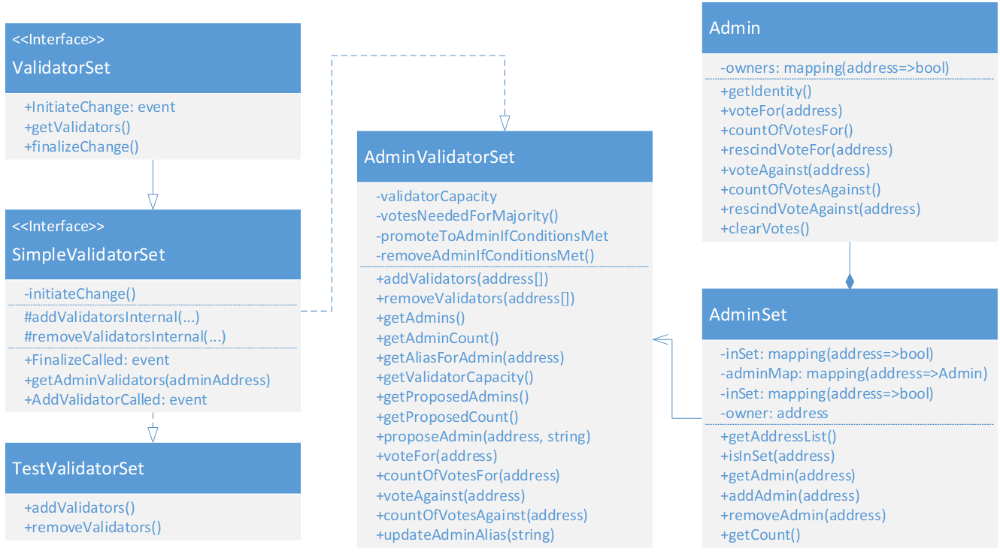

Validator Set Contracts
==================

This directory contains a set of smart-contracts used for Authority Governance in Ethereum Proof-of-Authority Consortium. This is an implementation of Parity Ethereum's [Validator Set contract interface](https://wiki.parity.io/Validator-Set.html).
* ValidatorSet
  * The interface that Parity client uses for determining authorities on the network
* SimpleValidatorSet
  * A simple implementation of the ValidatorSet that handles adding validators upon finality
  * Serves as a base class for AdminValidatorSet and TestValidatorSet
* TestValidatorSet
  * Inherits from SimpleValidatorSet
  * Used for testing SimpleValidatorSet
* AdminValidatorSet
  * Inherits from SimpleValidatorSet
  * Introduces the concept of Admins and voting
  * Allows an admin to control their validator set and vote for other admins
* Admin
  * Class representing a Consortium member
  * Tracks votes for or against a given member
* AdminSet
  * Datastructure used for performing O(1) operations on a set of Admins

