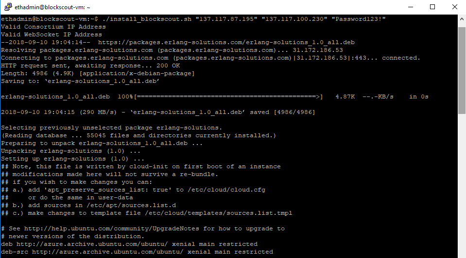

## BlockScout Overview

BlockScout is an open-source, real-time Ethereum block explorer which enables users to inspect and analyze blocks, transactions and accounts on any EVM (Ethereum Virtual Machine) blockchain network.

To learn more about BlockScout, please visit their [GitHub](https://github.com/poanetwork/blockscout).

## BlockScout Setup

The following steps will allow you to enable BlockScout on Microsoft's [Ethereum Proof-of-Authority Consortium](https://portal.azure.com/#create/microsoft-azure-blockchain.azure-blockchain-ethereumethereum-poa-consortium) Template.

#### Prerequisites

The only requirement is that you have already successfully deployed the Ethereum Proof-Of-Authority template in Azure. If you have yet to deploy an instance, please refer to the [documentation](https://docs.microsoft.com/azure/blockchain-workbench/ethereum-poa-deployment) before getting started.

#### Azure VM Setup

In order to deploy BlockScout, a separate Linux Virtual Machine must first be created. Either within the existing PoA Resource Group or within another Resource Group, select the "+ Add" button and search for "Ubuntu Server 16.04 LTS", then expand the resource and select "Create".

1. On the first blade, either select the existing Resource Group or a new Resource Group if you prefer.
2. Next, choose an appropriate size for the Virtual Machine (B2ms should suffice).
3. On the Settings blade, be sure to choose the following settings:
 - Virtual Network & Subnet -> **Select Existing Virtual Network in the PoA Resource Group**
 - Public IP Address -> **Create a new Public IP Address for the VM**
 - Network Security Group -> **Select Advanced and then choose the existing Network Security Group in the PoA Resource Group**
 - Diagnostics Storage Account -> Optional: Select the existing Storage Account in the Resource Group.

    See the following deployment settings example:

    

4. Select the "Create" button to complete the Virtual Machine deployment.

#### Network Security Group Rule

1. Navigate to the existing Network Security Group within the PoA Resource Group.
2. Select the "Inbound Security Rules" blade and then select the "+ Add" button.
3. Add a new Inbound Security Rule for Port 80 as follows:

#### Deployment Script

1. Make an [SSH connection](https://docs.microsoft.com/en-us/azure/blockchain-workbench/ethereum-poa-deployment#ssh-access) to the newly created VM and ensure you are in the following directory: **"home/{$USER}"**
2. Download a copy of the deployment shell script `install_blockscout.sh`.
	- `curl -O http://www.github.com/azure-samples/blockchain/ledger/template/ethereum-on-azure/block-explorers/blockscout/install_blockscout.sh`
	- Ensure you have the appropriate permissions to run the script: `chmod +x install_blockscout.sh`
3. Execute the script using the following parameters:

	| Parameter                                                      | Description                                                                                                      |
	|----------------------------------------------------------------|------------------------------------------------------------------------------------------------------------------|
	| Consortium IP Address                                          | This is the IP Address of the Load Balancer.                                                                     |
	| WebSocket IP Address*                                          | This must be the IP Address of a **specific node** within the PoA Consortium (not the Load Balancer IP Address). |
	| Database Password                                              | This will be the password to use when generating the BlockScout PostgreSQL database.                             |
	| RPC Port  (*Optional - Will use default if not supplied)       | The Parity PoA Template JSON RPC Port (default: 8540)                                                                         |
	| WebSocket Port  (*Optional - Will use default if not supplied) | The Parity PoA Template WebSocket Port (default: 8547)                                                                        |
     
	*The WebSocket IP Address is the Private IP Address of a specific node when deploying behind a VPN with a VNet Gateway.

     Example:

        ./install_blockscout.sh "192.168.0.1" "192.168.0.2" "Password123!" "8540" "8547"

    

4. Wait approximately 5-10 minutes for the script to complete execution.
             
#### (Optional) Add Custom DNS Name

1. You can optionally add a Custom DNS for the BlockScout site by navigating to the IP Address for the newly created VM.
2. Navigate to the "Configuration" blade and under "DNS name label", choose an appropriate DNS name.

## BlockScout UI

Once the deployment script has successfully completed, you should be able to navigate to either the Public IP Address or Custom DNS name to view the BlockScout user interface.

#### (Optional) Customize Theme Colors

If you would like to customize the theme, follow these steps after a successful deployment:

1. Stop the BlockScout service: `sudo systemctl stop blockscout.service`.
2. Navigate to `blockscout/apps/block_scout_web/assets/css/theme`.
3. Edit `_poa_variables.scss` with appropriate theme colors.
4. Rebuild the static assets: `sudo npm run-script deploy` (from `blockscout/apps/block_scout_web/assets` directory).
5. Restart the BlockScout service: `sudo systemctl start blockscout.service`.

The BlockScout application will now be running with the designated theme changes.

