# Migration of Azure Blockchain Workbench from ABS to another ledger

With the deprecation of Azure Blockchain Service, users of the Azure Blockchain Workbench, that have chosen to use Azure Blockchain Service will need to adjust the RPC endpoint configured in ABW to ensure that post migration, the workflow and applications deployed with ABW will continue to function. Depending on the users desire for future ABW work, there are a few options.

## Option 1 - Migration from Azure Blockchain Service (moderate)

Migration from ABS to QBS or another Quorum stack is considered a supported scenario, however it will require some work of the user as the settings to reconfigure Azure Blockchain Workbench are internal to the service. The steps to perform this are:

1. First, request the [export](https://docs.microsoft.com/en-us/azure/blockchain/service/migration-guide#export-data-from-azure-blockchain-service) of the blockchain data from the Azure Blockchain Service instance. Once the export is completed, the new instance of Quorum needs to be created and running.

2. Next, open the Azure portal to the resource group containing the Azure Blockchain Workbench deployed resources.

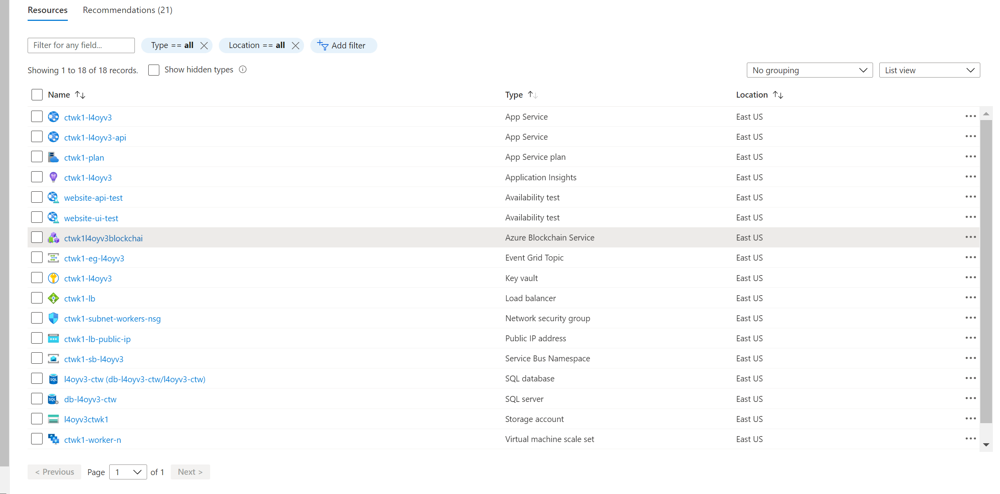

3. Click on the SQL database, there should be only one.

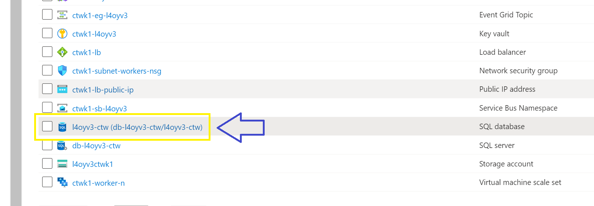

4. Click on Query Editor.

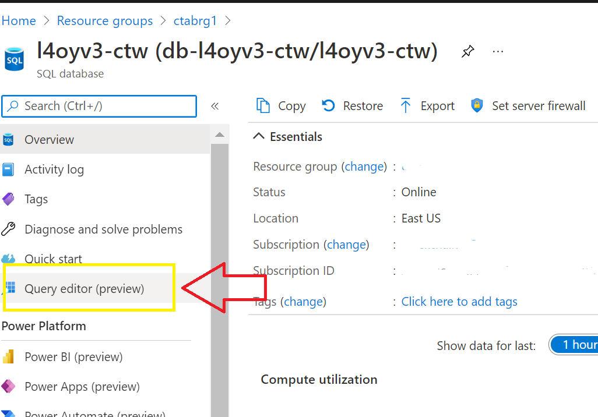

5. Enter you DB username / password that was used to deploy the resources initially. `NOTE: You may need to whitelist the Azure IP for access.`

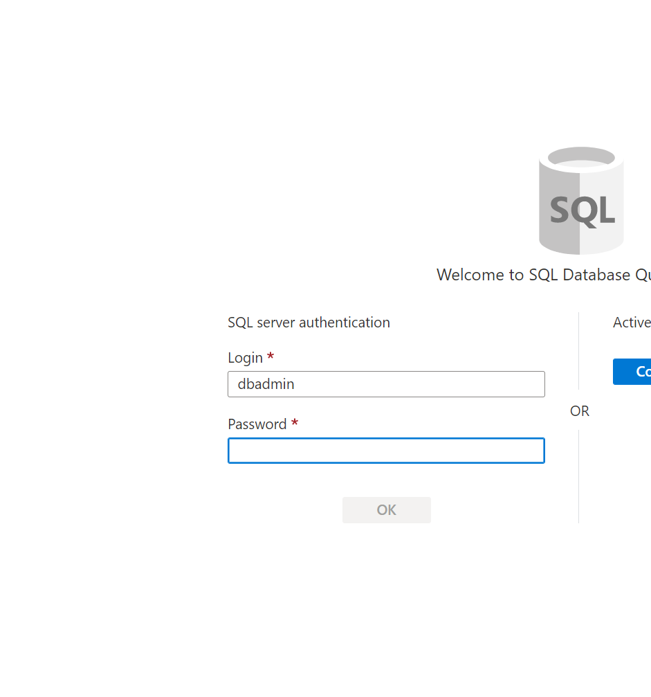

6. Run the following command to view the Connections to ledgers. `SELECT * FROM [dbo].[Connection]`

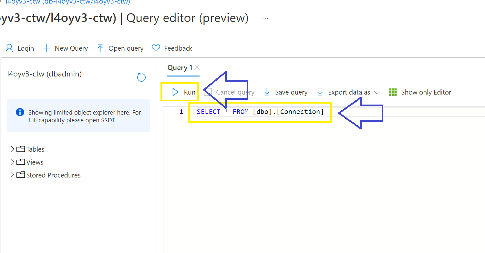

7. Now update the update the connection with the new RPC endpoint. `UPDATE [dbo].[Connection] SET EndPointURL = <your new rpc endpoint> WHERE Id = <id of connection>`

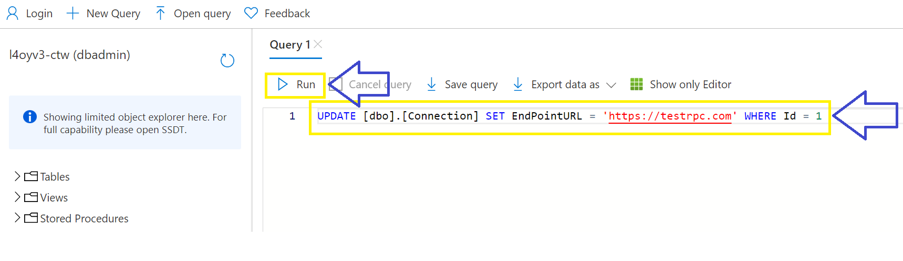

8. Now navigate back to the resource group and open the Azure Key Vault resource.

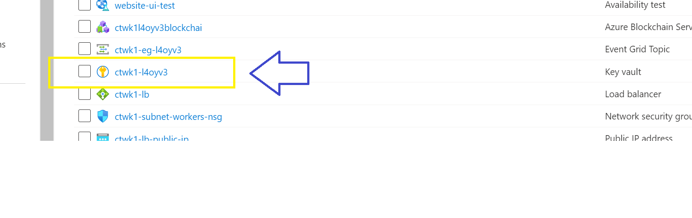

9. Add your AAD profile to the Access Policies.

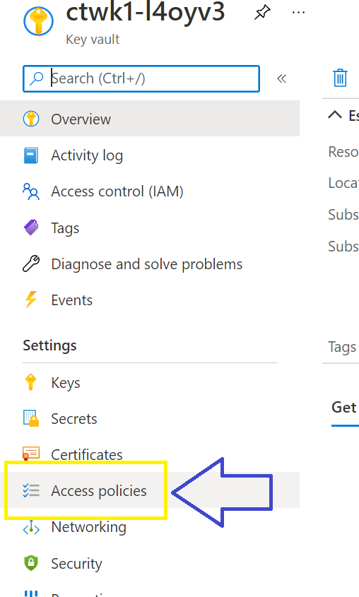

10. Select `SET, GET, LIST` under Secrets for access.

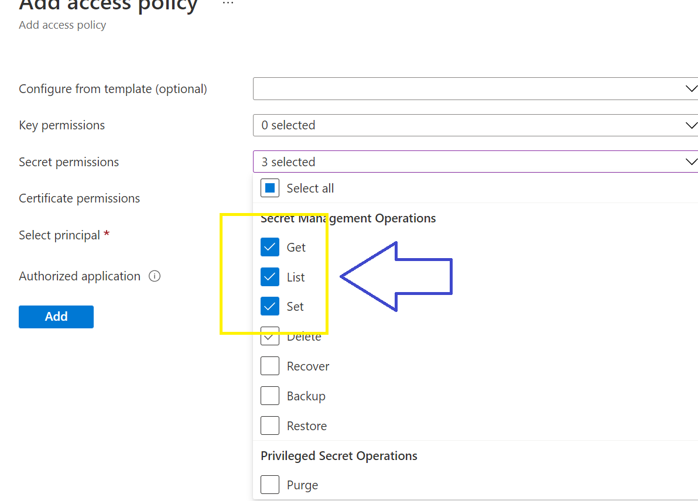

11. Click Add and then Save.

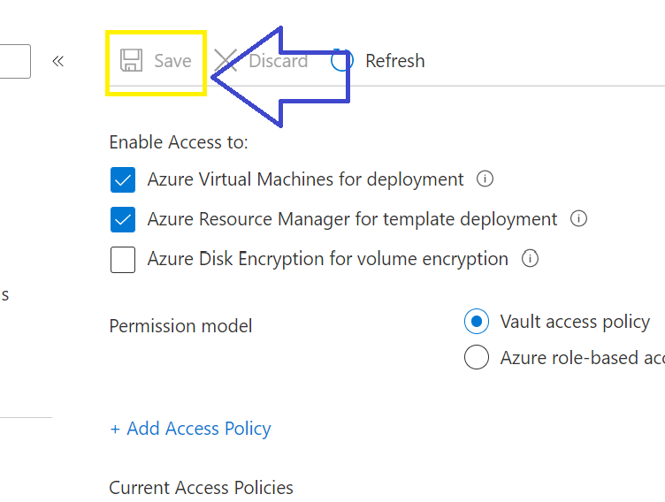

12. Click on Secrets.

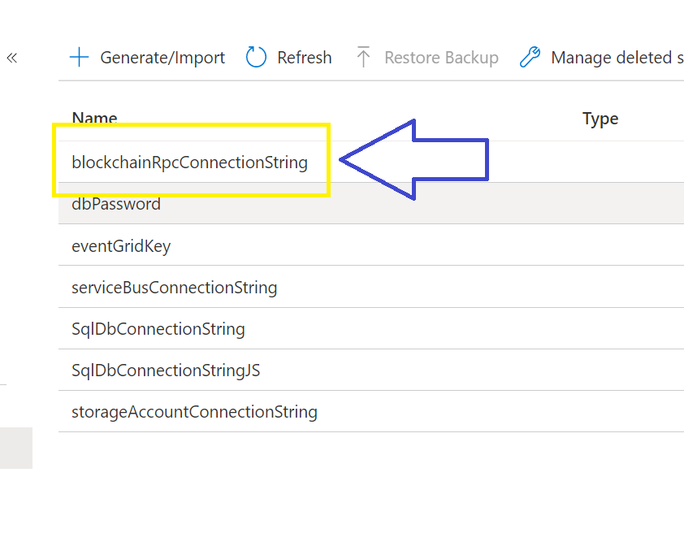

13. Click on `blockchainRpcConnectionString` secret.

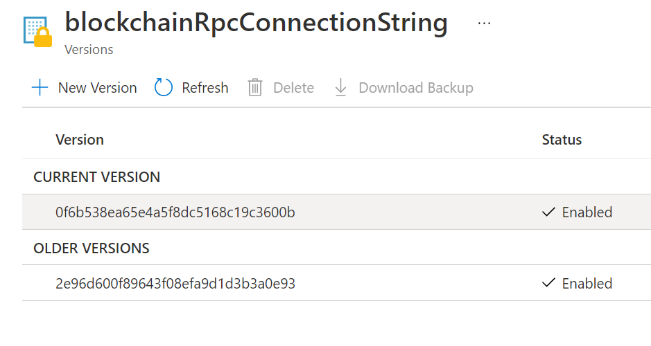

14. Click add new version.

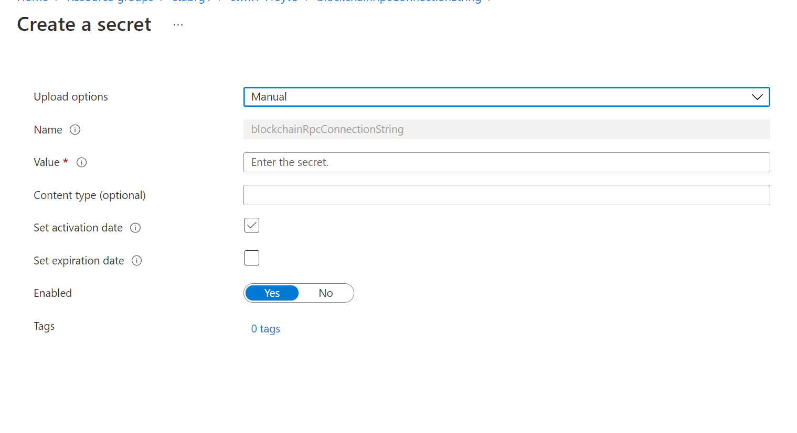

15. Paste the new RPC endpoint in the secret and save.

16. Restart the VMSS nodes.

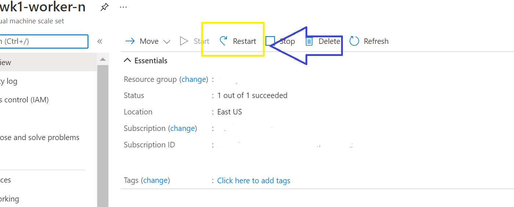

## Option 2 - Creating a new Azure Blockchain Workbench instance, connecting to a migrated ABS instance (easy)

Another option is to create a new instance of Azure Blockchain Workbench, connected to the migrated of Quorum either via QBS or manually. The steps to perform this are:

1. First, request the export of the blockchain data from the Azure Blockchain Service instance. Once the export is completed, the new instance of Quorum needs to be created and running.

2. Next, create a new instance of Azure Blockchain Workbench and in the advanced settings use the RPC endpoint of the Quorum node created in step 1.

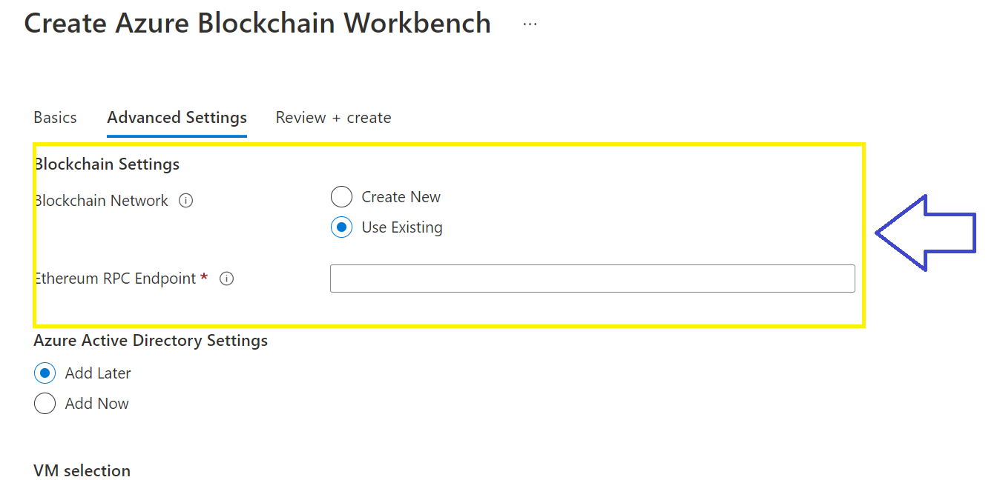

```
The ability to attach an existing ABW instance to a new blockchain ledger is not supported
```
