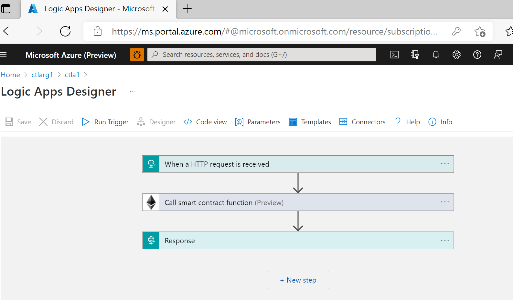
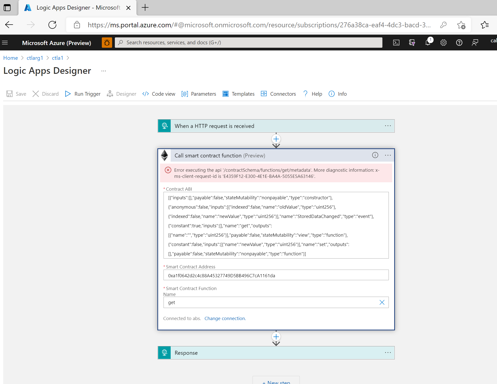
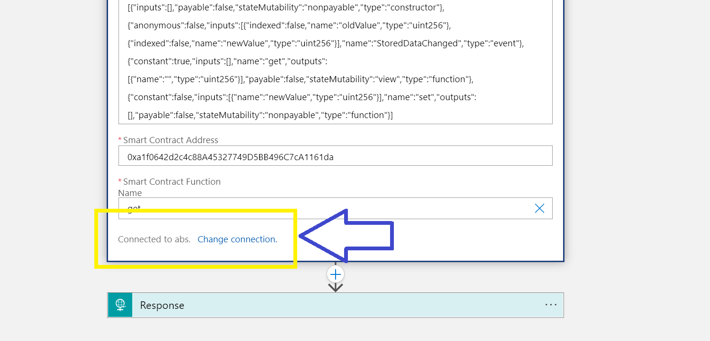
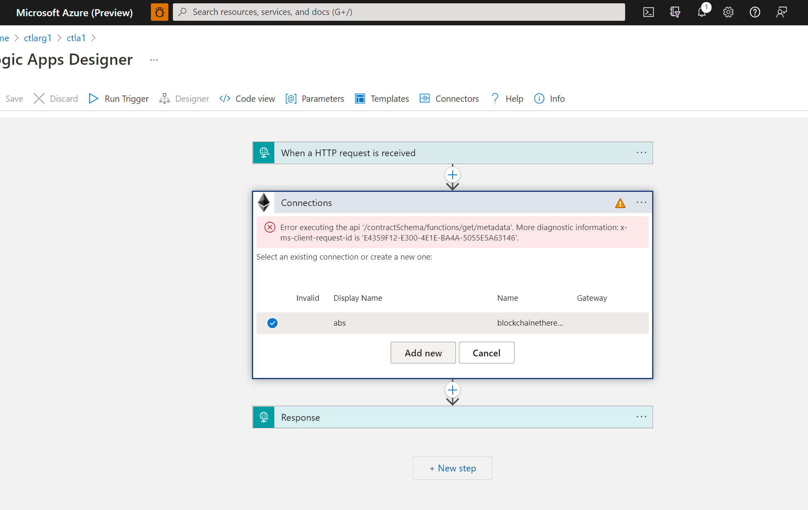
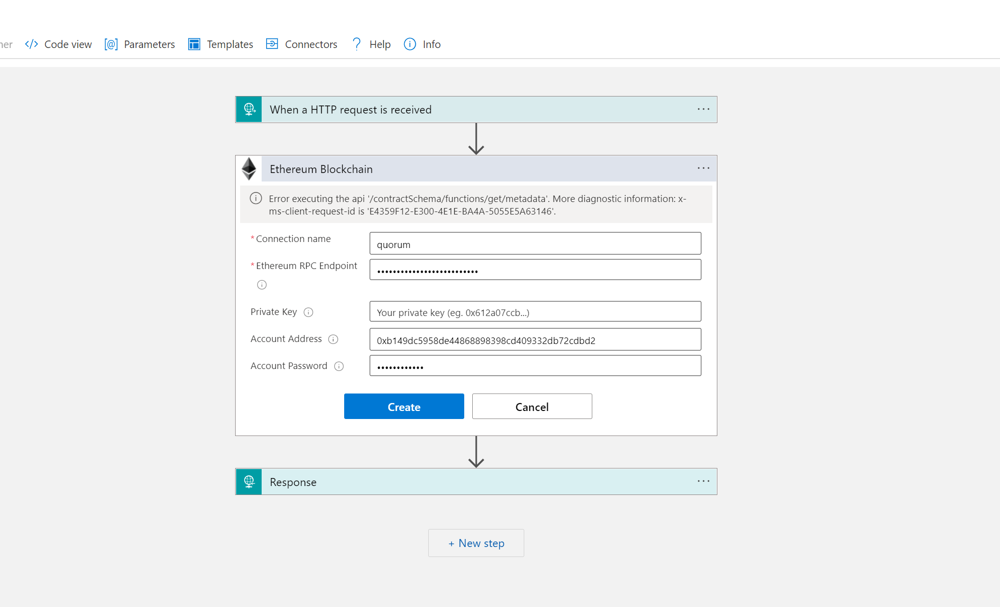
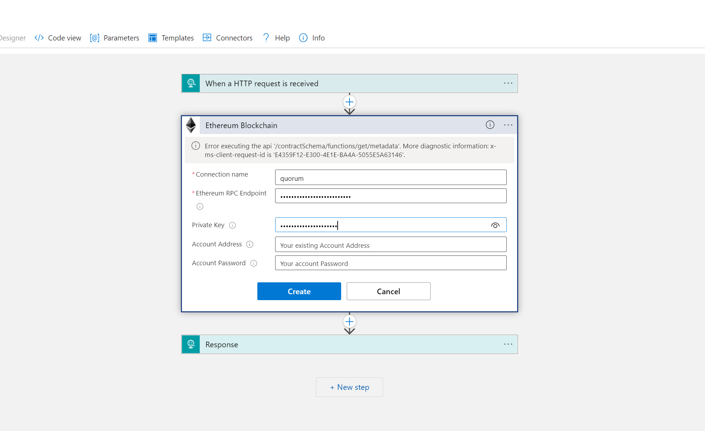
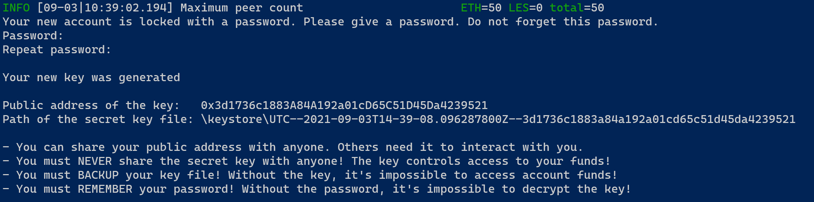

# Migration from ABS to Quorum Standalone for Logic Apps using Ethereum

With the deprecation of Azure Blockchain Service, users of the Ethereum connectors for Logics App will need to adjust the connection used by the Logic App to use the updated ledger RPC endpoint. Listed below are the steps to modify existing Logic Apps.

## Connection Manager

The Logic App connectors for Ethereum require an account that will perform the transaction with the Ethereum endpoint, so in addition to the new endpoint, an account will be required. There are a few options here.

- Member Account - If the Logic App connection was setup to use the member account with ABS, the user will need to provide the password that was used when the transaction node in Azure Blockchain Service was provisioned.

- Private Key - If the Logic App used the Private Key option for the account when setup, the user can simply provide the same Private Key for the update.

- Account Unknown - If the Logic App was provisioned with either the Member Account or Private Key and the user does not have the password or key, a new keyfile can be generated and used.

### Member Account

For the member account:

1. Open the Logic App Designer

    

2. Expand the Ethereum section

    

3. Click Change connection.

    

4. Click Add new button

    

5. Provide a new name for the connection, the new Ethereum endpoint, the account address, and the account password.

    

```
NOTE: The account address here will be the same account address that was available in Azure Blockchain Service.  The migration of ABS to QBS brings these accounts over to the new infrastructure, with only the password required to unlock the account provided by the user.
```

### Private Key

For the private key:

1. Open the Logic App Designer

    

2. Expand the Ethereum section

    

3. Click Change connection.

    

4. Click Add new button

    

5. Provide a new name for the connection, the new Ethereum endpoint, and the private key.

    

```
NOTE: The private key used here will be a valid private key for a key pair generated for use with Ethereum.
```

### Account Unknown

If the account is unknown, a new keyfile will need to be created and added to the node.

1. Generate a new keyfile
    
    a.  To generate a new keyfile, the geth client can be used.  This can be downloaded [here](https://geth.ethereum.org/downloads/).

    b.  After downloading the geth client, create a new keyfile by running the following:

        ```
        ./geth account new --datadir / 

        NOTE: This will prompt for a password used to encrypt the private key and will provide the address and location of the key file.
        ```

    

2. Add the keyfile to the VM node that will be used for the transaction.

3. Open the Logic App Designer

    

4. Expand the Ethereum section

        

5. Click Change connection.

    

6. Click Add new button

    

7. Provide a new name for the connection, the new Ethereum endpoint, the account address, and the account password.

    
